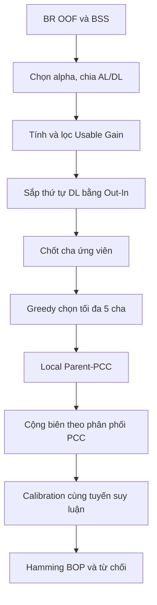

# Quy trình mô hình BSS-UG-SPCC-PA

## 1. Tên và định hướng mô hình

Tên tạm thời:

> **BSS-guided Usable-Gain Sparse Probabilistic Classifier Chain with Partial Abstention**  
> Viết tắt: **BSS-UG-SPCC-PA**.

Mô hình sử dụng Brier Skill Score (BSS) để tách nhãn, Usable Gain (UG) để xây dựng cấu trúc thưa và Probabilistic Classifier Chains (PCC) cục bộ để mô hình hóa phân phối chung của nhiều cha. Mô hình **không phải GBNC đầy đủ**, vì cấu trúc DAG không được tối ưu toàn cục bằng GOBNILP và các PCC cục bộ không tạo ra một phân phối chung duy nhất trên toàn bộ $K$ nhãn.

Điểm sửa chính của phiên bản này là bỏ xấp xỉ mean-field giữa các cha. Với mỗi nhãn con, một Local Parent-PCC được huấn luyện trên tập cha đã chọn. PCC cung cấp xác suất chung của các cấu hình cha, sau đó mô hình thực hiện phép cộng biên để thu xác suất của nhãn con.

---

## 2. Ký hiệu chung

Cho tập dữ liệu đa nhãn:

$$
\mathcal D=\{(\mathbf x_n,\mathbf y_n)\}_{n=1}^{N},
$$

trong đó:

- $N$: số mẫu.
- $\mathbf x_n\in\mathbb R^d$: vector đặc trưng của mẫu $n$.
- $\mathbf y_n=(y_{n1},\ldots,y_{nK})\in\{0,1\}^{K}$: vector gồm $K$ nhãn.
- $y_{nj}$: giá trị thật của nhãn $Y_j$ tại mẫu $n$.
- $\hat p_{nj}$: xác suất dự đoán $P(Y_j=1\mid\mathbf x_n)$.
- $AL$: tập **Anchor Labels**, được BR dự đoán đủ tốt từ $\mathbf X$.
- $DL$: tập **Dependent Labels**, được xử lý bằng DAG/chuỗi thưa.
- $P_j$: tập cha cuối cùng của nhãn $Y_j$.
- $q_{\max}=5$: số cha tối đa tạm thời của một nhãn. Giới hạn này được giữ làm rào chắn tính toán cho đến khi penalty số cha được xây dựng và kiểm chứng.
- $\delta_{UG}=0.0005$: ngưỡng giữ cạnh UG.
- $\epsilon=10^{-12}$: hằng số clipping xác suất.
- $\bot$: trạng thái từ chối dự đoán.

Toàn bộ BSS, UG, thứ tự nhãn, tập cha, calibration và chi phí từ chối phải được xác định chỉ từ tập train. Tập test chỉ được dùng để đánh giá cuối cùng.

---

# Pha huấn luyện

## Bước 1. Dùng BR tạo xác suất OOF và tính BSS

### 1.1. Tạo xác suất OOF

Với mỗi nhãn $Y_j$, huấn luyện một bộ phân loại BR:

$$
f_j:\mathbf X\longrightarrow[0,1].
$$

Sử dụng $R$-fold cross-validation trên tập train để thu được xác suất ngoài mẫu:

$$
\hat p_{nj}^{BR,OOF}=\widehat P(Y_j=1\mid\mathbf x_n).
$$

Mẫu $n$ không được tham gia huấn luyện mô hình sinh ra $\hat p_{nj}^{BR,OOF}$.

Bộ học cơ sở chính là Logistic Regression:

$$
\hat p_{nj}^{BR}
=
\sigma\left(\beta_{0j}+\boldsymbol\beta_j^\top\mathbf x_n\right),
$$

với:

$$
\sigma(u)=\frac{1}{1+\exp(-u)}.
$$

### 1.2. Brier Score của BR

$$
BS_j^{BR}
=
\frac{1}{N}\sum_{n=1}^{N}
\left(\hat p_{nj}^{BR,OOF}-y_{nj}\right)^2.
$$

$BS_j^{BR}$ càng nhỏ thì xác suất BR của nhãn $j$ càng chính xác.

### 1.3. Mô hình tham chiếu

Mô hình tham chiếu luôn dự đoán bằng prevalence của nhãn trong phần huấn luyện của từng fold:

$$
\hat p_{nj}^{ref}
=
\frac{1}{|\mathcal D_{-r(n)}|}
\sum_{m\in\mathcal D_{-r(n)}}y_{mj},
$$

trong đó $\mathcal D_{-r(n)}$ là phần huấn luyện không chứa fold của mẫu $n$.

$$
BS_j^{ref}
=
\frac{1}{N}\sum_{n=1}^{N}
\left(\hat p_{nj}^{ref}-y_{nj}\right)^2.
$$

### 1.4. Brier Skill Score

$$
BSS_j
=
1-\frac{BS_j^{BR}}{BS_j^{ref}}.
$$

Ý nghĩa:

- $BSS_j=1$: BR dự đoán hoàn hảo.
- $BSS_j>0$: BR tốt hơn mô hình tham chiếu.
- $BSS_j=0$: BR ngang mô hình tham chiếu.
- $BSS_j<0$: BR kém hơn mô hình tham chiếu.

Nếu $BS_j^{ref}\approx0$, nhãn gần như hằng số và BSS không ổn định. Nhãn này phải được xử lý riêng.

### Lợi ích

- Đánh giá chất lượng xác suất thay vì chỉ đánh giá quyết định cứng.
- So sánh BR với baseline prevalence thực tế.
- OOF hạn chế đánh giá quá lạc quan.

### Hạn chế

- BSS của nhãn rất hiếm có thể dao động mạnh.
- BSS cao chỉ chứng minh nhãn dự đoán tốt từ $\mathbf X$, không chứng minh nhãn độc lập với các nhãn khác.
- Kết quả phụ thuộc vào chất lượng và calibration ban đầu của BR.

---

## Bước 2. Chọn $\alpha$ và chia AL/DL

Tập giá trị cần thử:

$$
\mathcal A=\{0.1,0.2,0.3,0.4,0.5\}.
$$

Với mỗi $\alpha$:

$$
AL(\alpha)=\{Y_j:BSS_j>\alpha\},
$$

$$
DL(\alpha)=\mathcal Y\setminus AL(\alpha).
$$

Các nhãn AL:

- Được dự đoán trực tiếp bằng BR.
- Luôn đứng trước toàn bộ DL.
- Chỉ được làm cha, không được làm con trong DAG cuối cùng.

Thứ tự bên trong AL không ảnh hưởng đến dự đoán. Có thể sắp giảm dần theo BSS để bảo đảm tái lập.

### Chọn $\alpha^\star$

Với mỗi $\alpha$, chạy các bước xây dựng mô hình tiếp theo và thu xác suất OOF. Đánh giá bằng Macro-Brier:

$$
MacroBrier(\alpha)
=
\frac1K\sum_{j=1}^{K}
\frac1N\sum_{n=1}^{N}
\left(\hat p_{nj}^{OOF}(\alpha)-y_{nj}\right)^2.
$$

Chọn:

$$
\alpha^\star
=
\arg\min_{\alpha\in\mathcal A}MacroBrier(\alpha).
$$

Nên dùng xác suất trước calibration để lựa chọn cấu trúc, tránh calibration che lấp một cấu trúc kém. Nếu nhiều giá trị $\alpha$ gần tương đương, có thể chọn $\alpha$ nhỏ hơn để ưu tiên cấu trúc đơn giản hơn.

### Lợi ích

- Tự động điều chỉnh kích thước AL/DL theo dữ liệu.
- Nhãn BR dự đoán tốt không phải đi qua chuỗi phụ thuộc không cần thiết.
- Giảm lan truyền sai số và chi phí suy luận.

### Hạn chế

Việc bắt buộc mọi nhãn có $BSS>\alpha$ trở thành gốc là một **ràng buộc mô hình**, không phải kết luận thống kê rằng nhãn đó độc lập. Một nhãn BSS cao vẫn có thể được cải thiện nhờ nhãn khác.

Tập thử không chứa $\alpha=0$. Vì vậy nên dùng $\alpha=0$ làm một baseline/ablation bổ sung, dù không thuộc cấu hình chính.

---

## Bước 3. Tính Usable Gain cho các cạnh có hướng

### 3.1. Không gian cạnh ban đầu

Trước khi xác định thứ tự DL, xét:

$$
\mathcal E_0
=
\{Y_i\rightarrow Y_j:
Y_j\in DL,\;Y_i\in AL\cup DL,\;i\neq j\}.
$$

Quy tắc:

- Cho phép $AL\rightarrow DL$.
- Xét cả hai hướng giữa hai nhãn DL.
- Không cho phép $DL\rightarrow AL$.
- Không xét cạnh giữa các nhãn AL.

### 3.2. CLL cơ sở của nhãn đích

Với nhãn đích $Y_j$:

$$
\hat p_{nj}^{(0)}=\widehat P(Y_j=1\mid\mathbf x_n).
$$

Clipping xác suất:

$$
\tilde p=\min(1-\epsilon,\max(\epsilon,p)).
$$

Conditional log-likelihood trung bình:

$$
CLL_j^{(0)}
=
\frac1N\sum_{n=1}^{N}
\left[
y_{nj}\log\tilde p_{nj}^{(0)}
+(1-y_{nj})\log(1-\tilde p_{nj}^{(0)})
\right].
$$

Phải sử dụng CLL trung bình. Nếu dùng tổng CLL thì ngưỡng $0.0005$ sẽ phụ thuộc vào $N$.

### 3.3. Mô hình điều kiện cho cạnh $Y_i\rightarrow Y_j$

Huấn luyện Logistic Regression:

$$
g_{j\mid i}(\mathbf x,Y_i)
=
\sigma\left(\beta_0+\boldsymbol\beta^\top\mathbf x+\gamma_iY_i\right).
$$

Trong huấn luyện mô hình điều kiện, được phép dùng giá trị thật $Y_i$. Khi dự đoán validation/test, không được đưa nhãn thật vào mô hình.

Với mỗi mẫu OOF, tính hai trạng thái:

$$
q_{nj}^{(1)}
=
\widehat P(Y_j=1\mid\mathbf x_n,Y_i=1),
$$

$$
q_{nj}^{(0)}
=
\widehat P(Y_j=1\mid\mathbf x_n,Y_i=0).
$$

### 3.4. Đưa bất định của cha vào đánh giá cạnh

Sử dụng xác suất BR OOF của cha:

$$
\hat p_{ni}^{OOF}
=
\widehat P(Y_i=1\mid\mathbf x_n).
$$

Xác suất biên của nhãn đích:

$$
\hat p_{nj}^{i\rightarrow j}
=
\hat p_{ni}^{OOF}q_{nj}^{(1)}
+(1-\hat p_{ni}^{OOF})q_{nj}^{(0)}.
$$

CLL của cạnh:

$$
CLL_j^{(i)}
=
\frac1N\sum_{n=1}^{N}
\left[
y_{nj}\log\tilde p_{nj}^{i\rightarrow j}
+(1-y_{nj})\log(1-\tilde p_{nj}^{i\rightarrow j})
\right].
$$

Usable Gain:

$$
UG_{i\rightarrow j}
=
CLL_j^{(i)}-CLL_j^{(0)}.
$$

Ý nghĩa:

- $UG_{i\rightarrow j}>0$: cha $Y_i$ cải thiện xác suất của $Y_j$.
- $UG_{i\rightarrow j}\approx0$: cạnh gần như không mang thêm thông tin sử dụng được.
- $UG_{i\rightarrow j}<0$: cạnh làm chất lượng xác suất giảm.

### Lợi ích

- Đánh giá cha trong điều kiện cha cũng có sai số dự đoán.
- Thực tế hơn cách đánh giá bằng nhãn cha thật.
- Có hướng: $UG_{i\rightarrow j}$ không nhất thiết bằng $UG_{j\rightarrow i}$.

### Hạn chế

- Ở bước này, nhãn DL làm cha mới có xác suất BR, chưa có xác suất sau chuỗi; vì vậy UG có thể đánh giá thấp một cha DL sẽ được cải thiện ở bước sau.
- UG từng cặp không phát hiện tốt tương tác chỉ xuất hiện khi nhiều cha cùng có mặt.
- Phải huấn luyện gần $O(K^2)$ mô hình điều kiện.

---

## Bước 4. Sàng lọc cạnh bằng ngưỡng UG

Giữ cạnh khi:

$$
UG_{i\rightarrow j}>0.0005.
$$

Định nghĩa trọng số:

$$
w_{i\rightarrow j}
=
\begin{cases}
UG_{i\rightarrow j}, & UG_{i\rightarrow j}>0.0005,\\
0, & \text{ngược lại}.
\end{cases}
$$

Tập cạnh sau sàng lọc:

$$
\mathcal E^+=\{(i,j):w_{i\rightarrow j}>0\}.
$$

### Lợi ích

- Loại bỏ cạnh có mức cải thiện quá nhỏ.
- Giảm số cha ứng viên và thời gian chọn cha.
- Tạo cấu trúc thưa hơn CC đầy đủ.

### Hạn chế

Ngưỡng $0.0005$ là heuristic, chưa có bảo đảm phù hợp với mọi tập dữ liệu. Do thử nhiều cạnh, một số cạnh có thể vượt ngưỡng chỉ do nhiễu.

Có thể báo cáo độ ổn định:

$$
Stability_{i\rightarrow j}
=
\frac1R\sum_{r=1}^{R}
\mathbf1\left(UG_{i\rightarrow j}^{(r)}>0\right).
$$

Điều kiện $Stability\ge2/3$ nên được kiểm tra trong ablation, nhưng không thay đổi quy tắc chính $UG>0.0005$.

---

## Bước 5. Xây dựng thứ tự DL bằng tổng gain ra trừ tổng gain vào

Khởi tạo:

$$
R_1=DL,
$$

trong đó $R_t$ là tập DL chưa được xếp ở vòng $t$.

Với mỗi $Y_i\in R_t$, tính tổng gain đi ra:

$$
Out_t(i)
=
\sum_{\substack{j\in R_t\\j\neq i}}w_{i\rightarrow j}.
$$

Tổng gain đi vào:

$$
In_t(i)
=
\sum_{\substack{h\in R_t\\h\neq i}}w_{h\rightarrow i}.
$$

Điểm thứ tự:

$$
OrderScore_t(i)=Out_t(i)-In_t(i).
$$

Chọn nhãn đầu tiên còn lại:

$$
\pi_t
=
\arg\max_{i\in R_t}OrderScore_t(i).
$$

Cập nhật:

$$
R_{t+1}=R_t\setminus\{\pi_t\}.
$$

Lặp đến khi $R_t=\varnothing$, thu được:

$$
\pi_{DL}=(\pi_1,\pi_2,\ldots,\pi_{|DL|}).
$$

Nếu hòa điểm, ưu tiên lần lượt:

1. $Out_t(i)$ lớn hơn.
2. BSS lớn hơn.
3. Chỉ số nhãn nhỏ hơn để bảo đảm tái lập.

Các cạnh $AL\rightarrow DL$ không tham gia tính thứ tự, vì AL đã cố định trước toàn bộ DL. Chúng vẫn được giữ để chọn cha.

### Lợi ích

- Ưu tiên nhãn là nguồn thông tin cho nhiều nhãn khác.
- Trì hoãn nhãn nhận nhiều thông tin từ các nhãn khác.
- Sử dụng quan hệ có hướng thay vì chỉ sắp theo BSS.
- Thứ tự cuối cùng giúp loại chu trình.

### Hạn chế

- Là greedy heuristic, không bảo đảm tối ưu toàn cục.
- Một lựa chọn sớm sai ảnh hưởng toàn bộ phần còn lại.
- Tổng UG có thể ưu tiên nhãn có nhiều cạnh rất nhỏ.
- Không trực tiếp tối ưu Brier Score hoặc rủi ro từ chối cuối cùng.

---

## Bước 6. Chốt tập cha ứng viên

Với $Y_j\in DL$, tập nhãn đứng trước là:

$$
Pred(j)
=
AL\cup\{Y_i\in DL:\pi^{-1}(i)<\pi^{-1}(j)\}.
$$

Tập cha ứng viên:

$$
C_j
=
\{Y_i\in Pred(j):UG_{i\rightarrow j}>0.0005\}.
$$

Một nhãn chỉ là cha ứng viên nếu nó vừa đứng trước nhãn con vừa có cạnh UG vượt ngưỡng.

Nếu:

$$
C_j=\varnothing,
$$

thì đặt:

$$
P_j=\varnothing
$$

và dự đoán $Y_j$ bằng BR.

### Lợi ích

- Bảo đảm DAG không có chu trình.
- Giảm mạnh không gian tìm kiếm tập cha.
- Có phương án BR fallback khi không tìm thấy cha hữu ích.

### Hạn chế

- Một cạnh tốt có thể bị loại do thứ tự greedy đặt cha tiềm năng phía sau.
- Cạnh pairwise yếu nhưng hữu ích khi kết hợp với cha khác không được xem xét.
- Nhãn thuộc DL nhưng không có cha thực tế chỉ là nhãn BR có BSS thấp.

---

## Bước 7. Chọn tập cha cuối cùng bằng OOF-PCC, tối đa 5 cha

Không lấy toàn bộ $C_j$, vì nhiều cha có thể chứa thông tin trùng lặp. Phiên bản hiện tại chưa đưa penalty số cha vào hàm điểm. Do đó, $q_{\max}=5$ được giữ tạm thời để giới hạn số cấu hình PCC và thời gian huấn luyện.

Khởi tạo:

$$
P_j^{(0)}=\varnothing.
$$

### 7.1. Thứ tự PCC của tập cha

Với một tập cha tạm thời $P$, sắp các cha theo thứ tự toàn cục đã xác định ở Bước 5:

$$
\rho_j(P)=(i_1,i_2,\ldots,i_m),\qquad m=|P|.
$$

Thứ tự này phải được giữ cố định trong train, OOF, calibration và test. Không tối ưu một thứ tự PCC riêng trên tập test.

### 7.2. Local Parent-PCC của tập cha

Với mỗi vị trí $r\in\{1,\ldots,m\}$, huấn luyện một mô hình xác suất:

$$
h_{j,r,P}(\mathbf x,z_1,\ldots,z_{r-1})
=
P(Y_{i_r}=1\mid\mathbf x,
Y_{i_1}=z_1,\ldots,Y_{i_{r-1}}=z_{r-1}).
$$

Mô hình đầu tiên là BR cục bộ:

$$
h_{j,1,P}(\mathbf x)=P(Y_{i_1}=1\mid\mathbf x).
$$

Với một cấu hình cha:

$$
\mathbf z=(z_1,\ldots,z_m)\in\{0,1\}^{m},
$$

xác suất chung do PCC cung cấp là:

$$
w_{j,P}(\mathbf z\mid\mathbf x)
=
\prod_{r=1}^{m}
h_{j,r,P}(\mathbf x,\mathbf z_{<r})^{z_r}
\left[1-h_{j,r,P}(\mathbf x,\mathbf z_{<r})\right]^{1-z_r}.
$$

Trong đó:

$$
\mathbf z_{<r}=(z_1,\ldots,z_{r-1}).
$$

Do mỗi thừa số là một phân phối Bernoulli hợp lệ, ta có:

$$
\sum_{\mathbf z\in\{0,1\}^{m}}
w_{j,P}(\mathbf z\mid\mathbf x)=1.
$$

Các liên kết bên trong Local Parent-PCC là liên kết phụ trợ để phân rã phân phối chung của tập cha. Chúng không được thêm vào DAG cấu trúc và không làm thay đổi vai trò AL/DL đã xác định.

### 7.3. Mô hình của nhãn con

Huấn luyện:

$$
g_{j,P}(\mathbf x,\mathbf z)
=
P(Y_j=1\mid\mathbf x,\mathbf Y_P=\mathbf z).
$$

Với Logistic Regression:

$$
g_{j,P}(\mathbf x,\mathbf z)
=
\sigma\left(
\beta_{0j}
+\boldsymbol\beta_j^\top\mathbf x
+\sum_{r=1}^{m}\gamma_{i_rj}z_r
\right).
$$

Xác suất biên của nhãn con là:

$$
\hat p_j(\mathbf x;P)
=
\sum_{\mathbf z\in\{0,1\}^{m}}
g_{j,P}(\mathbf x,\mathbf z)
w_{j,P}(\mathbf z\mid\mathbf x).
$$

PCC không loại bỏ phép cộng biên. PCC thay thế tích các xác suất biên độc lập bằng một phân phối chung có thứ tự trên tập cha.

### 7.4. Điểm CLL ngoài mẫu

Toàn bộ các mô hình $h_{j,r,P}$ và $g_{j,P}$ phải tạo xác suất OOF. Nhãn thật của fold validation không được đưa vào tuyến dự đoán.

Gọi $\hat p_{nj}^{OOF}(P)$ là xác suất OOF thu được bằng Local Parent-PCC:

$$
CLL_j^{OOF}(P)
=
\frac1N\sum_{n=1}^{N}
\left[
y_{nj}\log\tilde p_{nj}^{OOF}(P)
+(1-y_{nj})\log(1-\tilde p_{nj}^{OOF}(P))
\right].
$$

Conditional gain của cha mới $Y_i$:

$$
\Delta_j^{PCC}(i\mid P)
=
CLL_j^{OOF}(P\cup\{Y_i\})-CLL_j^{OOF}(P).
$$

Tại vòng $s$, chọn:

$$
i^\star
=
\arg\max_{i\in C_j\setminus P_j^{(s)}}
\Delta_j^{PCC}(i\mid P_j^{(s)}).
$$

Chấp nhận nếu:

$$
\Delta_j^{PCC}(i^\star\mid P_j^{(s)})>0.0005
$$

và:

$$
|P_j^{(s)}|<q_{\max}=5.
$$

Cập nhật:

$$
P_j^{(s+1)}=P_j^{(s)}\cup\{Y_{i^\star}\}.
$$

Dừng khi không còn cha làm OOF-CLL tăng quá $0.0005$ hoặc đã chọn đủ 5 cha. Penalty BIC, EBIC hoặc computational penalty chưa thuộc phiên bản này.

### Lợi ích

- Đánh giá tập cha bằng cùng tuyến PCC được dùng ở test.
- Giữ được phụ thuộc có thứ tự giữa các cha.
- Không truyền một vector nhãn cứng duy nhất qua chuỗi.
- Tránh tìm kiếm vét cạn toàn bộ $2^{|C_j|}$ tập cha.

### Hạn chế

- Forward greedy có thể bỏ qua tập cha chỉ hữu ích khi được thêm đồng thời.
- Kết quả phụ thuộc vào thứ tự PCC của các cha.
- Mỗi tập cha ứng viên cần huấn luyện các mô hình PCC cục bộ, nên Bước 7 nặng hơn cách mean-field cũ.
- Logistic Regression dạng cộng không biểu diễn trực tiếp tương tác XOR giữa các cha.
- Ngưỡng $0.0005$ vẫn là heuristic và phải được kiểm tra bằng ablation.

OOF-CLL là bắt buộc. Nếu dùng CLL huấn luyện, thêm cha thường làm CLL tăng và dễ tạo cấu trúc quá đầy đủ.

---

## Bước 8. Huấn luyện Local Parent-PCC cuối và suy luận xác suất

Sau khi cố định $\alpha^\star$, AL, thứ tự DL và các $P_j$, huấn luyện lại toàn bộ mô hình trên tập train.

### 8.1. Nhãn AL

$$
p_j^{raw}(\mathbf x)=f_j^{BR}(\mathbf x),\qquad Y_j\in AL.
$$

### 8.2. Nhãn DL không có cha

Nếu:

$$
P_j=\varnothing,
$$

thì dùng BR fallback:

$$
p_j^{raw}(\mathbf x)=f_j^{BR}(\mathbf x).
$$

### 8.3. Nhãn DL có nhiều cha

Với:

$$
\rho_j(P_j)=(i_1,\ldots,i_m),\qquad 1\le m\le5,
$$

huấn luyện lại các mô hình PCC của cha:

$$
h_{j,r}(\mathbf x,\mathbf z_{<r})
=
P(Y_{i_r}=1\mid\mathbf x,\mathbf Y_{i_{<r}}=\mathbf z_{<r}),
$$

và mô hình nhãn con:

$$
g_j(\mathbf x,\mathbf z)
=
P(Y_j=1\mid\mathbf x,\mathbf Y_{P_j}=\mathbf z).
$$

Với mỗi cấu hình $\mathbf z$, tính trọng số PCC:

$$
w_j(\mathbf z\mid\mathbf x)
=
\prod_{r=1}^{m}
h_{j,r}(\mathbf x,\mathbf z_{<r})^{z_r}
\left[1-h_{j,r}(\mathbf x,\mathbf z_{<r})\right]^{1-z_r}.
$$

Xác suất thô của nhãn con:

$$
\boxed{
p_j^{raw}(\mathbf x)
=
\sum_{\mathbf z\in\{0,1\}^{m}}
g_j(\mathbf x,\mathbf z)
w_j(\mathbf z\mid\mathbf x)
}
$$

Với một cha, công thức trở về:

$$
p_i^{PCC}(\mathbf x)=h_{j,1}(\mathbf x),
$$

$$
p_j^{raw}
=
p_i^{PCC}q_j^{(1)}+(1-p_i^{PCC})q_j^{(0)}.
$$

Với năm cha, số cấu hình cha tối đa là:

$$
2^5=32.
$$

Số prefix PCC khác nhau cần đánh giá tối đa là:

$$
1+2+4+8+16=31.
$$

Không đưa kỳ vọng của cha trực tiếp vào Logistic Regression theo công thức:

$$
\sigma\left(\beta_0+\boldsymbol\beta^\top\mathbf x+\sum_i\gamma_i p_i\right),
$$

vì biểu thức này không tương đương với phép cộng biên trên các trạng thái nhị phân.

### 8.4. Thứ tự suy luận

Với mỗi nhãn $Y_j$:

1. Lấy tập cha cuối cùng $P_j$.
2. Sắp cha theo $\rho_j(P_j)$ đã cố định.
3. Liệt kê các cấu hình $\mathbf z\in\{0,1\}^{|P_j|}$.
4. Tính xác suất từng prefix bằng PCC.
5. Tính trọng số chung $w_j(\mathbf z\mid\mathbf x)$.
6. Cộng biên để thu $p_j^{raw}(\mathbf x)$.

Không truyền quyết định cứng $0/1$ hoặc trạng thái từ chối $\bot$ vào PCC.

### Lợi ích

- Giữ phụ thuộc có thứ tự giữa các cha thay vì giả định chúng độc lập.
- Xét toàn bộ cấu hình cha nên không bị lỗi do chọn một đường greedy duy nhất.
- Suy luận là xác định, không cần Monte Carlo.
- Với $q_{\max}=5$, mỗi nhãn con chỉ có tối đa 32 cấu hình cha.

### Hạn chế

- PCC cục bộ phụ thuộc vào thứ tự cha.
- Cùng một nhãn cha có thể tham gia các PCC cục bộ khác nhau ở các nhãn con khác nhau.
- Các PCC cục bộ tạo ra marginal cho từng nhãn nhưng không bảo đảm tồn tại một phân phối chung duy nhất trên toàn bộ $K$ nhãn.
- Phương pháp phù hợp trực tiếp với Hamming BOP. Nó chưa đủ để khẳng định F-measure BOP toàn cục là Bayes-optimal.

---

## Bước 9. Calibration bằng đúng tuyến Local Parent-PCC

Xác suất dùng để huấn luyện calibrator phải được sinh đúng như test:

- AL dùng xác suất BR OOF.
- DL không có cha dùng BR OOF.
- DL có cha dùng Local Parent-PCC OOF.
- Thứ tự cha của từng PCC phải giống giai đoạn test.
- Không dùng nhãn cha thật của fold validation trong tuyến suy luận.
- Mỗi DL dùng phép cộng biên trên tối đa $2^5=32$ cấu hình cha.

Gọi xác suất thô OOF là $p_{nj}^{raw,OOF}$.

### Platt scaling

Clipping:

$$
\tilde p_{nj}^{raw}
=
\min(1-\epsilon,\max(\epsilon,p_{nj}^{raw})).
$$

Chuyển sang logit:

$$
z_{nj}
=
\log\frac{\tilde p_{nj}^{raw}}{1-\tilde p_{nj}^{raw}}.
$$

Calibrator của nhãn $j$:

$$
p_{nj}^{cal}=\sigma(a_jz_{nj}+b_j).
$$

Trong đó:

- $a_j$: điều chỉnh độ dốc/độ tự tin.
- $b_j$: điều chỉnh sai lệch xác suất.
- $p_{nj}^{cal}$: xác suất sau calibration.

Chỉ giữ calibrator nếu nó cải thiện Brier Score trên validation:

$$
BS_j^{cal}<BS_j^{raw}.
$$

Nếu không cải thiện:

$$
p_j^{final}=p_j^{raw}.
$$

Trong mô hình chính, calibration được áp dụng sau khi tính xong toàn bộ xác suất thô. Xác suất đã calibration không được đưa trở lại bất kỳ Local Parent-PCC nào.

### Lợi ích

- Cải thiện độ tin cậy của xác suất trước khi từ chối.
- Giảm hiện tượng mô hình quá tự tin.
- Bảo đảm quy trình OOF và test nhất quán.

### Hạn chế

- Platt scaling chỉ là biến đổi đơn điệu hai tham số.
- Với nhãn quá hiếm, $a_j,b_j$ có thể không ổn định.
- Nếu cấu trúc và calibrator được đánh giá trên cùng dữ liệu, kết quả có thể lạc quan.

Để đánh giá nghiêm ngặt, cần full-pipeline OOF: ở mỗi fold, cả việc chọn cấu trúc và huấn luyện mô hình chỉ được dùng phần training của fold đó.

---

## Bước 10. Áp dụng cơ chế từ chối

Cơ chế chính là Hamming Bayes-optimal prediction (Hamming BOP).

Với:

$$
p_j=P(Y_j=1\mid\mathbf x),
$$

rủi ro của ba quyết định:

$$
R(\hat y_j=1\mid\mathbf x)=1-p_j,
$$

$$
R(\hat y_j=0\mid\mathbf x)=p_j,
$$

$$
R(\hat y_j=\bot\mid\mathbf x)=c,
$$

trong đó $c\in(0,0.5)$ là chi phí từ chối.

Quyết định Bayes:

$$
\hat y_j
=
\begin{cases}
0, & p_j<c,\\
\bot, & c\le p_j\le1-c,\\
1, & p_j>1-c.
\end{cases}
$$

Ý nghĩa:

- $c$ nhỏ: từ chối rẻ, vùng từ chối rộng.
- $c$ gần $0.5$: từ chối đắt, vùng từ chối hẹp.

Cơ chế từ chối chỉ được áp dụng sau khi đã tính xong tất cả xác suất. Trạng thái $\bot$ không được đưa vào bất kỳ Local Parent-PCC nào.

### Lợi ích

- Bayes-optimal đối với Hamming loss mở rộng nếu xác suất biên được hiệu chỉnh tốt.
- Mỗi nhãn có thể được chấp nhận hoặc từ chối riêng.
- Không làm gián đoạn suy luận xác suất của các PCC cục bộ.

### Hạn chế

- Hamming BOP không trực tiếp tối ưu Macro-F1.
- Kết quả phụ thuộc mạnh vào calibration.
- Chi phí $c$ phải được chọn trên validation hoặc dựa trên yêu cầu ứng dụng.
- Một $c$ chung có thể không phù hợp đồng thời cho nhãn hiếm và nhãn phổ biến.

---

# Pha kiểm thử

Với một mẫu test mới $\mathbf x^\star$:

1. Tính xác suất thô của AL:

   $$
   p_j^{raw}=f_j^{BR}(\mathbf x^\star).
   $$

2. Với mỗi $Y_j\in DL$ không có cha, tính:

   $$
   p_j^{raw}=f_j^{BR}(\mathbf x^\star).
   $$

3. Với mỗi $Y_j\in DL$ có cha, lấy thứ tự PCC đã cố định:

   $$
   \rho_j(P_j)=(i_1,\ldots,i_m).
   $$

4. Liệt kê tối đa $2^5=32$ cấu hình cha $\mathbf z$.

5. Với từng cấu hình, tính trọng số PCC:

   $$
   w_j(\mathbf z\mid\mathbf x^\star)
   =
   \prod_{r=1}^{m}
   h_{j,r}(\mathbf x^\star,\mathbf z_{<r})^{z_r}
   \left[1-h_{j,r}(\mathbf x^\star,\mathbf z_{<r})\right]^{1-z_r}.
   $$

6. Tính xác suất thô của nhãn con:

   $$
   p_j^{raw}
   =
   \sum_{\mathbf z\in\{0,1\}^{m}}
   g_j(\mathbf x^\star,\mathbf z)
   w_j(\mathbf z\mid\mathbf x^\star).
   $$

7. Sau khi tính xong toàn bộ nhãn, áp dụng calibrator:

   $$
   p_j^{final}=Cal_j(p_j^{raw}).
   $$

8. Áp dụng Hamming BOP:

   $$
   p_j^{final}\longrightarrow\hat y_j\in\{0,\bot,1\}.
   $$

Không sử dụng bất kỳ nhãn thật nào của mẫu test.

---

# Độ phức tạp

Gọi $L=|DL|$ và $q_{\max}=5$.

- BR: huấn luyện $K$ mô hình cho mỗi fold.
- Pairwise UG: tối đa gần $O(KL)$ mô hình điều kiện, xấp xỉ $O(K^2)$ khi phần lớn nhãn thuộc DL.
- Xây dựng thứ tự: $O(L^2)$ sau khi đã có ma trận UG.
- Chọn cha greedy: tối đa khoảng $q_{\max}|C_j|$ tập cha ứng viên cho mỗi nhãn DL.
- Mỗi tập cha PCC kích thước $m$ cần tối đa $m$ mô hình cha và một mô hình nhãn con.
- Nếu không tái dùng mô hình, chi phí huấn luyện PCC trong bước chọn cha có cận gần $O(q_{\max}^2|C_j|)$ mô hình cục bộ cho mỗi nhãn DL.
- Với một nhãn có $m$ cha, số prefix PCC khác nhau là $2^m-1$ và số cấu hình nhãn con là $2^m$.
- Suy luận PCC cục bộ có độ phức tạp $O(L2^{q_{\max}})$ theo bậc lớn. Với $q_{\max}=5$, mỗi DL cần tối đa 31 prefix và 32 giá trị điều kiện của nhãn con.
- Bộ nhớ lưu UG: $O(K^2)$.

So với mean-field cũ, Local Parent-PCC tăng số mô hình và số xác suất phải đánh giá. Nên cache các mô hình trùng prefix, vector hóa 32 cấu hình và dừng greedy ngay khi không còn gain dương. So với CC chỉ huấn luyện khoảng $K$ mô hình, phương pháp vẫn nặng hơn đáng kể ở pha train.

---

# Đánh giá tổng thể

## Điểm hợp lý

- BSS phù hợp để đánh giá chất lượng xác suất BR.
- UG đánh giá giá trị thực tế của cha khi cha không chắc chắn hoàn toàn.
- Điểm $Out-In$ tạo thứ tự có hướng hợp lý hơn chỉ sắp theo BSS.
- Chọn cha có điều kiện loại bỏ nhiều cạnh dư thừa.
- PCC mô hình hóa phân phối chung có thứ tự của các cha thay vì nhân các marginal độc lập.
- $q_{\max}=5$ tăng khả năng biểu diễn nhưng giữ số cấu hình cha ở mức tối đa 32.
- OOF và test dùng cùng tuyến Local Parent-PCC giúp giảm lệch huấn luyện-triển khai.
- Từ chối chỉ xuất hiện ở cuối nên không làm hỏng truyền xác suất.

## Điểm chưa tốt

1. **Cấu trúc vẫn là heuristic:** thứ tự $Out-In$ và chọn cha greedy không bảo đảm DAG tối ưu toàn cục.
2. **AL bị cố định quá cứng:** $BSS>\alpha$ không chứng minh nhãn không cần cha.
3. **Ngưỡng $0.0005$ chưa có cơ sở phổ quát:** phải kiểm tra bằng ablation và độ ổn định qua fold.
4. **Pairwise UG bỏ sót synergy:** nhiều cha có thể chỉ hữu ích khi xuất hiện cùng nhau.
5. **PCC phụ thuộc thứ tự:** một thứ tự cha kém làm các conditional models khó học hơn.
6. **Không có joint toàn cục:** các Local Parent-PCC không bảo đảm nhất quán thành một phân phối chung duy nhất trên toàn bộ nhãn.
7. **Chi phí train cao:** bước pairwise UG gần $O(K^2)$ và bước đánh giá PCC cho từng tập cha đều nặng hơn CC.
8. **Chưa có penalty số cha:** $q_{\max}=5$ vẫn là ràng buộc kỹ thuật tạm thời.
9. **Có nhiều mục tiêu cục bộ:** BSS dùng Brier, chọn cấu trúc dùng CLL, calibration dùng Brier và từ chối dùng Hamming risk. Đây không phải một hàm mục tiêu thống nhất, dù mỗi chỉ số có vai trò riêng.

## Ablation tối thiểu

- Thứ tự theo BSS so với thứ tự $Out-In$.
- $q_{\max}\in\{1,3,5\}$.
- Có/không lọc $UG>0.0005$.
- Local Parent-PCC so với mean-field cũ.
- Local Parent-PCC so với CC truyền nhãn cứng.
- Thứ tự PCC theo thứ tự toàn cục so với thứ tự BSS trong tập cha.
- Có/không calibration.
- $\alpha\in\{0.1,0.2,0.3,0.4,0.5\}$ và thêm $\alpha=0$ làm baseline.
- Báo cáo riêng thời gian huấn luyện, thời gian suy luận và bộ nhớ của PCC.

## Kết luận

Mô hình là một **BSS-UG Sparse Probabilistic Classifier Chain with Partial Abstention**, không phải GBNC đầy đủ. BSS xác định anchor, UG sàng lọc cạnh và xây dựng thứ tự, greedy chọn tập cha, Local Parent-PCC mô hình hóa phân phối chung của các cha, phép cộng biên tạo xác suất nhãn con và Hamming BOP quyết định từ chối.

Ba vấn đề cần được kiểm chứng bằng thực nghiệm là:

1. Mọi nhãn có $BSS>\alpha$ nên bị cố định thành gốc.
2. Thứ tự PCC lấy từ thứ tự toàn cục có phù hợp với từng tập cha cục bộ hay không.
3. Lợi ích xác suất của PCC có đủ bù cho chi phí huấn luyện tăng thêm hay không.

Penalty số cha chưa được đưa vào phiên bản hiện tại. Khi bổ sung penalty, cần đánh giá lại quy tắc dừng greedy và khả năng bỏ giới hạn cứng $q_{\max}=5$.
