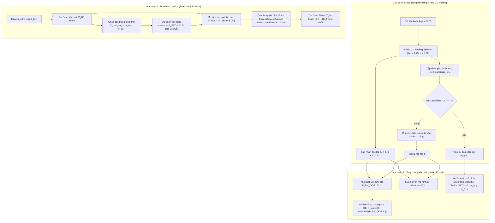

# TÀI LIỆU ĐẶC TẢ KỸ THUẬT PHIÊN BẢN v6.1: GSI-MLC-PA VỚI ENSEMBLE CLASSIFIER CHAINS (ECC) CHO TẬP PHỤ THUỘC DL

**Tài liệu tham chiếu:** `meeting_summary.md` (Mục **core**, Hướng 1 cho tập DL)  
**Nhánh Git:** `v6` (phát triển trực tiếp trên nhánh v6)  
**Tên phiên bản:** `v6.1`  
**Ngày lập đặc tả:** 02/10/2026  
**Trạng thái:** Kế hoạch kiến trúc & Đặc tả kỹ thuật (Chờ phê duyệt để thực thi)

---

## 1. Bối Cảnh và Mục Tiêu Kỹ Thuật (Motivation & Objectives)

### 1.1. Hạn chế của v6 Core với Classifier Chain (CC) đơn lẻ
Trong phiên bản `v6 Core`, tập nhãn phụ thuộc dư thừa $DL_{\text{residual}}$ được giải quyết bằng một mô hình Classifier Chain (CC) đơn lẻ với thứ tự chuỗi được sắp xếp theo tổng tương quan Phi ($\Phi$) tăng dần (*Ascending Phi-Correlation Order*). Tuy nhiên, phương pháp này gặp phải hai nút thắt lớn:
1. **Phụ thuộc vào ma trận tương quan nhãn biên (Marginal Phi Correlation):** Hệ số tương quan Phi tính trực tiếp trên ma trận nhãn $Y$ phản ánh tương quan biên $P(Y_j, Y_k)$, chứ không phản ánh chính xác tương quan điều kiện $P(Y_j, Y_k \mid X)$. Do đó, thứ tự sắp xếp chuỗi có thể không tối ưu cho mọi tập dữ liệu.
2. **Hiện tượng lan truyền sai số cố định (Fixed Error Propagation):** Với một chuỗi CC duy nhất, nếu các bộ phân loại ở đầu chuỗi đưa ra phán đoán sai, sai số này sẽ bị truyền cố định và khuếch đại về phía các nhãn cuối chuỗi. Đặc biệt trên các tập dữ liệu protein mất cân bằng cực đoan (`humanpseaac`, `plantpseaac`), hiện tượng này làm sụt giảm nghiêm trọng Macro-F1 toàn cục.
3. **Hiện tượng thoái hóa khi $DL$ chỉ còn 1 nhãn đơn lẻ:** Trên tập dữ liệu `genbase`, sau khi bóc tách 19-22 nhãn vào $IL$, tập $DL$ chỉ còn lại 1 nhãn hiếm duy nhất. Việc ép buộc đưa 1 nhãn này vào chuỗi CC đơn lẻ dẫn đến sự sụp đổ metric ($F_1 = 0.0000$) khi đánh giá cô lập, vì chuỗi độ dài 1 không có bất kỳ nút cha nào để khai thác tương quan.

### 1.2. Định Hướng Giải Pháp v6.1 từ `meeting_summary.md`
Theo biên bản cuộc họp:
- **Hướng 1 (Ưu tiên thực hiện trước - gọi là v6.1):** Thay thế CC đơn lẻ bằng **Ensemble of Classifier Chains (ECC)** cho tập phụ thuộc $DL$.
  - Không cần dùng hệ số tương quan Phi để sắp xếp chuỗi.
  - Sử dụng tập hợp $M$ chuỗi CC với các thứ tự hoán vị ngẫu nhiên (random chain orders).
  - Lấy trung bình xác suất dự đoán (probability averaging) để triệt tiêu phương sai và giảm thiểu rủi ro lan truyền sai số.
- **Quy tắc biên xử lý tập $DL$:** *"Khi tập DL chỉ còn 1 nhãn thì đưa luôn vào IL"*.
- **Tập dữ liệu huấn luyện cho tập $DL$:** $data = [X, P^{\text{OOF}}_{IL}]$, sử dụng 5-Fold Cross-Validation để huấn luyện lại bộ phân loại của ECC trên tập $DL$ nhằm đảm bảo không rò rỉ dữ liệu.
- **Báo cáo phân tầng:** Tiếp tục duy trì bảng chi tiết quá trình phân tách nhãn $IL$ qua các tầng.

---

## 2. Kiến Trúc và Thuật Toán Cốt Lõi (Core Algorithm & Architecture)

### 2.1. Sơ Đồ Quy Trình Hoạt Động (End-to-End Workflow)



---

### 2.2. Chi Tiết Thuật Toán Ensemble Classifier Chains (ECC) cho Tập $DL$

#### 1. Cấu trúc mô hình ECC trên tập $DL$:
Giả sử tập $DL$ gồm $K_{DL}$ nhãn $\{d_1, d_2, \dots, d_{K_{DL}}\}$ với $K_{DL} \ge 2$. Mô hình ECC bao gồm $M$ chuỗi phân loại thành phần:
$$\mathcal{E} = \{ \mathcal{C}_1, \mathcal{C}_2, \dots, \mathcal{C}_M \}$$
- Mỗi chuỗi $\mathcal{C}_m$ ($m = 1, \dots, M$) được gán một thứ tự nhãn ngẫu nhiên $\pi_m = (\pi_m(1), \pi_m(2), \dots, \pi_m(K_{DL}))$, là một hoán vị ngẫu nhiên của tập chỉ số $DL$.
- Tùy chọn lấy mẫu dữ liệu (subsampling / bagging): Mỗi chuỗi $\mathcal{C}_m$ có thể được huấn luyện trên toàn bộ tập dữ liệu tăng cường $X_{\text{aug}}$ hoặc một tập con bootstrap với tỷ lệ $s \in (0.0, 1.0]$ (mặc định $s = 1.0$ hoặc $s = 0.8$).

#### 2. Huấn luyện từng chuỗi $\mathcal{C}_m$:
Với chuỗi thứ $m$ có thứ tự hoán vị $\pi_m$:
- Với nhãn đầu tiên $\pi_m(1)$: Huấn luyện bộ phân loại nhị phân $h_1^{(m)}$ trên $(X_{\text{aug}}, Y[:, \pi_m(1)])$.
- Với nhãn thứ $k$ ($2 \le k \le K_{DL}$): Không gian thuộc tính được mở rộng bằng nhãn thực tế của các tiền thân trong chuỗi:
  $$X_{\text{train}}^{(m, k)} = \left[ X_{\text{aug}}, Y[:, \pi_m(1)], \dots, Y[:, \pi_m(k-1)] \right]$$
  Huấn luyện bộ phân loại nhị phân $h_k^{(m)}$ trên $(X_{\text{train}}^{(m, k)}, Y[:, \pi_m(k)])$.

#### 3. Suy diễn và Xấp xỉ trường trung bình (Mean-Field CC Inference):
Khi kiểm thử trên mẫu mới $x \in \mathbb{R}^d$ với thuộc tính tăng cường $x_{\text{aug}} = [x, \hat{p}_{IL}(x)]$:
- Đối với mỗi chuỗi $\mathcal{C}_m$, dự đoán xác suất tuần tự theo thứ tự $\pi_m$:
  - Nhãn đầu tiên: $\hat{p}_{\pi_m(1)}^{(m)} = P(h_1^{(m)} = 1 \mid x_{\text{aug}})$.
  - Nhãn thứ $k$: Đưa trực tiếp vector xác suất của các nút cha $\left[ \hat{p}_{\pi_m(1)}^{(m)}, \dots, \hat{p}_{\pi_m(k-1)}^{(m)} \right]$ vào không gian đặc trưng (Mean-Field Plug-in):
    $$x_{\text{test}}^{(m, k)} = \left[ x_{\text{aug}}, \hat{p}_{\pi_m(1)}^{(m)}, \dots, \hat{p}_{\pi_m(k-1)}^{(m)} \right]$$
    $$\hat{p}_{\pi_m(k)}^{(m)} = P(h_k^{(m)} = 1 \mid x_{\text{test}}^{(m, k)})$$
- **Tổng hợp xác suất Ensemble:**
  Xác suất cuối cùng của nhãn $j \in DL$ là giá trị trung bình cộng xác suất từ toàn bộ $M$ chuỗi:
  $$\hat{p}_j^{\text{ECC}}(x) = \frac{1}{M} \sum_{m=1}^M \hat{p}_j^{(m)}(x)$$

---

### 2.3. Quy Tắc Biên: Xử Lý Tập $DL$ Có Đúng 1 Nhãn (`len(DL) == 1`)

Sau khi kết thúc quá trình bóc tách đa tầng 5-Fold Peeling:
```python
if len(candidate_dl) == 1:
    singleton_label = candidate_dl[0]
    # Thăng hạng trực tiếp vào tập nhãn độc lập IL cuối cùng
    independent_layers.append([singleton_label])
    all_independent_labels.append(singleton_label)
    candidate_dl = []  # DL rỗng
    stopping_reason = "singleton_dl_promoted_to_il"
```
**Ý nghĩa kỹ thuật:**
- Nếu $K_{DL} = 1$, mô hình không thể hình thành chuỗi Classifier Chain nào ($M$ chuỗi ngẫu nhiên của 1 phần tử đều đồng nhất và không có đặc trưng cha).
- Đưa nhãn này vào $IL$ cho phép mô hình dự đoán nhãn đó bằng Binary Relevance (BR) trên không gian thuộc tính đầy đủ $X_{\text{aug}}$, loại trừ hoàn toàn hiện tượng suy biến $F1 = 0$ đã gặp ở `genbase`.

---

## 3. Mã Giả Thuật Toán Chi Tiết (Detailed Pseudocode)

```text
========================================================================================================
Thuật toán: GSI-MLC-PA v6.1 (5-Fold Peeling + Singleton DL Promotion + DL ECC)
========================================================================================================
ĐẦU VÀO:
  - X: Ma trận đặc trưng (N, d)
  - Y: Ma trận nhãn nhị phân (N, K)
  - BaseLearnerFactory: Hàm tạo mô hình nhị phân (Logistic, SVM, hoặc MLP)
  - tau: Ngưỡng Selective-F1 thăng hạng IL (mặc định = 0.75)
  - c: Chi phí từ chối (mặc định = 0.30)
  - n_folds: Số fold CV bóc tách (mặc định = 5)
  - max_depth: Độ sâu bóc tách tối đa (mặc định = 3)
  - n_chains: Số lượng chuỗi trong Ensemble ECC (mặc định M = 10)
  - subsample_ratio: Tỷ lệ mẫu cho từng chuỗi (mặc định = 1.0)
  - random_state: Hạt giống ngẫu nhiên

ĐẦU RA:
  - Model_v6_1: Mô hình đã huấn luyện hoàn chỉnh sẵn sàng cho suy diễn chọn lọc

QUY TRÌNH THỰC HIỆN:
  1: // BƯỚC 1: BÓC TÁCH PHÂN TẦNG VỚI 5-FOLD CV OUT-OF-FOLD
  2: {IL_layers, Candidate_DL, P_OOF_all} ← Run_5Fold_Peeling(X, Y, tau, c, n_folds, max_depth)
  3:
  4: // BƯỚC 2: QUY TẮC BIÊN SINGLETON DL
  5: IF length(Candidate_DL) == 1 THEN:
  6:     singleton_label ← Candidate_DL[0]
  7:     IL_layers.append([singleton_label])
  8:     Candidate_DL ← []  // DL rỗng hoàn toàn
  9: END IF
 10:
 11: All_IL ← Flatten(IL_layers)
 12: Residual_DL ← Candidate_DL
 13:
 14: // BƯỚC 3: HUẤN LUYỆN MÔ HÌNH BINARY RELEVANCE TRÊN TOÀN BỘ TẬP IL
 15: BR_Model ← BinaryRelevanceClassifier(base_estimator=BaseLearnerFactory())
 16: IF length(All_IL) > 0 THEN:
 17:     BR_Model.fit(X, Y[:, All_IL])
 18: END IF
 19:
 20: // BƯỚC 4: HUẤN LUYỆN MÔ HÌNH ECC TRÊN TẬP DL VỚI DATA = [X, P_OOF_IL]
 21: ECC_Model ← None
 22: IF length(Residual_DL) >= 2 THEN:
 23:     P_IL_oof ← Lấy các cột xác suất OOF thuộc All_IL từ P_OOF_all
 24:     X_aug_train ← [X, Normalize(P_IL_oof, reference=X, strategy="matching")]
 25:     
 26:     ECC_Model ← EnsembleClassifierChain(
 27:         base_estimator=BaseLearnerFactory(),
 28:         n_chains=n_chains,
 29:         subsample=subsample_ratio,
 30:         random_state=random_state
 31:     )
 32:     ECC_Model.fit(X_aug_train, Y[:, Residual_DL])
 33: END IF
 34:
 35: TRẢ VỀ Mô hình đóng băng {BR_Model, ECC_Model, All_IL, Residual_DL}
========================================================================================================

SUY DIỄN CHỌN LỌC (PREDICT VỚI CHI PHÍ c):
ĐẦU VÀO: Mẫu kiểm tra mới X_test (M, d), chi phí c = 0.30
ĐẦU RA: Y_pred_partial (M, K) với giá trị thuộc {0, 1, -1}
  1: P_final ← zeros(M, K)
  2:
  3: // 1. Dự đoán trên tập IL bằng BR
  4: IF length(All_IL) > 0 THEN:
  5:     P_IL_test ← BR_Model.predict_proba(X_test)
  6:     FOR idx, label IN enumerate(All_IL) DO:
  7:         P_final[:, label] ← P_IL_test[:, idx]
  8:     END FOR
  9: END IF
 10:
 11: // 2. Dự đoán trên tập DL bằng ECC (nếu có)
 12: IF length(Residual_DL) >= 2 THEN:
 13:     X_test_aug ← [X_test, Normalize(P_IL_test, strategy="matching")]
 14:     P_DL_test ← ECC_Model.predict_proba(X_test_aug)  // Trung bình từ M chuỗi
 15:     FOR idx, label IN enumerate(Residual_DL) DO:
 16:         P_final[:, label] ← P_DL_test[:, idx]
 17:     END FOR
 18: END IF
 19:
 20: // 3. Áp dụng cơ chế từ chối từng phần Bayes-Optimal
 21: Y_pred_partial ← full(M, K, -1)
 22: FOR j = 0 TO K - 1 DO:
 23:     FOR i = 0 TO M - 1 DO:
 24:         p ← P_final[i, j]
 25:         IF min(p, 1.0 - p) <= c THEN:
 26:             Y_pred_partial[i, j] ← 1 NẾU p >= 0.5 NGƯỢC LẠI 0
 27:         END IF
 28:     END FOR
 29: END FOR
 30: TRẢ VỀ Y_pred_partial và P_final
========================================================================================================
```

---

## 4. Thiết Kế Cấu Trúc Mã Nguồn Dự Kiến (Software Architecture Design)

1. **`src/models/ensemble_classifier_chain.py` (Mới):**
   - Lớp `EnsembleClassifierChainClassifier`:
     - Tham số: `base_estimator`, `n_chains=10`, `subsample=1.0`, `random_state=42`, `use_mean_field=True`.
     - Phương thức:
       - `fit(X, Y)`: Sinh $M$ hoán vị nhãn ngẫu nhiên, huấn luyện $M$ chuỗi `ClassifierChainClassifier`.
       - `predict_proba(X)`: Suy diễn qua từng chuỗi bằng Mean-Field Approximation, trả về ma trận trung bình xác suất kích thước $(N, K)$.
       - `predict(X)`: Dự đoán nhị phân với ngưỡng $0.5$.
2. **Cập nhật `src/selection/cv_peeling.py`:**
   - Thêm tham số `promote_singleton_dl: bool = True` vào `CVPeelingConfig`.
   - Trong hàm `select()` của `CVStratifiedPeelingSelector`: Khi kết thúc vòng lặp bóc tách, nếu `len(candidate_dl) == 1` và `promote_singleton_dl is True`, tự động chuyển nhãn đó sang $IL$, ghi nhật ký `stopping_reason = "singleton_dl_promoted_to_il"`.
3. **Cập nhật `src/models/gsi_mlc_pa.py`:**
   - Bổ sung cấu hình `dl_method: str = "ecc"` (mặc định cho v6.1) bên cạnh `"cc"`.
   - Khi `dl_method == "ecc"`, khởi tạo và huấn luyện `EnsembleClassifierChainClassifier` cho các nhãn trong `Residual_DL`.
4. **Bộ kiểm thử tự động:**
   - `tests/test_v6_1_ecc.py`: Kiểm thử độc lập:
     - Khả năng khớp và suy diễn của `EnsembleClassifierChainClassifier`.
     - Quy tắc biên `len(candidate_dl) == 1` chuyển thành công vào $IL$.
     - Khả năng tái lập kết quả qua `random_state`.
     - Đảm bảo tính tương thích với quy tắc quyết định tối ưu Bayes.
5. **Kịch bản thực nghiệm benchmark:**
   - `scripts/run_v6_1_e2e_benchmark.py`:
     - Chạy kiểm định 5-Fold Multilabel Stratified CV trên toàn bộ 10 tập dữ liệu và 3 bộ học cơ sở (Logistic, SVM, MLP).
     - So sánh trực tiếp: `BR` vs `CC` vs `GSI_v6` (CC) vs `GSI_v6.1` (ECC).
     - Xuất kết quả vào `results_v6_1/` và bảng tổng hợp.

---

## 5. Kế Hoạch Triển Khai Chi Tiết (Implementation Roadmap)

| Giai đoạn | Nhiệm vụ kỹ thuật cụ thể | Sản phẩm đầu ra | Tiêu chí nghiệm thu |
|:---|:---|:---|:---|
| **Phase 1** | Xây dựng lớp `EnsembleClassifierChainClassifier` trong `src/models/ensemble_classifier_chain.py` | Mã nguồn module ECC hoàn chỉnh | Vượt qua unit test với dữ liệu tổng hợp và kiểm tra shape đầu ra |
| **Phase 2** | Nâng cấp `CVPeelingConfig` và logic `singleton_dl_promoted_to_il` trong `src/selection/cv_peeling.py` | Cập nhật `cv_peeling.py` | Kiểm thử trên `genbase`: $K_{DL}$ khi còn 1 nhãn chuyển thành công sang $IL$ |
| **Phase 3** | Tích hợp nhánh `dl_method="ecc"` vào mô hình toàn cục `GSIMLCPartialAbstentionClassifier` | Cập nhật `gsi_mlc_pa.py` | Kiểm thử end-to-end fit/predict_partial không lỗi trên cả 3 bộ học cơ sở |
| **Phase 4** | Xây dựng bộ kiểm thử đơn vị `tests/test_v6_1_ecc.py` | Bộ test pytest tự động | 100% test cases pass, kiểm soát rò rỉ dữ liệu |
| **Phase 5** | Xây dựng kịch bản benchmark `scripts/run_v6_1_e2e_benchmark.py` | Script benchmark tự động | Chạy mượt mà, lưu checkpoint an toàn, xuất bảng Markdown/CSV |
