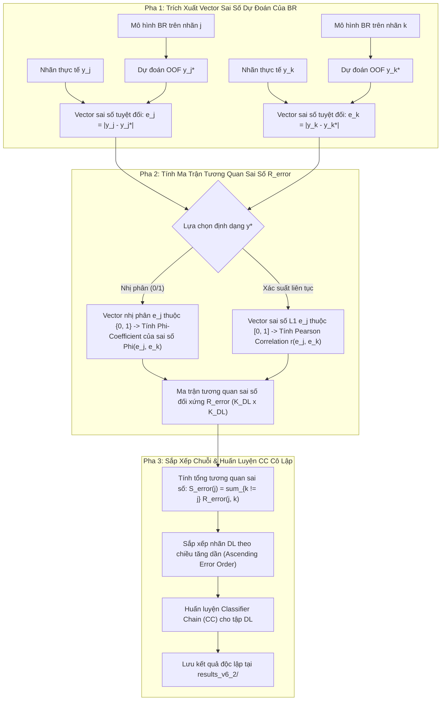

# TÀI LIỆU ĐẶC TẢ KỸ THUẬT PHIÊN BẢN v6.2: GSI-MLC-PA VỚI TƯƠNG QUAN SAI SỐ DỰ ĐOÁN BR (BR RESIDUAL / ERROR CORRELATION) CHO TẬP DL

**Tài liệu tham chiếu:** `meeting_summary.md` (Mục **core**, Hướng 2 cho tập DL)  
**Nhánh Git:** `v6` (giữ nguyên nhánh v6, thực hiện nguyên tắc cô lập cấu phần)  
**Tên phiên bản:** `v6.2`  
**Ngày lập đặc tả:** 02/10/2026  
**Trạng thái:** Kế hoạch kiến trúc & Đặc tả kỹ thuật (Chờ phê duyệt để thực thi sau khi hoàn thành v6.1)

---

## 1. Bối Cảnh và Mục Tiêu Kỹ Thuật (Motivation & Objectives)

### 1.1. Vấn Đề Của Tương Quan Biên Nhãn (Marginal Label Correlation)
Trong học máy đa nhãn truyền thống và các phiên bản CC tiền nhiệm (kể cả v5.1 và v6 Core), việc sắp xếp thứ tự chuỗi Classifier Chain dựa trên ma trận hệ số tương quan Phi ($\Phi$). Hệ số $\Phi$ được tính trực tiếp từ ma trận nhãn mặt đất $Y$:
$$\Phi(Y_j, Y_k) = \frac{P(Y_j=1, Y_k=1) - P(Y_j=1)P(Y_k=1)}{\sqrt{P(Y_j=1)(1-P(Y_j=1))P(Y_k=1)(1-P(Y_k=1))}}$$
Đây là **tương quan biên vô điều kiện (Marginal Correlation)**. Trong nhiều trường hợp, hai nhãn $Y_j$ và $Y_k$ có tương quan biên cao chỉ vì chúng cùng phụ thuộc vào một thuộc tính đầu vào chung $X$ (ví dụ: trong bài toán phân loại ảnh cảnh quan `scene`, nhãn "cây" và "núi" thường cùng xuất hiện khi ảnh có đặc trưng màu xanh lá và kết cấu gồ ghề). Khi mô hình phân loại nhị phân đã học được đặc trưng $X$, sự phụ thuộc có điều kiện $P(Y_j, Y_k \mid X)$ có thể hoàn toàn biến mất ($Y_j \perp Y_k \mid X$).

Việc sử dụng tương quan biên $\Phi$ để ép buộc chuỗi CC có thể dẫn đến **liên kết giả (Spurious Dependency)**, đưa nhiễu vào mô hình và gây ra hiện tượng *Negative Inductive Transfer*.

### 1.2. Giải Pháp Hướng 2 từ `meeting_summary.md` (v6.2)
Biên bản cuộc họp chỉ đạo:
> *"Hướng 2 cho tập DL: Tính tương quan giữa $|y_1 - y_1^*|$ với $|y_n - y_n^*|$ với $y_n^*$ là dự đoán của mô hình BR. Show bảng chi tiết quá trình tính tương quan này trong báo cáo - Thực hiện sau khi hoàn thành hướng 1, gọi là v6.2"*  
> *"Khi thực hiện hướng 2 thì không tách nhánh mới mà cô lập kết quả chạy cũng như những thành phần khác của nó để không ảnh hưởng đến hướng 1"*

#### Mục tiêu cụ thể của v6.2:
1. **Định lượng tương quan sai số dự đoán (BR Prediction Error Correlation):** Đo lường trực tiếp mức độ tương quan giữa các vector lỗi phân loại $e_j = |y_j - y_j^*|$ của mô hình Binary Relevance trên từng cặp nhãn thuộc tập $DL$.
2. **Khai thác cấu trúc phụ thuộc có điều kiện thực sự:** Nếu hai nhãn có sai số tương quan cao, điều đó chứng minh bộ phân loại độc lập đồng thời thất bại trên cả 2 nhãn, khẳng định sự tồn tại của mối quan hệ phụ thuộc mà $X$ chưa giải quyết được, cần chuỗi CC can thiệp.
3. **Sắp xếp thứ tự tối ưu cho CC trong tập $DL$:** Sắp xếp chuỗi CC dựa trên ma trận tương quan sai số (Residual Error Correlation Ordering).
4. **Báo cáo kiểm toán minh bạch:** Xuất bảng ma trận tương quan sai số chi tiết của các nhãn trong tập $DL$ trên 10 tập dữ liệu benchmark.
5. **Nguyên tắc cô lập tuyệt đối:** Toàn bộ mã nguồn, cấu hình và thư mục lưu trữ kết quả của v6.2 được tách biệt hoàn toàn (`results_v6_2/`), bảo đảm không làm biến đổi hành vi của v6.1 hay v6 Core.

---

## 2. Nền Tảng Lý Thuyết và Mô Hình Toán Học (Mathematical Foundations)



---

### 2.1. Định Nghĩa Toán Học Về Sai Số Dự Đoán Của Mô Hình BR

Cho tập dữ liệu huấn luyện $\mathcal{D} = \{(x_i, y_i)\}_{i=1}^N$ với $x_i \in \mathbb{R}^d$ và nhãn nhị phân $y_i \in \{0, 1\}^K$.  
Mô hình Binary Relevance (BR) huấn luyện $K$ bộ phân loại nhị phân độc lập $h_1, \dots, h_K$. Để tránh hiện tượng quá khớp in-sample, dự đoán $y_{i, j}^*$ được trích xuất bằng quy trình **Out-Of-Fold (OOF)** 5-Fold Cross-Validation.

Với mỗi nhãn $j \in DL$, vector sai số dự đoán trên $N$ mẫu được xác định:
$$e_j = \left[ |y_{1, j} - y_{1, j}^*|, |y_{2, j} - y_{2, j}^*|, \dots, |y_{N, j} - y_{N, j}^*| \right]^\top \in \mathbb{R}^N$$

#### Hai Biến Thể Của Vector Sai Số $e_j$:
1. **Biến thể A: Sai số phân loại nhị phân (Binary Classification Error - $e_j^{\text{bin}}$):**
   - $y_{i, j}^* = \hat{y}_{i, j} \in \{0, 1\}$ (dự đoán nhị phân sau ngưỡng $0.5$ hoặc theo luật Bayes).
   - $e_{i, j}^{\text{bin}} = \mathbb{I}(y_{i, j} \neq \hat{y}_{i, j}) \in \{0, 1\}$.
   - $e_{i, j}^{\text{bin}} = 1$ khi mô hình BR phân loại sai trên mẫu $i$, và $0$ khi đoán đúng.
   - **Thước đo tương quan:** Sử dụng hệ số tương quan Phi giữa hai biến nhị phân:
     $$\mathbf{R}_{\text{error}}^{\Phi}(j, k) = \frac{N_{11} N_{00} - N_{10} N_{01}}{\sqrt{(N_{11}+N_{10})(N_{11}+N_{01})(N_{00}+N_{10})(N_{00}+N_{01})}}$$
     trong đó $N_{ab} = \sum_{i=1}^N \mathbb{I}(e_{i, j}^{\text{bin}} = a \land e_{i, k}^{\text{bin}} = b)$.

2. **Biến thể B: Sai số phần dư xác suất liên tục (Continuous Soft Residual - $e_j^{\text{soft}}$):**
   - $y_{i, j}^* = \hat{p}_{i, j} \in [0, 1]$ (xác suất dự đoán OOF của mô hình BR).
   - $e_{i, j}^{\text{soft}} = |y_{i, j} - \hat{p}_{i, j}| \in [0, 1]$.
   - $e_{i, j}^{\text{soft}}$ phản ánh mức độ bất định hoặc độ lệch biên của phán đoán (L1 Loss Residual).
   - **Thước đo tương quan:** Sử dụng hệ số tương quan Pearson giữa hai vector thực:
     $$\mathbf{R}_{\text{error}}^{\text{Pearson}}(j, k) = \frac{\sum_{i=1}^N (e_{i, j} - \bar{e}_j)(e_{i, k} - \bar{e}_k)}{\sqrt{\sum_{i=1}^N (e_{i, j} - \bar{e}_j)^2} \sqrt{\sum_{i=1}^N (e_{i, k} - \bar{e}_k)^2}}$$

---

### 2.2. Chiến Lược Sắp Xếp Chuỗi Classifier Chains Dựa Trên Tương Quan Sai Số

Với ma trận tương quan sai số đối xứng $\mathbf{R}_{\text{error}} \in [0, 1]^{K_{DL} \times K_{DL}}$, với mỗi nhãn $j \in DL$, điểm số phụ thuộc sai số tổng hợp được tính:
$$S_{\text{error}}(j) = \sum_{k \in DL, k \neq j} |\mathbf{R}_{\text{error}}(j, k)|$$

#### Nguyên lý sắp xếp tăng dần (Ascending Error Correlation Order):
$$\pi_{DL} = \operatorname{Argsort}_{\text{ascending}}\left( S_{\text{error}}(j) \right)$$
- **Cơ sở khoa học:**
  - Nhãn có $S_{\text{error}}$ nhỏ nhất là nhãn mà các sai sót của mô hình BR độc lập ít bị ràng buộc hoặc ít lây lan sang các nhãn khác. Dự đoán của nhãn này mang tính độc lập tương đối cao trong nội bộ $DL$, do đó cần được đưa lên đầu chuỗi CC để cung cấp thông tin dự đoán ổn định.
  - Các nhãn có $S_{\text{error}}$ lớn là các nhãn có sai số phụ thuộc chằng chịt, dễ bị ảnh hưởng bởi lỗi của các nhãn khác. Chúng cần được đặt ở cuối chuỗi CC để có cơ hội nhận toàn bộ các nhãn đi trước làm đặc trưng bổ trợ nhằm nắn chỉnh sai số.

---

## 3. Thuật Toán Chi Tiết và Mã Giả (Detailed Pseudocode)

```text
========================================================================================================
Thuật toán: GSI-MLC-PA v6.2 (5-Fold Peeling + Singleton DL + BR Error Correlation Ordering CC)
========================================================================================================
ĐẦU VÀO:
  - X: Ma trận đặc trưng (N, d)
  - Y: Ma trận nhãn nhị phân (N, K)
  - BaseLearnerFactory: Hàm tạo mô hình nhị phân (Logistic, SVM, hoặc MLP)
  - tau: Ngưỡng Selective-F1 thăng hạng IL (mặc định = 0.75)
  - c: Chi phí từ chối (mặc định = 0.30)
  - n_folds: Số fold CV (mặc định = 5)
  - error_type: Loại sai số ("binary" cho |y - y_hat| hoặc "soft" cho |y - p_hat|)
  - order_direction: "ascending" (mặc định) hoặc "descending"

ĐẦU RA:
  - Model_v6_2: Mô hình CC có thứ tự chuỗi điều khiển bởi tương quan sai số BR
  - Error_Corr_Matrix: Ma trận tương quan sai số giữa các cặp nhãn trong DL
  - Execution_Order: Thứ tự chuỗi thực thi hoàn chỉnh

CÁC BƯỚC THỰC HIỆN:
  1: // BƯỚC 1: BÓC TÁCH PHÂN TẦNG 5-FOLD PEELING
  2: {IL_layers, Candidate_DL, P_OOF_all} ← Run_5Fold_Peeling(X, Y, tau, c, n_folds)
  3:
  4: // BƯỚC 2: QUY TẮC BIÊN SINGLETON DL
  5: IF length(Candidate_DL) == 1 THEN:
  6:     singleton_label ← Candidate_DL[0]
  7:     IL_layers.append([singleton_label])
  8:     Candidate_DL ← []  // DL rỗng
  9: END IF
 10:
 11: All_IL ← Flatten(IL_layers)
 12: Residual_DL ← Candidate_DL
 13:
 14: // BƯỚC 3: HUẤN LUYỆN BR TRÊN TẬP IL
 15: BR_Model ← BinaryRelevanceClassifier(base_estimator=BaseLearnerFactory())
 16: IF length(All_IL) > 0 THEN:
 17:     BR_Model.fit(X, Y[:, All_IL])
 18: END IF
 19:
 20: // BƯỚC 4: TÍNH VECTOR SAI SỐ VÀ MA TRẬN TƯƠNG QUAN SAI SỐ TRÊN TẬP DL
 21: IF length(Residual_DL) >= 2 THEN:
 22:     Error_Matrix ← zeros(N, length(Residual_DL))
 23:     
 24:     FOR idx, j IN enumerate(Residual_DL) DO:
 25:         // Lấy xác suất dự đoán OOF của nhãn j từ BR
 26:         p_oof_j ← P_OOF_all[j]
 27:         IF error_type == "binary" THEN:
 28:             y_hat_j ← (p_oof_j >= 0.5)
 29:             Error_Matrix[:, idx] ← abs(Y[:, j] - y_hat_j)
 30:         ELSE:
 31:             Error_Matrix[:, idx] ← abs(Y[:, j] - p_oof_j)
 32:         END IF
 33:     END FOR
 34:     
 35:     // Tính ma trận tương quan giữa các cột sai số
 36:     Error_Corr_Matrix ← Compute_Correlation_Matrix(Error_Matrix)
 37:     
 38:     // Sắp xếp thứ tự nhãn DL theo tổng tương quan sai số
 39:     Scores_error ← zeros(length(Residual_DL))
 40:     FOR idx = 0 TO length(Residual_DL) - 1 DO:
 41:         Scores_error[idx] ← sum(abs(Error_Corr_Matrix[idx, :])) - 1.0 // Bỏ đường chéo chính
 42:     END FOR
 43:     
 44:     IF order_direction == "ascending" THEN:
 45:         Sorted_Indices ← Argsort_Ascending(Scores_error)
 46:     ELSE:
 47:         Sorted_Indices ← Argsort_Descending(Scores_error)
 48:     END IF
 49:     Ordered_DL ← [Residual_DL[i] FOR i IN Sorted_Indices]
 50:     
 51:     // BƯỚC 5: HUẤN LUYỆN CLASSIFIER CHAIN TRÊN TẬP DL VỚI DATA = [X, P_OOF_IL]
 52:     P_IL_oof ← Lấy các cột thuộc All_IL từ P_OOF_all
 53:     X_aug_train ← [X, Normalize(P_IL_oof, reference=X, strategy="matching")]
 54:     
 55:     CC_Model ← ClassifierChainClassifier(
 56:         base_estimator=BaseLearnerFactory(),
 57:         order=Ordered_DL
 58:     )
 59:     CC_Model.fit(X_aug_train, Y)
 60: ELSE:
 61:     Ordered_DL ← []
 62:     CC_Model ← None
 63: END IF
 64:
 65: Execution_Order ← All_IL + Ordered_DL
 66: TRẢ VỀ Mô hình đóng băng {BR_Model, CC_Model, All_IL, Ordered_DL, Error_Corr_Matrix}
========================================================================================================
```

---

## 4. Thiết Kế Cô Lập Hệ Thống (Isolation Architecture)

Để tuân thủ tuyệt đối chỉ đạo: *"Khi thực hiện hướng 2 thì không tách nhánh mới mà cô lập kết quả chạy cũng như những thành phần khác của nó để không ảnh hưởng đến hướng 1"*:

```
BR_CC/
├── src/
│   ├── selection/
│   │   ├── br_residual_correlation.py    <-- [CÔ LẬP] Module tính toán tương quan sai số v6.2
│   │   └── cv_peeling.py                 <-- [CHUNG] Giữ nguyên cho v6.0 / v6.1 / v6.2
│   └── models/
│       ├── ensemble_classifier_chain.py  <-- [CỦA v6.1] Giữ nguyên, không sửa đổi khi làm v6.2
│       └── gsi_mlc_pa.py                 <-- [MỞ RỘNG CÔ LẬP] Hỗ trợ dl_method="error_corr_cc"
├── scripts/
│   ├── run_v6_1_e2e_benchmark.py         <-- [SCRIPT v6.1] Độc lập
│   └── run_v6_2_error_correlation.py     <-- [CÔ LẬP] Script benchmark chuyên biệt cho v6.2
├── tests/
│   ├── test_v6_1_ecc.py                  <-- [TEST v6.1] Độc lập
│   └── test_v6_2_residual_corr.py        <-- [CÔ LẬP] Bộ test chuyên biệt cho v6.2
└── results_v6_2/                         <-- [CÔ LẬP HOÀN TOÀN] Thư mục chứa bảng và báo cáo v6.2
    ├── error_correlation_matrices/       <-- Lưu ma trận tương quan sai số chi tiết của từng dataset
    ├── tables_comparison_v6_2.csv
    └── report_v6_2_residual_study.md
```

### Các Biện Pháp Bảo Đảm Tính Cô Lập:
1. **Cô lập không gian tên cấu hình (Config Namespace Isolation):**
   Mô hình toàn cục sử dụng cờ phân nhánh rõ ràng:
   - `dl_method="ecc"`: Kích hoạt thuật toán v6.1 (Ensemble CC).
   - `dl_method="error_corr_cc"`: Kích hoạt thuật toán v6.2 (BR Error Correlation CC).
   - Mặc định của hệ thống giữ nguyên theo cấu hình của v6.1.
2. **Cô lập dữ liệu đầu ra (Output Directory Isolation):**
   Toàn bộ bảng số liệu, file JSON checkpoints, và ma trận tương quan sai số của v6.2 được ghi trực tiếp vào `results_v6_2/`, tuyệt đối không ghi đè vào `results_v6/` hay `results_v6_1/`.
3. **Cô lập kịch bản thực thi:**
   Kịch bản chạy v6.2 có cờ độc lập, có thể chạy song song hoặc chạy sau mà không làm thay đổi các file mã nguồn dùng chung.

---

## 5. Bảng Chi Tiết Ma Trận Tương Quan Sai Số Trong Báo Cáo Kỹ Thuật

Theo yêu cầu của `meeting_summary.md`, báo cáo của v6.2 sẽ có bảng chi tiết quá trình tính tương quan sai số dự đoán BR cho các tập dữ liệu có tập $DL \ge 2$:

### 5.1. Định dạng bảng xuất ra (Mẫu minh họa trên tập `scene`):

| Nhãn $j \in DL$ | Tên / Chỉ số nhãn | Tỷ lệ lỗi BR ($\bar{e}_j$) | Nhãn có tương quan sai số cao nhất | $\max_{k \neq j} \mathbf{R}_{\text{error}}(j, k)$ | Tổng tương quan sai số $S_{\text{error}}(j)$ | Thứ tự chuỗi CC v6.2 |
|:---|:---|:---:|:---|:---:|:---:|:---:|
| Nhãn 4 | Sunset | 0.082 | Nhãn 5 (Mountain) | 0.3421 | 0.5124 | **1 (Đầu chuỗi)** |
| Nhãn 5 | Mountain | 0.114 | Nhãn 4 (Sunset) | 0.3421 | 0.5124 | **2 (Cuối chuỗi)** |

### 5.2. Các chỉ số phân tích chuyên sâu:
1. **So sánh $\mathbf{R}_{\text{error}}$ với $\Phi_{\text{label}}$:** Đánh giá mức độ sai lệch giữa ma trận tương quan nhãn biên thô và ma trận tương quan sai số thực tế.
2. **Kiểm tra mức giảm phương sai tích lũy:** Đo lường sự thay đổi của Hamming Loss và Selective Macro-F1 khi sắp xếp theo tương quan sai số so với sắp xếp tự nhiên hoặc tương quan Phi.

---

## 6. Kế Hoạch Triển Khai Chi Tiết v6.2 (Implementation Roadmap)

| Giai đoạn | Nhiệm vụ kỹ thuật cụ thể | Sản phẩm đầu ra | Tiêu chí nghiệm thu |
|:---|:---|:---|:---|
| **Phase 1** | Xây dựng module `src/selection/br_residual_correlation.py` hỗ trợ tính ma trận tương quan sai số nhị phân và liên tục | Module `br_residual_correlation.py` | Kiểm thử ma trận đối xứng, đường chéo bằng 1.0, xử lý an toàn nhãn hằng số |
| **Phase 2** | Thêm hàm sắp xếp thứ tự chuỗi `order_dl_by_residual_error()` | Hàm sắp xếp chuỗi | Đảm bảo tính tất định (deterministic tie-breaking) qua chỉ số nhãn |
| **Phase 3** | Tích hợp nhánh cô lập `dl_method="error_corr_cc"` vào `GSIMLCPartialAbstentionClassifier` | Cập nhật `gsi_mlc_pa.py` | Kiểm thử không ảnh hưởng tới kết quả của chế độ `dl_method="ecc"` (v6.1) |
| **Phase 4** | Xây dựng bộ test cô lập `tests/test_v6_2_residual_corr.py` | File test pytest độc lập | Vượt qua 100% test cases |
| **Phase 5** | Xây dựng kịch bản benchmark `scripts/run_v6_2_error_correlation.py` | Script benchmark cô lập | Xuất bảng ma trận tương quan sai số và bảng so sánh trực tiếp vào `results_v6_2/` |
