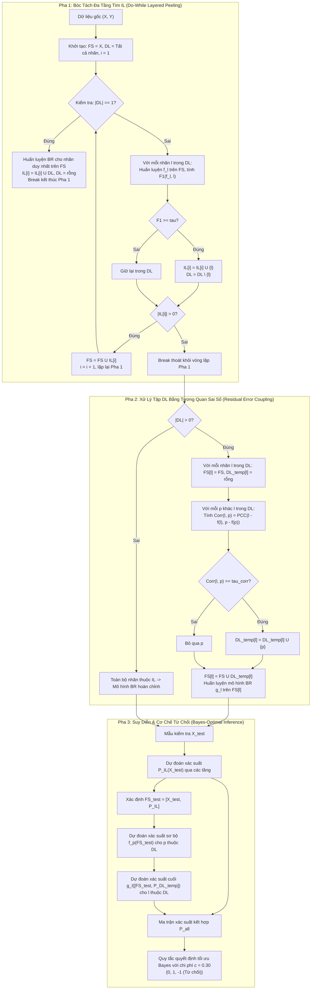

# TÀI LIỆU ĐẶC TẢ KỸ THUẬT PHIÊN BẢN v6.2: GSI-MLC-PA VỚI TƯƠNG QUAN SAI SỐ DỰ ĐOÁN BR (BR RESIDUAL ERROR CONDITIONAL DEPENDENCY) CHO TẬP DL

**Tài liệu tham chiếu:** `meeting_summary.md` (Mục **core** & **option**)  
**Nhánh Git:** `v6` (giữ nguyên nhánh v6, tuân thủ nghiêm ngặt nguyên tắc cô lập cấu phần)  
**Tên phiên bản:** `v6.2`  
**Ngày lập đặc tả:** 04/10/2026  
**Trạng thái:** Đặc tả kỹ thuật chính thức & Kế hoạch chạy thử nghiệm (Ready for Implementation)

---

## 1. Bối Cảnh và Mục Tiêu Kỹ Thuật (Motivation & Objectives)

### 1.1. Hạn Chế Của Các Phiên Bản Tiền Nhiệm
- **v5.1 & v6 Core (Single Classifier Chain):** Tập nhãn phụ thuộc $DL$ được giải quyết bằng một chuỗi CC đơn lẻ sắp xếp theo tương quan nhãn biên vô điều kiện Phi ($\Phi$). Mô hình này ép buộc tất cả các nhãn sau phải nhận tất cả các nhãn trước làm đặc trưng bổ trợ, bất kể chúng có thực sự phụ thuộc hay không (*Spurious Correlations*), dẫn đến tích lũy sai số và sụt giảm F1 nghiêm trọng trên các tập dữ liệu mất cân bằng cao.
- **v6.1 (Ensemble Classifier Chains - ECC):** Dùng tập hợp $M=10$ chuỗi CC ngẫu nhiên và lấy trung bình xác suất để giảm phương sai. Dù cải thiện độ ổn định, ECC có chi phí tính toán cao gấp $M$ lần và vẫn mang tính mù mờ (heuristic), chưa mô hình hóa tường minh đồ thị phụ thuộc giữa các nhãn trong $DL$.

### 1.2. Đột Phá Kiến Trúc Của v6.2 Từ `meeting_summary.md`
Theo biên bản chỉ đạo mới nhất tại `meeting_summary.md`:
1. **Phân tách nhãn độc lập đa tầng (Layered Independent Label Discovery - $IL$):**
   - Vòng lặp `Do { ... } while(1)` kiểm tra từng nhãn $l \in DL$ bằng mô hình BR trên không gian đặc trưng tích lũy $FS = [X, P^{\text{OOF}}_{IL}]$.
   - Nếu $F_1(f_l, l) \ge \tau$ (ngưỡng threshold, mặc định 0.75), nhãn $l$ được thăng hạng vào tầng độc lập hiện tại $IL[i]$.
   - **Quy tắc biên Singleton DL:** Khi $|DL| == 1$, nhãn duy nhất còn lại được huấn luyện ngay trên $FS$, đưa thẳng vào $IL$, và kết thúc tìm kiếm nhãn độc lập ($DL = \emptyset$).
2. **Xử lý tập $DL$ bằng BR phụ thuộc điều kiện theo tương quan sai số (Residual Error Conditional Coupling):**
   - Khi kết thúc pha bóc tách mà vẫn còn $|DL| \ge 2$:
     - Với mỗi cặp nhãn $l, p \in DL$ ($p \neq l$), tính tương quan sai số dự đoán:
       $$\text{Corr}(l, p) = \text{PCC}\Big( \big(l - f(l)\big), \big(p - f(p)\big) \Big)$$
       trong đó $f(l), f(p)$ là các bộ phân loại BR cơ sở đã học từ không gian $FS$.
     - Nếu $\text{Corr}(l, p) \ge \tau_{\text{corr}}$, bổ sung nhãn $p$ vào tập phụ thuộc cục bộ $DL\_temp[l]$.
     - Cập nhật không gian đặc trưng riêng biệt cho từng nhãn: $FS[l] = FS \cup DL\_temp[l]$.
     - Huấn luyện hàm phân lớp nhị phân BR chuyên biệt cho $l$ trên $FS[l]$.
3. **Cơ chế từ chối tối ưu Bayes (Bayes Optimal Partial Abstention):**
   - Áp dụng cơ chế từ chối với chi phí $c$ (ngưỡng từ chối $c = 0.40$) trực tiếp tại các hàm BR cho từng lớp.

---

## 2. Nền Tảng Lý Thuyết và Mô Hình Toán Học (Mathematical Foundations)



### 2.1. Bản Chất Toán Học Của Tương Quan Sai Số (Residual Error Correlation)
Cho vector nhãn thực tế $y_l \in \{0, 1\}^N$ và dự đoán xác suất ngoài mẫu (OOF) của mô hình BR cơ sở trên không gian $FS$:
$$\hat{p}_l = f_l(FS) \in [0, 1]^N$$
Vector sai số phần dư (Residual Vector) của nhãn $l$:
$$e_l = y_l - \hat{p}_l \in [-1, 1]^N \quad \text{hoặc} \quad e_l^{\text{abs}} = |y_l - \hat{p}_l| \in [0, 1]^N$$
Hệ số tương quan Pearson giữa hai vector sai số $e_l$ và $e_p$:
$$\text{Corr}(l, p) = \frac{\sum_{k=1}^N (e_{l, k} - \bar{e}_l)(e_{p, k} - \bar{e}_p)}{\sqrt{\sum_{k=1}^N (e_{l, k} - \bar{e}_l)^2} \sqrt{\sum_{k=1}^N (e_{p, k} - \bar{e}_p)^2}}$$

**Ý nghĩa xác suất:**
- Nếu $\text{Corr}(l, p) \approx 0$, sai số của bộ phân loại nhãn $l$ và $p$ độc lập tuyến tính sau khi đã biết không gian thuộc tính $FS$. Điều này chỉ ra $y_l \perp y_p \mid FS$. Việc thêm $p$ vào đặc trưng của $l$ chỉ mang lại nhiễu.
- Nếu $\text{Corr}(l, p) \ge \tau_{\text{corr}}$, tồn tại mối phụ thuộc điều kiện thực sự mà $FS$ chưa giải thích được. Do đó, việc ghép $p$ vào $FS[l]$ giúp bộ phân loại $g_l$ nắn chỉnh sai số dựa trên trạng thái của $p$.

---

## 3. Thuật Toán Chi Tiết và Mã Giả (Detailed Algorithm Pseudocode)

```text
========================================================================================================
Thuật toán: GSI-MLC-PA v6.2 (Layered CV Peeling + Residual Correlation Conditional BR)
========================================================================================================
ĐẦU VÀO:
  - X: Ma trận đặc trưng huấn luyện kích thước (N, d)
  - Y: Ma trận nhãn nhị phân kích thước (N, K)
  - BaseLearnerFactory: Hàm khởi tạo mô hình phân loại nhị phân (Logistic, SVM Calibrated, MLP)
  - tau_f1: Ngưỡng Selective-F1 thăng hạng tầng độc lập (mặc định = 0.75)
  - tau_corr: Ngưỡng tương quan sai số PCC để liên kết nhãn phụ thuộc (mặc định = 0.25)
  - c: Chi phí từ chối cho luật Bayes (mặc định = 0.30)
  - n_folds: Số fold CV bóc tách OOF (mặc định = 5)
  - max_depth: Độ sâu tối đa các tầng IL (mặc định = 3)

ĐẦU RA:
  - Model_v6_2: Mô hình phân loại đa nhãn hoàn chỉnh
  - IL_layers: Danh sách các tầng nhãn độc lập [IL_1, IL_2, ...]
  - DL_residual: Danh sách các nhãn phụ thuộc còn lại
  - Residual_Corr_Matrix: Ma trận tương quan sai số giữa các cặp nhãn trong DL
  - Dependency_Graph: Ánh xạ phụ thuộc l -> DL_temp[l] cho từng nhãn DL

CÁC BƯỚC THỰC HIỆN:

// ----------------------------------------------------------------------------------------------------
// PHA 1: BÓC TÁCH ĐA TẦNG TÌM CÁC NHÃN ĐỘC LẬP (IL)
// ----------------------------------------------------------------------------------------------------
1:  FS_features ← X
2:  DL ← {0, 1, ..., K - 1}
3:  IL_layers ← []
4:  P_OOF_accumulated ← Ma trận rỗng (N, 0)
5:  stage_idx ← 1
6:  BR_IL_models ← {}  // Lưu các mô hình BR đã huấn luyện cho từng nhãn IL

7:  DO:
8:      IL_current ← []
9:      
10:     // Kiểm tra quy tắc biên Singleton DL
11:     IF length(DL) == 1 THEN:
12:         singleton_label ← DL[0]
13:         model_single ← Train_BR(BaseLearnerFactory(), FS_features, Y[:, singleton_label])
14:         BR_IL_models[singleton_label] ← model_single
15:         IL_current.append(singleton_label)
16:         DL ← []
17:         IL_layers.append(IL_current)
18:         BREAK
19:     END IF
20:     
21:     // Đánh giá từng nhãn ứng viên trong DL bằng 5-Fold CV Out-Of-Fold
22:     P_OOF_stage ← zeros(N, length(DL))
23:     Candidate_scores ← {}
24:     FOR EACH label l IN DL DO:
25:         oof_probs_l, sel_f1_l ← Evaluate_5Fold_OOF(FS_features, Y[:, l], BaseLearnerFactory(), c)
26:         P_OOF_stage[l] ← oof_probs_l
27:         Candidate_scores[l] ← sel_f1_l
28:         IF sel_f1_l >= tau_f1 THEN:
29:             IL_current.append(l)
30:         END IF
31:     END FOR
32:     
33:     IF length(IL_current) > 0 THEN:
34:         FOR EACH label l IN IL_current DO:
35:             DL ← DL \ {l}
36:             // Huấn luyện mô hình BR hoàn chỉnh trên toàn bộ tập FS_features hiện tại
37:             BR_IL_models[l] ← Train_BR(BaseLearnerFactory(), FS_features, Y[:, l])
38:         END FOR
39:         IL_layers.append(IL_current)
40:         
41:         // Bổ sung các nhãn IL vừa tìm được vào không gian đặc trưng FS
42:         P_promoted ← P_OOF_stage[:, IL_current]
43:         FS_features ← [FS_features, Normalize_Augmented(P_promoted, reference=X)]
44:         stage_idx ← stage_idx + 1
45:         
46:         IF stage_idx > max_depth OR length(DL) == 0 THEN:
47:             BREAK
48:         END IF
49:     ELSE:
50:         // Không còn nhãn nào đạt ngưỡng độc lập ở tầng này
51:         BREAK
52:     END IF
53:  WHILE TRUE

// ----------------------------------------------------------------------------------------------------
// PHA 2: XỬ LÝ CÁC NHÃN TRONG TẬP PHỤ THUỘC DL
// ----------------------------------------------------------------------------------------------------
54:  BR_base_DL_models ← {}  // Hàm f(l) trên FS
55:  BR_cond_DL_models ← {}  // Hàm g(l) trên FS[l]
56:  DL_temp ← {}            // Bản đồ liên kết l -> [p1, p2, ...]
57:  Corr_Matrix_DL ← zeros(length(DL), length(DL))

58:  IF length(DL) > 0 THEN:
59:      // Bước 2.1: Huấn luyện bộ phân loại BR cơ sở f_l trên không gian FS và lấy dự đoán OOF
60:      P_OOF_DL ← zeros(N, length(DL))
61:      FOR EACH label l IN DL DO:
62:          model_f_l ← Train_BR(BaseLearnerFactory(), FS_features, Y[:, l])
63:          BR_base_DL_models[l] ← model_f_l
64:          oof_probs_l, _ ← Evaluate_5Fold_OOF(FS_features, Y[:, l], BaseLearnerFactory(), c)
65:          P_OOF_DL[l] ← oof_probs_l
66:      END FOR
67:      
68:      // Bước 2.2: Tính ma trận tương quan sai số dự đoán PCC(l - f(l), p - f(p))
69:      FOR EACH label l IN DL DO:
70:          e_l ← Y[:, l] - P_OOF_DL[l]
71:          DL_temp[l] ← []
72:          FOR EACH label p IN DL DO:
73:              IF p == l THEN:
74:                  Corr_Matrix_DL[l, p] ← 1.0
75:                  CONTINUE
76:              END IF
77:              e_p ← Y[:, p] - P_OOF_DL[p]
78:              corr_lp ← Absolute_Pearson_Correlation(e_l, e_p)
79:              Corr_Matrix_DL[l, p] ← corr_lp
80:              
81:              IF corr_lp >= tau_corr THEN:
82:                  DL_temp[l].append(p)
83:              END IF
84:          END FOR
85:          
86:          // Bước 2.3: Cập nhật không gian đặc trưng riêng FS[l] và huấn luyện BR g_l
87:          IF length(DL_temp[l]) > 0 THEN:
88:              P_coupled ← P_OOF_DL[:, DL_temp[l]]
89:              FS_l_train ← [FS_features, Normalize_Augmented(P_coupled, reference=X)]
90:          ELSE:
91:              FS_l_train ← FS_features
92:          END IF
93:          BR_cond_DL_models[l] ← Train_BR(BaseLearnerFactory(), FS_l_train, Y[:, l])
94:      END FOR
95:  END IF

// ----------------------------------------------------------------------------------------------------
// PHA 3: SUY DIỄN VỚI CƠ CHẾ TỪ CHỐI TỐI ƯU BAYES (PARTIAL ABSTENTION)
// ----------------------------------------------------------------------------------------------------
96:  FUNCTION Predict_Proba(X_new):
97:      P_final ← zeros(M, K)
98:      FS_current_test ← X_new
99:      
100:     // Dự đoán lần lượt qua các tầng IL
101:     FOR EACH layer IN IL_layers DO:
102:         P_layer_test ← zeros(M, length(layer))
103:         FOR idx, l IN enumerate(layer) DO:
104:             P_layer_test[:, idx] ← BR_IL_models[l].predict_proba(FS_current_test)[:, 1]
105:             P_final[:, l] ← P_layer_test[:, idx]
106:         END FOR
107:         FS_current_test ← [FS_current_test, Normalize_Augmented(P_layer_test, reference=X_new)]
108:     END FOR
109:     
110:     // Dự đoán cho tập DL
111:     IF length(DL) > 0 THEN:
112:         // Dự đoán xác suất sơ bộ từ f_p
113:         P_DL_base_test ← zeros(M, length(DL))
114:         FOR EACH p IN DL DO:
115:             P_DL_base_test[p] ← BR_base_DL_models[p].predict_proba(FS_current_test)[:, 1]
116:         END FOR
117:         
118:         // Dự đoán xác suất tinh chỉnh từ g_l trên FS[l]_test
119:         FOR EACH l IN DL DO:
120:             IF length(DL_temp[l]) > 0 THEN:
121:                 P_coupled_test ← P_DL_base_test[:, DL_temp[l]]
122:                 FS_l_test ← [FS_current_test, Normalize_Augmented(P_coupled_test, reference=X_new)]
123:                 P_final[:, l] ← BR_cond_DL_models[l].predict_proba(FS_l_test)[:, 1]
124:             ELSE:
125:                 P_final[:, l] ← P_DL_base_test[l]
126:             END IF
127:         END FOR
128:     END IF
129:     RETURN P_final
130:  END FUNCTION

131: FUNCTION Predict_Selective(X_new, cost c):
132:     P ← Predict_Proba(X_new)
133:     Y_pred ← zeros(M, K)
134:     FOR sample i = 0 TO M - 1 DO:
135:         FOR label j = 0 TO K - 1 DO:
136:             p_val ← P[i, j]
137:             IF p_val >= 1.0 - c THEN:
138:                 Y_pred[i, j] ← 1
139:             ELSE IF p_val <= c THEN:
140:                 Y_pred[i, j] ← 0
141:             ELSE:
142:                 Y_pred[i, j] ← -1  // Từ chối (Abstain)
143:             END IF
144:         END FOR
145:     END FOR
146:     RETURN Y_pred
147:  END FUNCTION
========================================================================================================
```

---

## 4. Kế Hoạch Chạy Thử Nghiệm Phần Core (Execution Plan)

### 4.1. Mục Tiêu Thử Nghiệm
1. **Kiểm chứng tính đúng đắn toán học của thuật toán Core:**
   - Đảm bảo vòng lặp `Do...While(1)` phân tách nhãn hoạt động chính xác, không rò rỉ dữ liệu qua các tầng.
   - Kiểm tra quy tắc biên Singleton DL: Khi $|DL| == 1$, nhãn duy nhất được đưa thẳng vào $IL$ và dừng thuật toán sạch sẽ (ngăn chặn sụp đổ $F_1 = 0$ trên `genbase`).
   - Đảm bảo tính toán ma trận tương quan sai số $\text{Corr}(l, p) = \text{PCC}(l - f(l), p - f(p))$ đối xứng, an toàn trước phương sai 0 (zero variance).
2. **Đo đạc và đánh giá hiệu năng đối sánh:**
   - So sánh trực tiếp `GSI_v6_2` với:
     - `BR` (Binary Relevance độc lập)
     - `CC` (Classifier Chains)
     - `ECC` (Ensemble Classifier Chains - v6.1)
     - `GSI_v6` (5-Fold Peeling + Single CC)
3. **Phân tích độ thưa của đồ thị phụ thuộc điều kiện:**
   - Khảo sát số lượng nhãn được ghép vào $DL\_temp[l]$ theo các ngưỡng tương quan $\tau_{\text{corr}} \in \{0.20, 0.25, 0.30, 0.40\}$.

### 4.2. Bộ Dữ Liệu Benchmark và Phân Kỳ Thử Nghiệm
Hệ thống sẽ chạy trên toàn bộ 10 tập dữ liệu đa nhãn chuẩn thuộc nhiều lĩnh vực:
- **Audio / Media:** `emotions` (6 nhãn), `music` (6 nhãn)
- **Hình ảnh:** `scene` (6 nhãn)
- **Y sinh / Hóa sinh:** `chd49` (49 nhãn), `genbase` (27 nhãn), `yeast` (14 nhãn)
- **Protein PseAAC:** `gpositivepseaac` (4 nhãn), `humanpseaac` (14 nhãn), `plantpseaac` (12 nhãn), `viruspseaac` (6 nhãn)

#### Lộ Trình Triển Khai Thử Nghiệm:
- **Giai đoạn 1 (Smoke Test & Unit Validation):**
  - Chạy kiểm thử tự động trên dữ liệu synthetic và tập dữ liệu nhỏ (`emotions`, `scene`, `genbase`).
  - Xác thực 100% test cases của bộ kiểm thử cô lập `tests/test_v6_2_core.py`.
- **Giai đoạn 2 (Benchmark Full 10 Datasets trên Base Learner Logistic Regression):**
  - Chạy kịch bản `scripts/run_v6_2_experiment.py` với cấu hình chuẩn ($\tau_{\text{f1}} = 0.75$, $\tau_{\text{corr}} = 0.25$, $c = 0.30$, 5-Fold CV).
  - Thu thập ma trận tương quan sai số chi tiết và bảng số liệu phân tầng.
- **Giai đoạn 3 (Mở rộng Base Learner SVM Calibrated & MLP):**
  - Đánh giá khả năng khái quát hóa của `GSI_v6_2` qua các họ mô hình cơ sở phi tuyến và biên lớn.
- **Giai đoạn 4 (Phân Tích Nghiên Cứu Mở Rộng - Option Study):**
  - Thử nghiệm cơ chế giảm ngưỡng $\tau_{\text{f1}}$ qua các tầng (`decaying_threshold`: 0.80 -> 0.75 -> 0.70).
  - Tổng hợp bảng so sánh đối chuẩn quốc tế với các bài báo công bố BR, CC, ECC.

---

## 5. Thiết Kế Cô Lập Hệ Thống (Isolation Architecture)

Để đảm bảo nguyên tắc: *"Khi thực hiện hướng 2 thì không tách nhánh mới mà cô lập kết quả chạy cũng như những thành phần khác của nó để không ảnh hưởng đến hướng 1"*:

```
BR_CC/
├── src/
│   ├── selection/
│   │   ├── br_residual_correlation.py     <-- [CÔ LẬP] Module tính ma trận tương quan sai số PCC
│   │   └── cv_peeling.py                  <-- [CHUNG] Giữ nguyên cho v6.0 / v6.1 / v6.2
│   └── models/
│       ├── ensemble_classifier_chain.py   <-- [CỦA v6.1] Giữ nguyên
│       ├── gsi_v6_1.py                    <-- [CỦA v6.1] Giữ nguyên
│       └── gsi_v6_2.py                    <-- [CÔ LẬP MỚI] Lớp GSIMLCPAv6_2Classifier chuẩn Core
├── scripts/
│   ├── run_v6_1_e2e_benchmark.py          <-- [v6.1] Giữ nguyên
│   └── run_v6_2_experiment.py             <-- [CÔ LẬP MỚI] Script benchmark độc lập v6.2
├── tests/
│   ├── test_v6_1_ecc.py                   <-- [v6.1] Giữ nguyên
│   └── test_v6_2_core.py                  <-- [CÔ LẬP MỚI] Bộ test độc lập v6.2
└── results_v6_2/                          <-- [CÔ LẬP HOÀN TOÀN] Thư mục kết quả độc lập
    ├── residual_correlation_matrices/     <-- Bảng chi tiết ma trận PCC(l - f(l), p - f(p))
    ├── table_v6_2_benchmark.csv           <-- Bảng đối sánh metric 10 datasets
    ├── table_il_peeling_breakdown.md      <-- Bảng phân tách nhãn IL qua các tầng
    └── v6_2_core_report.md                <-- Báo cáo khoa học tổng hợp
```

---

## 6. Định Dạng Báo Cáo Kiểm Toán Ma Trận Tương Quan Sai Số

Theo yêu cầu trực tiếp từ `meeting_summary.md`, báo cáo kỹ thuật sẽ xuất bảng kiểm toán ma trận tương quan sai số chi tiết cho từng tập dữ liệu có $|DL| \ge 2$:

### 6.1. Bảng Chi Tiết Liên Kết Phụ Thuộc Cục Bộ (Minh họa trên tập `scene`):
| Nhãn $l \in DL$ | Tên nhãn | Tỷ lệ lỗi BR ($\bar{e}_l$) | Nhãn có tương quan sai số cao nhất | $\max_{p \neq l} \text{Corr}(l, p)$ | Tập liên kết $DL\_temp[l]$ ($\tau_{\text{corr}} \ge 0.25$) | Kích thước $FS[l]$ |
|:---|:---|:---:|:---|:---:|:---|:---:|
| Nhãn 4 | Sunset | 0.082 | Nhãn 5 (Mountain) | 0.3421 | {Nhãn 5} | $d + |IL| + 1$ |
| Nhãn 5 | Mountain | 0.114 | Nhãn 4 (Sunset) | 0.3421 | {Nhãn 4} | $d + |IL| + 1$ |

### 6.2. Các Chỉ Số Đánh Giá Toàn Diện:
- **Selective Macro-F1 & Selective Micro-F1:** Đánh giá chất lượng phân loại trên các mẫu được chấp nhận quyết định.
- **Coverage (Tỷ lệ bao phủ):** Tỷ lệ quyết định không bị từ chối ($\text{Coverage} = \frac{N_{\text{decided}}}{N \times K}$).
- **Full Macro-F1 & Full Micro-F1:** Đánh giá không từ chối (quy tắc ngưỡng 0.5 truyền thống).
- **Hamming Loss & Zero-One Loss:** Đánh giá mức độ chính xác tổng thể trên toàn bộ không gian nhãn.
- **Thời gian huấn luyện và suy diễn (Training/Inference Time):** Chứng minh tính vượt trội về chi phí tính toán so với ECC ($M=10$ chuỗi).
