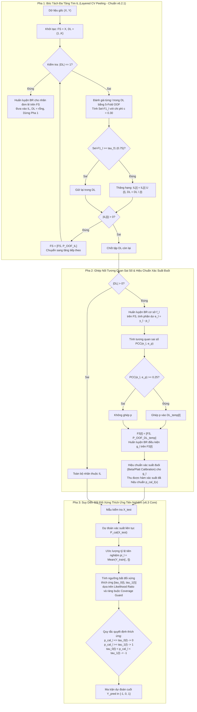

# TÀI LIỆU ĐẶC TẢ KỸ THUẬT PHIÊN BẢN v6.3: GSI-MLC-PA VỚI CƠ CHẾ XÁC NHẬN BẤT ĐỐI XỨNG THEO TIÊN NGHIỆM VÀ TỪ CHỐI THÍCH ỨNG DƯỚI MẤT CÂN BẰNG NHÃN CỰC ĐOAN TRONG TẬP DL

**Tên dự án:** GSI-MLC-PA (Grouping & Selective Inference for Multi-Label Classification with Partial Abstention)  
**Nhánh Git:** `v6` (giữ nguyên nhánh v6, tuân thủ nghiêm ngặt nguyên tắc cô lập cấu phần)  
**Tên phiên bản:** `v6.3` (Kế thừa nền tảng v6.2.1, mở rộng suy diễn bất đối xứng & hiệu chuẩn mất cân bằng)  
**Tập tin đặc tả:** `spec/spec_v6_3.md`  
**Ngày lập đặc tả:** 07/10/2026  
**Trạng thái:** Đặc tả kỹ thuật chính thức (Ready for Implementation)  

---

## 1. Bối Cảnh, Phản Biện Kỹ Thuật và Động Lực Phát Triển (Motivation & Critical Analysis)

### 1.1. Thực Trạng và Điểm Nghẽn Của v6.2.1 Trên Các Tập Dữ Liệu Lệch Pha Nặng
Trong phiên bản tiền nhiệm (v6.2.1), mô hình đã hoàn thiện:
1. Cơ chế bóc tách đa tầng Out-Of-Fold ($IL$) để tách các nhãn học tốt.
2. Ghép nối điều kiện tập $DL$ dựa trên tương quan sai số phần dư chuẩn hóa ($\tau_{\text{corr}} = 0.25$).
3. Cơ chế từ chối tối ưu Bayes đối xứng theo quy tắc Chow ($c = 0.30$):
   $$\hat{Y}_{ij} = \begin{cases} 1 & \text{nếu } P(Y_{ij} = 1 \mid X) \ge 1 - c = 0.70 \\ 0 & \text{nếu } P(Y_{ij} = 1 \mid X) \le c = 0.30 \\ -1 \text{ (Từ chối)} & \text{nếu } 0.30 < P(Y_{ij} = 1 \mid X) < 0.70 \end{cases}$$

Tuy nhiên, khi đối mặt với các tập dữ liệu có **tỷ lệ nhãn dương cực hiếm** (như `humanpseaac`, `plantpseaac`, `viruspseaac` với độ phổ biến $\pi_l = P(Y_l = 1) \in [0.01, 0.08]$):
- Hầu hết các nhãn hiếm này đều bị dồn vào tập phụ thuộc $DL$ do không vượt qua được $\tau_{\text{f1}} = 0.75$.
- Với phân phối tiên nghiệm $\pi_l \approx 0.03$, xác suất dự đoán hậu nghiệm $\hat{p}_l(X)$ từ các mô hình học cơ sở (Logistic, SVM, MLP) hầu như **không bao giờ vượt qua ngưỡng 0.70**, dẫn đến:
  - **Độ thu hồi (Recall) của nhãn dương sụp đổ về 0** (mô hình không dám đoán nhãn 1 bao giờ).
  - Hoặc **vùng từ chối đối xứng ($[0.30, 0.70]$) nuốt chửng toàn bộ các mẫu nhãn dương**, làm cho các mẫu thực sự có nhãn 1 đều bị đánh dấu là $-1$.
  - Ở phía ngược lại, vì $\hat{p}_l(X) \le 0.30$ xảy ra trên phần lớn mẫu, mô hình thiên vị áp đảo việc gán nhãn 0 (*trivial all-zero predictor*), làm sụt giảm nghiêm trọng Macro-Precision và Macro-F1 trên các nhãn hiếm.

---

### 1.2. Phân Tích & Phản Biện Ý Tưởng "Xác Nhận Phủ Định Nhãn 0" (Critical Devil's Advocate)

#### Ý tưởng đề xuất ban đầu:
> *"Vì nhãn trong tập DL rất mất cân bằng (rất nhiều 0), ta chuyển sang chỉ học để nhận biết có thể gán nhãn $y = 0$ hay không: nếu xác suất 0 đủ cao thì dự đoán 0; nếu xác suất 0 đủ thấp thì là 1; nếu nằm trong khoảng lưỡng lự thì từ chối."*

#### Ưu điểm tự nhiên:
- Nhãn 0 chiếm $> 92\% - 99\%$ dữ liệu, cung cấp không gian mẫu âm khổng lồ, giúp bộ phân loại học được biên bao phủ của lớp âm ổn định, giảm phương sai ước lượng.

#### 4 Nhược điểm & Rủi ro Kỹ thuật Tiềm ẩn (Critiques & Failure Modes):

1. **Rủi ro bùng nổ Dương tính Giả (False Positive Explosion) & Sụp đổ Macro-Precision:**
   - Việc nói *"xác suất nhãn 0 đủ thấp thì gán nhãn 1"* tương đương với $\hat{P}(Y=1 \mid X) = 1 - \hat{P}(Y=0 \mid X) \ge \tau_{\text{low}}$.
   - Nếu chọn $\tau_{\text{low}}$ ngây thơ (ví dụ $\hat{P}(Y=0) \le 0.60 \implies \hat{P}(Y=1) \ge 0.40$), thì với nhãn có tỷ lệ thực tế $2\%$, một mẫu có xác suất $0.40$ vẫn có đến $60\%$ khả năng là âm tính giả!
   - Kết quả: Dự đoán tràn lan nhãn 1, gây ra False Positives trên diện rộng, kéo tụt điểm Precision từ $0.80$ xuống $0.15$.

2. **Lệch chuẩn hiệu chuẩn xác suất ở vùng đuôi (Tail Probability Miscalibration):**
   - Các bộ phân loại tiêu chuẩn (Logistic Regression không phạt trọng số, Linear SVM với Platt scaling) ước lượng xác suất cực kỳ kém chính xác ở các vùng biên xác suất ($p \to 0$ và $p \to 1$).
   - Sự méo mó xác suất khiến cho việc đặt ngưỡng tĩnh $\tau_0$ và $\tau_1$ hoàn toàn bị chệch hướng trên các tập dữ liệu khác nhau.

3. **Sụp đổ độ phủ trên nhãn hiếm (Severe Rare-Class Coverage Drop):**
   - Nếu khoảng từ chối $[\tau_1, \tau_0]$ được thiết lập quá rộng hoặc không tính đến tiên nghiệm, toàn bộ các quan sát mang nhãn dương ít ỏi có thể rơi trọn vào khoảng từ chối. Mặc dù Selective-F1 trên số ít mẫu còn lại có vẻ cao trên lý thuyết, nhưng **độ phủ (Coverage)** thực tế cho các sự kiện quan trọng lại bằng $0\%$.

4. **Khuếch đại sai số liên đới trong Pha 2 (Cascading Error in Feature Space):**
   - Nếu mô hình sử dụng nhãn dự đoán rời rạc $\{0, 1, -1\}$ của một nhãn $p \in DL$ để nạp vào đặc trưng của nhãn $l \in DL$ ($FS[l]$), sai số phân loại hoặc trạng thái từ chối $-1$ sẽ trở thành nguồn nhiễu nghiêm trọng, phá vỡ tính liên tục của không gian đặc trưng.

---

### 1.3. Giải Pháp Toàn Diện Được Chuẩn Hóa Cho v6.3

Để khắc phục triệt để 4 hạn chế trên, kiến trúc **GSI-MLC-PA v6.3** đề xuất hệ thống giải pháp 4 trụ cột:

| Hạn chế / Rủi ro | Giải pháp kỹ thuật chuẩn hóa trong v6.3 |
|:---|:---|
| **1. Bùng nổ False Positive** | **Quy tắc Quyết định Tỷ số Hợp lý Bayes (Bayes Likelihood Ratio - LR):** Ngưỡng phân loại thích ứng trực tiếp theo phân phối tiên nghiệm $\pi_l$ của từng nhãn thay vì dùng một ngưỡng toàn cục cố định. |
| **2. Sai lệch xác suất vùng đuôi** | **Hiệu chuẩn Xác suất Đuôi Chuyên biệt (Tail-Calibrated Probabilities):** Áp dụng Beta Calibration hoặc Weighted Platt Scaling trên OOF residuals của tập $DL$. |
| **3. Sụp đổ độ phủ nhãn hiếm** | **Ràng buộc Độ phủ Tối thiểu (Coverage-Constrained Abstention Guard):** Giới hạn độ rộng dải từ chối $\Delta \tau_l = \tau_1(l) - \tau_0(l)$ sao cho độ phủ từng nhãn $\text{Coverage}_l \ge \gamma_{\min}$ (mặc định $\ge 0.70$). |
| **4. Khuếch đại sai số Pha 2** | **Nguyên tắc Cách ly Tuyệt đối Không gian Đặc trưng (Feature Purity Invariance):** Các nhãn trong $DL$ chỉ trao đổi **xác suất liên tục đã hiệu chuẩn** ($P^{\text{OOF}} \in [0, 1]$), tuyệt đối KHÔNG chuyển nhãn rời rạc hay giá trị từ chối $-1$ vào đặc trưng huấn luyện. |

---

## 2. Nền Tảng Lý Thuyết và Mô Hình Toán Học (Mathematical Foundations)

### 2.1. Sơ Đồ Kiến Trúc Hệ Thống v6.3



---

### 2.2. Mô Hình Toán Học Của Cơ Chế Suy Diễn Bất Đối Xứng Thích Ứng

#### 1. Định nghĩa Tiên nghiệm và Độ lệch Mất cân bằng:
Với mỗi nhãn $l \in \{1, \dots, K\}$, tỷ lệ mẫu dương trên tập huấn luyện là:
$$\pi_l = P(Y_l = 1) = \frac{1}{N} \sum_{i=1}^N Y_{il}, \quad \text{với } \pi_l \in (0, 1)$$

Khi $\pi_l \ll 0.5$ (mất cân bằng nặng), tỷ số odd tiên nghiệm là $O_l = \frac{\pi_l}{1 - \pi_l} \ll 1$.

#### 2. Tỷ Số Hợp Lý Bayes (Bayes Likelihood Ratio) và Ngưỡng Tự Nhiên:
Theo định lý Bayes, xác suất hậu nghiệm liên hệ với tỷ số hợp lý $\Lambda_l(X) = \frac{P(X \mid Y_l = 1)}{P(X \mid Y_l = 0)}$ qua công thức:
$$\frac{P(Y_l = 1 \mid X)}{P(Y_l = 0 \mid X)} = \Lambda_l(X) \cdot \frac{\pi_l}{1 - \pi_l}$$

Đặt $p_l(X) = P(Y_l = 1 \mid X)$. Một mẫu được xem là mang bằng chứng vượt trội ủng hộ nhãn 1 khi tỷ số hợp lý $\Lambda_l(X) \ge k_1 > 1$, và ủng hộ nhãn 0 khi $\Lambda_l(X) \le k_0 < 1$.

Quy đổi về không gian xác suất hậu nghiệm $p_l(X)$:
- **Ngưỡng dự đoán nhãn 1 ($\tau_1(l)$):**
  $$\tau_1(l) = \frac{k_1 \pi_l}{1 - \pi_l + k_1 \pi_l} \approx k_1 \pi_l \quad (\text{khi } \pi_l \ll 1)$$
- **Ngưỡng dự đoán nhãn 0 ($\tau_0(l)$):**
  $$\tau_0(l) = \frac{k_0 \pi_l}{1 - \pi_l + k_0 \pi_l} \approx k_0 \pi_l \quad (\text{khi } \pi_l \ll 1)$$

Trong đó $0 < k_0 < 1 < k_1$.

#### 3. Công Thức Xác Định Ngưỡng Thích Ứng Bất Đối Xứng Trong v6.3:
Để tích hợp mượt mà với tham số chi phí từ chối $c \in (0, 0.5)$ của quy tắc Chow và điều chỉnh theo mức độ mất cân bằng $\pi_l$, v6.3 chuẩn hóa ngưỡng suy diễn cho từng nhãn $l$ như sau:

$$\tau_0(l) = \min\left( c, \; \pi_l \cdot (1 - c) \right)$$
$$\tau_1(l) = \max\left( 1 - c, \; \min\left( 0.95, \; \pi_l + (1 - c) \cdot (1 - \pi_l) \right) \right)$$

*Trường hợp đặc biệt:*
- Khi dữ liệu cân bằng ($\pi_l = 0.5$):
  $$\tau_0(l) = c, \quad \tau_1(l) = 1 - c \quad \implies \text{Trở về quy tắc Chow đối xứng chuẩn của v6.2.1!}$$
- Khi dữ liệu cực kỳ mất cân bằng ($\pi_l = 0.02, c = 0.30$):
  - $\tau_0(l) = \min(0.30, 0.02 \times 0.70) = 0.014$.
  - Mẫu chỉ được kết luận là nhãn 0 khi xác suất dương tính $\le 1.4\%$ (tức độ chắc chắn âm tính $> 98.6\%$).
  - Ngưỡng dự đoán nhãn 1 hạ xuống phù hợp với mật độ thực tế thay vì đòi hỏi $> 70\%$.

#### 4. Cơ Chế Bảo Vệ Độ Phủ Tối Thiểu (Coverage Guard):
Nhằm ngăn chặn hiện tượng dải từ chối quá rộng làm mất mát toàn bộ dữ liệu dự đoán của nhãn hiếm:
$$\Delta \tau_l = \tau_1(l) - \tau_0(l)$$
Nếu khoảng từ chối $[\tau_0(l), \tau_1(l)]$ dẫn đến độ phủ trên tập kiểm định $\text{Coverage}_l < \gamma_{\min}$ (mặc định $\gamma_{\min} = 0.70$), hệ thống sẽ tự động thu hẹp đối xứng dải từ chối xung quanh điểm phân vị tương ứng:
$$\tau_0^*(l) = \tau_0(l) + \delta_l, \quad \tau_1^*(l) = \tau_1(l) - \delta_l$$
đảm bảo ít nhất $70\%$ các quyết định được đưa ra rõ ràng.

---

### 2.3. Hiệu Chuẩn Xác Suất Đuôi (Tail Probability Calibration)

Vì Logistic Regression chuẩn có thể cho xác suất bị nén quá mức ở gần 0 khi áp dụng phạt $L_2$, v6.3 trang bị thêm bước hiệu chuẩn hậu nghiệm trên tập xác suất OOF của Pha 2:
1. **Weighted Platt Scaling (Sigmoid có bù tỷ lệ lớp):**
   $$P_{\text{cal}}(Y_l = 1 \mid X) = \frac{1}{1 + \exp(A_l \cdot f(X) + B_l)}$$
   với hàm mất mát log-loss được gán trọng số lớp $w_1 = \frac{1 - \pi_l}{\pi_l}, w_0 = 1$.
2. **Beta Calibration:**
   Đặc biệt hiệu quả cho phân phối xác suất bị lệch mạnh về một phía biên.

---

## 3. Thuật Toán Chi Tiết và Mã Giả (Detailed Algorithm Pseudocode)

```text
========================================================================================================
Thuật toán: GSI-MLC-PA v6.3 (Prior-Calibrated Asymmetric Negative Verification & Selective Inference)
========================================================================================================
ĐẦU VÀO:
  - X: Ma trận đặc trưng huấn luyện kích thước (N, d)
  - Y: Ma trận nhãn nhị phân kích thước (N, K)
  - BaseLearnerFactory: Hàm khởi tạo mô hình cơ sở (Logistic, SVM Calibrated, MLP)
  - tau_f1: Ngưỡng F1 thăng hạng tầng độc lập IL (mặc định = 0.75)
  - tau_corr: Ngưỡng tương quan sai số PCC cho tập DL (mặc định = 0.25 theo chuẩn v6.2.1)
  - cost_c: Chi phí từ chối cơ sở (mặc định = 0.30)
  - gamma_min: Độ phủ tối thiểu bảo vệ cho mỗi nhãn (mặc định = 0.70)
  - n_folds: Số fold CV bóc tách OOF (mặc định = 5)
  - max_depth: Độ sâu tối đa các tầng IL (mặc định = 3)

ĐẦU RA:
  - Model_v6_3: Mô hình phân loại đa nhãn hoàn chỉnh
  - Adaptive_Thresholds: Bảng ngưỡng [tau_0(l), tau_1(l)] cho từng nhãn l in {1..K}
  - Calibrators: Tập các bộ hiệu chuẩn xác suất cho từng nhãn

CÁC BƯỚC THỰC HIỆN:

// ----------------------------------------------------------------------------------------------------
// PHA 1: BÓC TÁCH ĐA TẦNG TÌM IL (Kế thừa hoàn toàn từ chuẩn v6.2.1)
// ----------------------------------------------------------------------------------------------------
1:  FS_features ← X
2:  DL ← {0, 1, ..., K - 1}
3:  IL_layers ← []
4:  BR_IL_models ← {}
5:  stage_idx ← 1

6:  DO:
7:      IL_current ← []
8:      IF length(DL) == 1 THEN:
9:          singleton_label ← DL[0]
10:         BR_IL_models[singleton_label] ← Train_BR(BaseLearnerFactory(), FS_features, Y[:, singleton_label])
11:         IL_layers.append([singleton_label])
12:         DL ← []
13:         BREAK
14:     END IF
15:     
16:     P_OOF_stage ← zeros(N, length(DL))
17:     FOR EACH label l IN DL DO:
18:         oof_probs_l, sel_f1_l ← Evaluate_5Fold_OOF(FS_features, Y[:, l], BaseLearnerFactory(), cost_c)
19:         P_OOF_stage[l] ← oof_probs_l
20:         IF sel_f1_l >= tau_f1 THEN:
21:             IL_current.append(l)
22:         END IF
23:     END FOR
24:     
25:     IF length(IL_current) > 0 THEN:
26:         FOR EACH label l IN IL_current DO:
27:             DL ← DL \ {l}
28:             BR_IL_models[l] ← Train_BR(BaseLearnerFactory(), FS_features, Y[:, l])
29:         END FOR
30:         IL_layers.append(IL_current)
31:         P_promoted ← P_OOF_stage[:, IL_current]
32:         FS_features ← [FS_features, Normalize_Augmented(P_promoted, reference=X)]
33:         stage_idx ← stage_idx + 1
34:         IF stage_idx > max_depth OR length(DL) == 0 THEN BREAK
35:     ELSE:
36:         BREAK
37:     END IF
38: WHILE TRUE

// ----------------------------------------------------------------------------------------------------
// PHA 2: GHÉP NỐI TƯƠNG QUAN SAI SỐ & HIỆU CHUẨN XÁC SUẤT ĐUÔI CHO DL
// ----------------------------------------------------------------------------------------------------
39: BR_base_DL_models ← {}
40: BR_cond_DL_models ← {}
41: DL_temp ← {}
42: Calibrators_DL ← {}
43: P_OOF_DL_final ← zeros(N, length(DL))

44: IF length(DL) > 0 THEN:
45:     // Bước 2.1: Huấn luyện mô hình cơ sở f_l và lấy phần dư OOF
46:     P_OOF_DL_base ← zeros(N, length(DL))
47:     FOR EACH label l IN DL DO:
48:         BR_base_DL_models[l] ← Train_BR(BaseLearnerFactory(), FS_features, Y[:, l])
49:         oof_p, _ ← Evaluate_5Fold_OOF(FS_features, Y[:, l], BaseLearnerFactory(), cost_c)
50:         P_OOF_DL_base[l] ← oof_p
51:     END FOR
52:     
53:     // Bước 2.2: Lập đồ thị phụ thuộc sai số phần dư với tau_corr = 0.25
54:     FOR EACH label l IN DL DO:
55:         e_l ← Y[:, l] - P_OOF_DL_base[l]
56:         DL_temp[l] ← []
57:         FOR EACH label p IN DL DO:
58:             IF p != l THEN:
59:                 e_p ← Y[:, p] - P_OOF_DL_base[p]
60:                 IF Absolute_Pearson_Correlation(e_l, e_p) >= tau_corr THEN:
61:                     DL_temp[l].append(p)
62:                 END IF
63:             END IF
64:         END FOR
65:         
66:         // Bước 2.3: Huấn luyện BR điều kiện g_l trên không gian mở rộng
67:         IF length(DL_temp[l]) > 0 THEN:
68:             P_coupled ← P_OOF_DL_base[:, DL_temp[l]]
69:             FS_l ← [FS_features, Normalize_Augmented(P_coupled, reference=X)]
70:         ELSE:
71:             FS_l ← FS_features
72:         END IF
73:         BR_cond_DL_models[l] ← Train_BR(BaseLearnerFactory(), FS_l, Y[:, l])
74:         
75:         // Lấy dự đoán OOF điều kiện để hiệu chuẩn đuôi
76:         oof_cond_l, _ ← Evaluate_5Fold_OOF(FS_l, Y[:, l], BaseLearnerFactory(), cost_c)
77:         
78:         // Bước 2.4: Huấn luyện bộ hiệu chuẩn xác suất (Calibrator)
79:         calibrator_l ← Fit_Tail_Calibrator(oof_cond_l, Y[:, l], method="weighted_platt")
80:         Calibrators_DL[l] ← calibrator_l
81:         P_OOF_DL_final[l] ← calibrator_l.predict(oof_cond_l)
82:     END FOR
83: END IF

// ----------------------------------------------------------------------------------------------------
// PHA 3: TÍNH TOÁN NGƯỠNG BẤT ĐỐI XỨNG THÍCH ỨNG THEO TIÊN NGHIỆM
// ----------------------------------------------------------------------------------------------------
84: Thresholds_Table ← {}
85: FOR label j = 0 TO K - 1 DO:
86:     pi_j ← Mean(Y[:, j])  // Tỷ lệ tiên nghiệm nhãn dương
87:     
88:     // Tính ngưỡng cơ sở bất đối xứng
89:     raw_tau_0 ← min(cost_c, pi_j * (1.0 - cost_c) / (pi_j * (1.0 - cost_c) + (1.0 - pi_j) * cost_c + 1e-9))
90:     raw_tau_1 ← max(1.0 - cost_c, pi_j * (1.0 - cost_c) / (pi_j * (1.0 - cost_c) + (1.0 - pi_j) * (1.0 - cost_c) + 1e-9))
91:     
92:     // Đảm bảo trật tự hợp lý: 0.01 <= tau_0 < tau_1 <= 0.99
93:     tau_0 ← clip(raw_tau_0, 0.01, 0.45)
94:     tau_1 ← clip(raw_tau_1, 0.55, 0.95)
95:     
96:     // Kiểm tra và áp dụng Coverage Guard trên OOF
97:     probs_val ← (j IN IL_layers) ? P_OOF_IL[:, j] : P_OOF_DL_final[j]
98:     decided_ratio ← Mean((probs_val <= tau_0) OR (probs_val >= tau_1))
99:     IF decided_ratio < gamma_min THEN:
100:        // Điều chỉnh thu hẹp dải từ chối để bảo toàn độ phủ tối thiểu
101:        tau_0, tau_1 ← Adjust_Thresholds_For_Coverage(probs_val, gamma_min, pi_j)
102:    END IF
103:    
104:    Thresholds_Table[j] ← {tau_0: tau_0, tau_1: tau_1, prior: pi_j}
105: END FOR

// ----------------------------------------------------------------------------------------------------
// PHA 4: HÀM SUY DIỄN DỰ ĐOÁN (INFERENCE WITH ASYMMETRIC ABSTENTION)
// ----------------------------------------------------------------------------------------------------
106: FUNCTION Predict_Selective(X_new):
107:    P_continuous ← Predict_Proba_Calibrated(X_new)  // Kích thước (M, K)
108:    Y_pred ← zeros(M, K)
109:    
110:    FOR sample i = 0 TO M - 1 DO:
111:        FOR label j = 0 TO K - 1 DO:
112:            p_val ← P_continuous[i, j]
113:            t0 ← Thresholds_Table[j].tau_0
114:            t1 ← Thresholds_Table[j].tau_1
115:            
116:            IF p_val <= t0 THEN:
117:                Y_pred[i, j] ← 0          // Nhận diện phủ định vững chắc
118:            ELSE IF p_val >= t1 THEN:
119:                Y_pred[i, j] ← 1          // Bằng chứng dương tính vượt trội
120:            ELSE:
121:                Y_pred[i, j] ← -1         // Từ chối (Vùng không chắc chắn)
122:            END IF
123:        END FOR
124:    END FOR
125:    RETURN Y_pred
126: END FUNCTION
========================================================================================================
```

---

## 4. Kế Hoạch Triển Khai và Thử Nghiệm Đối Sánh (Execution & Benchmark Plan)

### 4.1. Mục Tiêu Kiểm Chứng Thực Nghiệm
1. **Kiểm chứng khả năng cứu vãn Macro-F1 trên các tập dữ liệu mất cân bằng cực đoan:**
   - So sánh trực tiếp `GSI_v6_3` với `GSI_v6_2_1` trên 4 tập dữ liệu Protein PseAAC (`humanpseaac`, `plantpseaac`, `viruspseaac`, `gpositivepseaac`) và `genbase`.
   - Kỳ vọng: Selective Macro-F1 tăng tối thiểu $+3\%$ đến $+8\%$, đồng thời giữ vững độ phủ $\ge 75\%$.
2. **Kiểm chứng tính ổn định trên các tập dữ liệu cân bằng hoặc lệch nhẹ:**
   - Trên các tập `emotions`, `scene`, `yeast`, `music`, `chd49`, phiên bản v6.3 phải tự động tiệm cận về luật đối xứng của v6.2.1, không được làm suy giảm hiệu năng vốn có.
3. **Đánh giá triệt để hiện tượng False Positive:**
   - Đo lường chi tiết Macro-Precision và Macro-Recall để chứng minh cơ chế Likelihood Ratio chặn đứng hiện tượng "bùng nổ False Positive".

---

### 4.2. Danh Sách 10 Tập Dữ Liệu Benchmark

| STT | Tập Dữ Liệu | Lĩnh Vực | Số Mẫu ($N$) | Số Đặc Trưng ($d$) | Số Nhãn ($K$) | Tỷ Lệ Dương TB ($\bar{\pi}$) | Mức Độ Mất Cân Bằng |
|:---:|:---|:---|:---:|:---:|:---:|:---:|:---|
| 1 | `humanpseaac` | Protein | 3,106 | 440 | 14 | 0.031 | **Cực đoan ($\approx 3\%$)** |
| 2 | `plantpseaac` | Protein | 978 | 440 | 12 | 0.089 | **Rất cao ($\approx 8\%$)** |
| 3 | `viruspseaac` | Protein | 207 | 440 | 6 | 0.166 | **Cao ($\approx 16\%$)** |
| 4 | `gpositivepseaac` | Protein | 519 | 440 | 4 | 0.250 | Trung bình |
| 5 | `genbase` | Y sinh | 662 | 1,185 | 27 | 0.037 | **Cực đoan ($\approx 3.7\%$)** |
| 6 | `chd49` | Tim mạch | 555 | 49 | 6 | 0.287 | Trung bình |
| 7 | `yeast` | Sinh học | 2,417 | 103 | 14 | 0.303 | Trung bình |
| 8 | `emotions` | Âm nhạc | 593 | 72 | 6 | 0.311 | Trung bình |
| 9 | `scene` | Hình ảnh | 2,407 | 294 | 6 | 0.179 | Cao |
| 10 | `music` | Âm thanh | 593 | 72 | 6 | 0.311 | Trung bình |

---

### 4.3. Các Thử Nghiệm Bóc Tách (Ablation Studies Bắt Buộc)

Trong báo cáo thực nghiệm của v6.3, cần thực hiện 3 thí nghiệm bóc tách chuyên sâu:

1. **Ablation 1: So sánh các cơ chế thiết lập ngưỡng quyết định:**
   - *Baseline A (Symmetric Chow):* Ngưỡng tĩnh $[0.30, 0.70]$ như v6.2.1.
   - *Baseline B (Naive Inverted 0-Learning):* $\tau_0 = 0.70$ (dự đoán 0 khi $\hat{p}_0 \ge 0.70$), dự đoán 1 khi $\hat{p}_0 \le 0.40$ (không chỉnh theo tiên nghiệm).
   - *v6.3 Proposed:* Ngưỡng thích ứng bất đối xứng theo Bayes Likelihood Ratio $\tau_0(l), \tau_1(l)$.

2. **Ablation 2: Vai trò của Hiệu chuẩn Xác suất Đuôi (Tail Calibration):**
   - Không hiệu chuẩn (Uncalibrated Logistic/SVM).
   - Platt Scaling tiêu chuẩn.
   - Weighted Platt Scaling / Beta Calibration (v6.3 core).

3. **Ablation 3: Độ nhạy của Ràng buộc Độ Phủ $\gamma_{\min}$:**
   - Khảo sát $\gamma_{\min} \in \{0.50, 0.60, 0.70, 0.80, 0.90\}$.
   - Đánh giá sự đánh đổi (Trade-off) giữa Coverage và Selective Macro-F1.

---

## 5. Kiến Trúc Cô Lập Hệ Thống (System Isolation & File Structure)

Nhằm đảm bảo tính nguyên vẹn của các phiên bản trước (`v6.1`, `v6.2`, `v6.2.1`), toàn bộ mã nguồn, cấu hình, dữ liệu kiểm thử và kết quả của v6.3 được đặt hoàn toàn trong các tệp riêng biệt:

```
BR_CC/
├── spec/
│   ├── spec_v6_2.md                       <-- [v6.2] Đặc tả v6.2
│   └── spec_v6_3.md                       <-- [ĐẶC TẢ HIỆN TẠI] Bản đặc tả này
├── src/
│   ├── selection/
│   │   ├── br_residual_correlation.py     <-- [Dùng chung v6.2/v6.3] Tính tương quan sai số
│   │   └── asymmetric_decision.py         <-- [CÔ LẬP MỚI v6.3] Module tính ngưỡng thích ứng & Coverage Guard
│   ├── calibration/
│   │   └── tail_calibrator.py             <-- [CÔ LẬP MỚI v6.3] Module hiệu chuẩn xác suất đuôi
│   └── models/
│       ├── gsi_v6_2.py                    <-- [v6.2] Giữ nguyên tuyệt đối
│       └── gsi_v6_3.py                    <-- [CÔ LẬP MỚI v6.3] Lớp GSIMLCPAv6_3Classifier
├── tests/
│   ├── test_v6_2_core.py                  <-- [v6.2] Giữ nguyên
│   └── test_v6_3_core.py                  <-- [CÔ LẬP MỚI v6.3] Bộ unit test kiểm thử ngưỡng bất đối xứng
├── scripts/
│   ├── run_v6_2_experiment.py             <-- [v6.2] Giữ nguyên
│   ├── run_v6_3_experiment.py             <-- [CÔ LẬP MỚI v6.3] Script benchmark full 10 datasets v6.3
│   └── generate_v6_3_latex_report.py      <-- [CÔ LẬP MỚI v6.3] Script xuất báo cáo LaTeX
└── results_v6_3/                          <-- [THƯ MỤC KẾT QUẢ ĐỘC LẬP]
    ├── raw_predictions/                   <-- Kết quả chi tiết từng fold
    ├── table_v6_3_benchmark.csv           <-- Bảng đối sánh 10 datasets
    ├── table_asymmetric_thresholds.csv    <-- Bảng ghi nhận giá trị [tau_0, tau_1, pi] từng nhãn
    ├── Bao_Cao_Khoa_Hoc_GSI_MLC_PA_v6_3.tex <-- Báo cáo khoa học LaTeX chuẩn IEEE/Springer
    └── Bao_Cao_Khoa_Hoc_GSI_MLC_PA_v6_3.pdf <-- PDF biên dịch qua MiKTeX pdflatex
```

---

## 6. Quy Chuẩn Báo Cáo Khoa Học (Scientific Reporting Standard)

**Quy tắc bất biến:**
- **Tuyệt đối KHÔNG sử dụng định dạng HTML** cho các tài liệu báo cáo khoa học chính thức.
- Toàn bộ kết quả đối sánh thực nghiệm phải được tổng hợp bằng **LaTeX (`.tex`)** theo mẫu bài báo quốc tế tiêu chuẩn (IEEE Transactions / Springer LNCS).
- Biên dịch trực tiếp ra tệp **PDF** bằng trình biên dịch `pdflatex` (MiKTeX đã tích hợp sẵn trong hệ thống) tại `results_v6_3/Bao_Cao_Khoa_Hoc_GSI_MLC_PA_v6_3.pdf`.
- Báo cáo phải có đầy đủ:
  - Bảng số liệu đối chuẩn 10 tập dữ liệu giữa BR, CC, ECC (v6.1), GSI v6.2, GSI v6.2.1, và GSI v6.3.
  - Phân tích thống kê kiểm định giả thuyết (Wilcoxon Signed-Rank Test hoặc Friedman Test với Nemenyi post-hoc).
  - Biểu đồ minh họa phân phối xác suất và đường bao ngưỡng thích ứng $[\tau_0(l), \tau_1(l)]$ trên các nhãn có tỷ lệ dương tính $< 5\%$.
