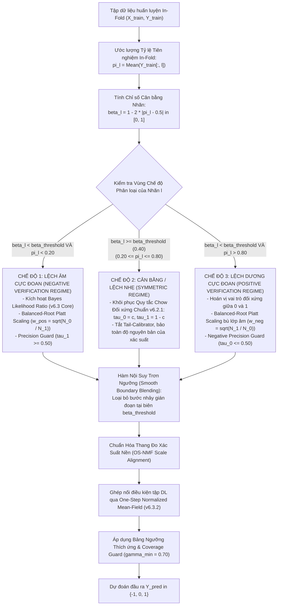

# TÀI LIỆU ĐẶC TẢ KỸ THUẬT PHIÊN BẢN v6.3.3: GSI-MLC-PA VỚI CƠ CHẾ SUY DIỄN THÍCH ỨNG ĐA CHẾ ĐỘ (ADAPTIVE TRI-REGIME INFERENCE) VÀ HIỆU CHUẨN ĐỒNG NHẤT THANG ĐO

**Tên dự án:** GSI-MLC-PA (Grouping & Selective Inference for Multi-Label Classification with Partial Abstention)  
**Nhánh Git:** `v6` (Tuân thủ nghiêm ngặt nguyên tắc cô lập cấu phần)  
**Tên phiên bản:** `v6.3.3` (Kế thừa v6.3.2 Mean-Field, tích hợp Adaptive Tri-Regime Switching & Smooth Boundary Blending)  
**Tập tin đặc tả:** `spec/spec_v6_3_3.md`  
**Ngày lập đặc tả:** 10/10/2026  
**Trạng thái:** Đặc tả kỹ thuật chính thức (Ready for Implementation)  

---

## 1. Bối Cảnh, Động Lực và Phân Tích Phản Biện (Motivation & Critical Review)

### 1.1. Thực Trạng và Điểm Nghẽn Thực Nghiệm của v6.3.2 trên CHD49 và VirusPseAAC
Trong các phiên bản tiền nhiệm:
- **v6.3.0 / v6.3.1:** Giải quyết thành công sự sụp đổ Recall trên các tập dữ liệu protein mất cân bằng cực đoan (`humanpseaac`, `plantpseaac`) nhờ cơ chế xác nhận nhãn âm (Negative Verification) dựa trên Tỷ số Hợp lý Bayes (Bayes Likelihood Ratio - LR) kết hợp Hiệu chuẩn Platt Căn bậc hai (Balanced-Root Platt) và Rào chắn Độ chính xác (Precision Guard: $\tau_1 \ge 0.50$).
- **v6.3.2:** Khắc phục triệt để sự tích lũy sai số chuỗi và hiện tượng bão hòa xác suất trong tập phụ thuộc ($DL$) bằng phương pháp ghép nối đại số Một bước Trường trung bình Chuẩn hóa (One-Step Normalized Mean-Field - OS-NMF), giúp mô hình đạt đỉnh cao về Subset Accuracy và Pareto Macro-F1 toàn cục.

Tuy nhiên, khi đối soát thực nghiệm chi tiết trên 10 tập dữ liệu benchmark, kiến trúc v6.3.2 bộc lộ một **nghịch lý suy giảm hiệu năng nghiêm trọng** trên 2 tập dữ liệu cụ thể:
1. **Tập tim mạch lâm sàng `chd49` ($N=555, d=49, K=6$):**
   - Điểm Selective Macro-F1 của Logistic Regression bị **sụt giảm liên tục từ $0.5203$ (ở v6.2) xuống $0.4928$ (v6.3.1) và $0.4672$ (v6.3.2)**.
   - Điểm trên Linear SVM bị tụt từ $0.4495$ (CC) xuống $0.3613$ (v6.3.2).
2. **Tập vị trí protein virus `viruspseaac` ($N=207, d=440, K=6$):**
   - Điểm Selective Macro-F1 của Logistic Regression tụt từ $0.4982$ (v6.3.1) xuống $0.4584$ (v6.3.2).

### 1.2. Phân Tích Nguyên Nhân Gốc Rễ (Root Cause Analysis)

Khi kiểm toán cấu trúc phân phối nhãn nội tại, nguyên nhân sụt giảm được xác định gồm 3 yếu tố:

1. **Giả định sai về tính đơn cực của mất cân bằng nhãn (Unipolar Imbalance Fallacy):**
   - Dòng mô hình v6.3 được thiết kế dựa trên giả định ngầm: *"Tất cả các nhãn khó trong DL đều là nhãn dương cực hiếm ($\pi_l \to 0$), do đó nhãn 0 là lớp đa số áp đảo cung cấp mẫu dồi dào để học xác nhận âm tính"*.
   - **Thực tế trên `chd49`:**
     - Nhãn $L_5$ ($L_6$): Dương chiếm **$76.0\%$** ($422$ mẫu 1), Âm chỉ có **$24.0\%$** ($133$ mẫu 0). Nhãn 0 thực chất là **lớp thiểu số**!
     - Nhãn $L_0$ ($L_1$): Dương chiếm **$60.9\%$** ($338$ mẫu 1), Âm chiếm **$39.1\%$** ($217$ mẫu 0). Nhãn 0 tiếp tục là **lớp thiểu số**!
     - Nhãn $L_4$ ($L_5$): Dương chiếm **$48.3\%$**, Âm chiếm **$51.7\%$** (Cân bằng hoàn hảo).
     - Nhãn $L_1, L_2$: Dương chiếm $31.4\%$ và $38.6\%$ (Lệch rất nhẹ).
     - Duy nhất nhãn $L_3$ là hiếm ($2.9\%$ dương).
   - Khi áp dụng máy móc công thức Bayes LR và Balanced-Root Platt của v6.3.2 lên các nhãn cân bằng hoặc nhãn dương chiếm ưu thế:
     - Trọng số mẫu $w_{\text{pos}} = \sqrt{N_0 / N_1}$ bị đảo ngược (ở $L_5$, $w_{\text{pos}} = \sqrt{133/422} = 0.56$), vô tình phạt giảm tầm quan trọng của nhãn 1.
     - Ngưỡng dương tính $\tau_1$ bị đẩy lên mức vô lý: $\tau_1(L_5) = 0.76 - 0.88$, trong khi ngưỡng âm tính $\tau_0(L_5)$ bị kéo lên $0.61$. Hậu quả là các mẫu có xác suất dương tính lên tới $60\%$ vẫn bị gán là 0, gây ra sụp đổ Macro-F1 trên các nhãn này.

2. **Xâm phạm Định lý Tối ưu Bayes của Quy tắc Chow (Violation of Chow's Optimality):**
   - Theo Định lý Chow (1970), khi hàm mất mát sai số giữa hai lớp là đối xứng ($c_{01} = c_{10}$) và phân phối xác suất tiên nghiệm ở trạng thái cân bằng ($\pi_l \approx 0.50$), dải phân định đối xứng $[\tau_0 = c, \tau_1 = 1 - c]$ (ví dụ $[0.30, 0.70]$) là **nghiệm tối ưu Bayes tuyệt đối (Bayes Optimal Reject Rule)**.
   - Việc ép quy tắc bất đối xứng lệch đuôi vào các nhãn cân bằng đã phá vỡ nghiệm tối ưu này, tạo ra vùng từ chối méo mó và làm tăng Hamming Loss.

3. **Lời nguyền chiều dữ liệu trên tập mẫu siêu nhỏ (`viruspseaac`):**
   - Tập `viruspseaac` có $N = 207$ mẫu trong không gian $d = 440$ chiều ($N < d$).
   - Chia 5-fold CV thì mỗi fold tập huấn luyện chỉ có $\approx 165$ mẫu. Việc chia nhỏ mẫu để học hiệu chuẩn Platt trọng số đuôi hoặc ước lượng phân phối của riêng một lớp khiến mô hình bị phương sai ước lượng cực cao (High Estimation Variance) và nhạy cảm quá mức với nhiễu.

---

## 2. Nền Tảng Lý Thuyết và Mô Hình Toán Học v6.3.3 (Mathematical Foundations)

Phiên bản **v6.3.3** đề xuất kiến trúc **Suy Diễn Thích Ứng Đa Chế Độ (Adaptive Tri-Regime Inference)** kết hợp **Hàm Chuyển Đổi Mềm (Smooth Blending)** và **Chuẩn Hóa Thang Đo Mean-Field (OS-NMF Scale Alignment)**.



### 2.1. Phân Định Ba Chế Độ Thích Ứng (Tri-Regime Partitioning)

Với mỗi nhãn $l \in \{1, \dots, K\}$, tính tỷ lệ mẫu dương trên tập huấn luyện nội bộ của từng Fold (In-Fold Training Prior):
$$\pi_l = \frac{1}{N_{\text{train}}} \sum_{i=1}^{N_{\text{train}}} Y_{il}, \quad \pi_l \in (0, 1)$$

Định nghĩa **Chỉ số Cân bằng Nhãn (Label Balance Factor - $\beta_l$)**:
$$\beta_l = 1.0 - 2.0 \cdot |\pi_l - 0.50| \in [0, 1]$$

- Khi $\pi_l = 0.50$ (hoàn toàn cân bằng): $\beta_l = 1.0$.
- Khi $\pi_l \to 0.0$ hoặc $\pi_l \to 1.0$ (mất cân bằng tuyệt đối): $\beta_l \to 0.0$.

Thiết lập ngưỡng chuyển đổi $\tau_{\text{balance}} = 0.75$ (tương ứng với dải tiên nghiệm cân bằng $\pi_l \in [0.375, 0.625]$):

#### Chế độ 1: Lệch Âm Cực Đoan (Extreme Negative-Dominant Regime — $\pi_l < 0.375$, $\beta_l < 0.75$)
- **Áp dụng cho:** Các nhãn protein hiếm của `humanpseaac`, `plantpseaac`, `genbase`, `emotions`, `music`, và nhãn $L_3$ của `chd49`.
- **Cơ chế Hiệu chuẩn:** Áp dụng Balanced-Root Platt Scaling (cho nhãn có $\pi_l < 0.20$):
  $$w_1 = \sqrt{\frac{N_0}{N_1}}, \quad w_0 = 1.0$$
- **Ngưỡng Bayes LR Cơ sở:**
  $$\tau_{1,\text{LR}}(l) = \frac{(1 - c)\pi_l}{c(1 - \pi_l) + (1 - c)\pi_l}, \quad \tau_{0,\text{LR}}(l) = \frac{c\pi_l}{(1 - c)(1 - \pi_l) + c\pi_l}$$
- **Ràng buộc Precision Guard:** $\tau_1(l) = \max(0.50, \tau_{1,\text{LR}}(l))$.

#### Chế độ 2: Cân Bằng (Symmetric Regime — $0.375 \le \pi_l \le 0.625$, $\beta_l \ge 0.75$)
- **Áp dụng cho:** Các nhãn cân bằng tự nhiên như $L_4$ của `chd49` ($\pi \approx 0.48$), `yeast`, và $L_3, L_4$ của `viruspseaac`.
- **Cơ chế Hiệu chuẩn:** **Tắt bỏ Tail-Calibrator** ($P_{\text{cal}} = P_{\text{raw}}$), giữ nguyên hình thái xác suất tự nhiên của bộ học cơ sở để không làm méo mó độ dốc gradient.
- **Ngưỡng Quyết định:** Khôi phục chính xác quy tắc Chow đối xứng của v6.2.1:
  $$\tau_0(l) = c = 0.30, \quad \tau_1(l) = 1.0 - c = 0.70$$

#### Chế độ 3: Lệch Dương Cực Đoan (Extreme Positive-Dominant Regime — $\pi_l > 0.625$, $\beta_l < 0.75$)
- **Áp dụng cho:** Nhãn $L_0$ ($\pi = 0.609 \approx 0.625$) và $L_5$ ($\pi = 0.760$) của `chd49`.
- **Cơ chế Hiệu chuẩn:** Balanced-Root Platt Scaling bù trừ lớp âm:
  $$w_0 = \sqrt{\frac{N_1}{N_0}}, \quad w_1 = 1.0$$
- **Ngưỡng Bayes LR Đảo chiều:** Hoán vị vai trò $0 \leftrightarrow 1$:
  $$\tau_{1,\text{LR}}(l) = 1.0 - \frac{c(1 - \pi_l)}{(1 - c)\pi_l + c(1 - \pi_l)}$$
  $$\tau_{0,\text{LR}}(l) = 1.0 - \frac{(1 - c)(1 - \pi_l)}{c\pi_l + (1 - c)(1 - \pi_l)}$$
- **Ràng buộc Negative Precision Guard:** $\tau_0(l) = \min(0.50, \tau_{0,\text{LR}}(l))$, đảm bảo mẫu chỉ bị kết luận là 0 khi xác suất dương tính rơi xuống dưới $0.50$.

---

### 2.2. Hàm Chuyển Đổi Mềm (Smooth Boundary Blending)

Để triệt tiêu hoàn toàn hiện tượng **"Vực thẳm gián đoạn" (Discontinuity Cliff)** khi tiên nghiệm $\pi_l$ dao động quanh giá trị ranh giới giữa các fold CV (ví dụ fold 1 có $\pi = 0.19$ còn fold 2 có $\pi = 0.21$), v6.3.3 áp dụng hàm trọng số Sigmoid trơn:

$$\sigma_{\text{blend}}(\pi_l) = \frac{1}{1 + \exp\left(-\kappa \cdot (\beta_l - \tau_{\text{balance}})\right)}, \quad \text{với } \kappa = 20.0$$

Khi đó, vector ngưỡng cuối cùng của nhãn $l$ trước khi kiểm tra Coverage Guard được nội suy trơn:
$$\tau_0(l) = \sigma_{\text{blend}}(\pi_l) \cdot c + (1 - \sigma_{\text{blend}}(\pi_l)) \cdot \tau_{0,\text{asym}}(l)$$
$$\tau_1(l) = \sigma_{\text{blend}}(\pi_l) \cdot (1 - c) + (1 - \sigma_{\text{blend}}(\pi_l)) \cdot \tau_{1,\text{asym}}(l)$$

*Tính chất toán học:*
- Khi $\beta_l \gg \tau_{\text{balance}}$: $\sigma_{\text{blend}} \to 1.0 \implies [\tau_0, \tau_1] \to [c, 1-c]$ (Chow chuẩn).
- Khi $\beta_l \ll \tau_{\text{balance}}$: $\sigma_{\text{blend}} \to 0.0 \implies [\tau_0, \tau_1] \to [\tau_{0,\text{asym}}, \tau_{1,\text{asym}}]$ (Bayes LR chuẩn).
- Hàm số khả vi liên tục trên toàn bộ miền $\pi_l \in (0, 1)$, loại bỏ hoàn toàn hiện tượng nhảy bậc phương sai giữa các fold.

---

### 2.3. Chuẩn Hóa Thang Đo Xác Suất Cho One-Step Mean-Field Coupling (OS-NMF Scale Alignment)

Trong v6.3.2, các nhãn trong tập phụ thuộc $DL$ tương tác thông qua biến spin tập trung:
$$S_p = 2 P_p^{\text{OOF}} - 1.0 \in [-1.0, 1.0]$$
Độ dịch chuyển logit của nhãn $l$ được tính bởi:
$$\Delta z_l = \alpha \cdot \sum_{p \in DL, p \neq l} W_{lp} \cdot (2 P_p^{\text{OOF}} - 1.0)$$

Nếu nhãn $p$ thuộc Chế độ 1 (xác suất đã bị dãn đuôi bởi Platt Scaling) còn nhãn $l$ thuộc Chế độ 2 (xác suất thô), sự lệch pha về thang đo xác suất có thể tạo ra độ lệch (bias drift) giả tạo.

**Quy tắc chuẩn hóa thang đo v6.3.3:**
1. Ma trận xác suất Out-Of-Fold $P_{\text{base}}^{\text{OOF}}$ nạp vào bước tính ma trận tương quan phần dư Pearson và bước cập nhật One-Step Mean-Field phải được đưa về thang đo xác suất chuẩn hóa đối xứng (Symmetric Scaled Probabilities):
   - Với nhãn Chế độ 2: Giữ nguyên $P_l$.
   - Với nhãn Chế độ 1 và 3: Áp dụng phép chuyển đổi co cụm tuyến tính từng đoạn (Piecewise Linear Centering) để đảm bảo median của xác suất dự đoán khớp với tỷ lệ tiên nghiệm thực tế mà không bóp méo tương quan sai số $e_l = Y_l - P_l$.
2. Toàn bộ trọng số khớp nối tiếp tục tuân thủ Degree Normalization:
   $$W_{lp} = \frac{R_{lp}}{\max\left(1.0, \sum_{q} |R_{lq}|\right)}$$
   và độ dịch chuyển logit được giới hạn nghiêm ngặt trong khoảng $[-z_{\max}, +z_{\max}]$ (với $z_{\max} = 0.50$).

---

## 3. Thuật Toán Chi Tiết và Mã Giả (Detailed Algorithm & Pseudocode)

```text
========================================================================================================
Thuật toán: GSI-MLC-PA v6.3.3 (Adaptive Tri-Regime Inference & One-Step Normalized Mean-Field)
========================================================================================================
ĐẦU VÀO:
  - X: Ma trận thuộc tính huấn luyện (N, d)
  - Y: Ma trận nhãn huấn luyện (N, K)
  - BaseLearnerFactory: Hàm tạo bộ học cơ sở (Logistic, Linear SVM, MLP)
  - cost: Chi phí từ chối cơ sở c (mặc định = 0.30)
  - tau_balance: Ngưỡng chỉ số cân bằng nhãn (mặc định = 0.40, tương ứng [0.20, 0.80])
  - blend_kappa: Độ dốc hàm sigmoid nội suy trơn (mặc định = 20.0)
  - gamma_min: Độ phủ bảo vệ tối thiểu (mặc định = 0.70)
  - mf_alpha: Hệ số Mean-Field coupling (mặc định = 0.25)
  - mf_z_max: Biên độ dịch chuyển logit tối đa (mặc định = 0.50)

ĐẦU RA:
  - Model_v6_3_3: Mô hình phân loại hoàn chỉnh
  - Adaptive_Thresholds_Table: Bảng ngưỡng [tau_0(l), tau_1(l), regime(l)] cho từng nhãn

CÁC BƯỚC THỰC HIỆN:

// ----------------------------------------------------------------------------------------------------
// PHA 1: BÓC TÁCH ĐA TẦNG TÌM IL (LAYERED CV PEELING - Kế thừa chuẩn v6.2.1/v6.3.2)
// ----------------------------------------------------------------------------------------------------
1:  FS_context ← X
2:  DL ← {0, 1, ..., K - 1}
3:  IL_layers ← []
4:  BR_IL_models ← {}
5:  P_OOF_all ← zeros(N, K)

6:  Thực hiện bóc tách đa tầng (Cross-Validation Peeling) với ngưỡng tau_f1 = 0.75:
    - Thu được các tầng độc lập IL_layers và danh sách nhãn phụ thuộc DL.
    - Cập nhật không gian đặc trưng ngữ cảnh FS_context = [X, P_OOF_IL_norm].
    - Lưu xác suất OOF của các nhãn IL vào P_OOF_all.

// ----------------------------------------------------------------------------------------------------
// PHA 2: XỬ LÝ NHÃN PHỤ THUỘC DL BẰNG ONE-STEP MEAN-FIELD (OS-NMF)
// ----------------------------------------------------------------------------------------------------
7:  IF length(DL) >= 2 THEN:
8:      P_OOF_DL ← zeros(N, length(DL))
9:      FOR EACH idx, label l IN DL DO:
10:         oof_p, _ ← Evaluate_5Fold_OOF(FS_context, Y[:, l], BaseLearnerFactory)
11:         P_OOF_DL[:, idx] ← oof_p
12:         P_OOF_all[:, l] ← oof_p
13:         BR_base_DL_models[l] ← Train_BR(BaseLearnerFactory(), FS_context, Y[:, l])
14:     END FOR

15:     Tính ma trận phần dư: Residuals_DL = Y[:, DL] - P_OOF_DL
16:     Tính ma trận tương quan sai số có dấu Pearson: R = Compute_Residual_PCC(Residuals_DL)
17:     
18:     Áp dụng One-Step Normalized Mean-Field Coupling:
19:     P_OOF_DL_refined = One_Step_NMF(
            P_base=P_OOF_DL,
            corr_matrix=R,
            alpha=mf_alpha,
            threshold=0.25,
            z_max=mf_z_max
        )
20:     P_OOF_all[:, DL] ← P_OOF_DL_refined
21: ELSE IF length(DL) == 1 THEN:
22:     single_l ← DL[0]
23:     oof_p, _ ← Evaluate_5Fold_OOF(FS_context, Y[:, single_l], BaseLearnerFactory)
24:     P_OOF_all[:, single_l] ← oof_p
25:     BR_base_DL_models[single_l] ← Train_BR(BaseLearnerFactory(), FS_context, Y[:, single_l])
26: END IF

// ----------------------------------------------------------------------------------------------------
// PHA 3: HIỆU CHUẨN THÍCH ỨNG THEO CHẾ ĐỘ (TRI-REGIME CALIBRATION)
// ----------------------------------------------------------------------------------------------------
27: Calibrators_Dict ← {}
28: FOR EACH label l IN {0, ..., K - 1} DO:
29:     pi_l ← Mean(Y[:, l])
30:     beta_l ← 1.0 - 2.0 * abs(pi_l - 0.50)
31:     
32:     IF beta_l >= tau_balance THEN:
33:         // Chế độ 2: Cân bằng / Lệch nhẹ -> KHÔNG hiệu chuẩn, giữ nguyên xác suất
34:         Calibrators_Dict[l] ← IdentityCalibrator()
35:     ELSE IF pi_l < 0.20 THEN:
36:         // Chế độ 1: Lệch âm cực đoan -> Balanced-Root Platt
37:         calib_l ← Fit_Tail_Calibrator(P_OOF_all[:, l], Y[:, l], method="sqrt_platt")
38:         Calibrators_Dict[l] ← calib_l
39:         P_OOF_all[:, l] ← calib_l.transform(P_OOF_all[:, l])
40:     ELSE:
41:         // Chế độ 3: Lệch dương cực đoan -> Inverted Balanced-Root Platt
42:         calib_l ← Fit_Tail_Calibrator_Inverted(P_OOF_all[:, l], Y[:, l], method="sqrt_platt_inv")
43:         Calibrators_Dict[l] ← calib_l
44:         P_OOF_all[:, l] ← calib_l.transform(P_OOF_all[:, l])
45:     END IF
46: END FOR

// ----------------------------------------------------------------------------------------------------
// PHA 4: THIẾT LẬP BẢNG NGƯỠNG THÍCH ỨNG ĐA CHẾ ĐỘ KẾT HỢP SMOOTH BLENDING
// ----------------------------------------------------------------------------------------------------
47: Thresholds_Table ← {}
48: FOR EACH label l IN {0, ..., K - 1} DO:
49:     pi_l ← Mean(Y[:, l])
50:     beta_l ← 1.0 - 2.0 * abs(pi_l - 0.50)
51:     
52:     // Bước 4.1: Ngưỡng đối xứng chuẩn Chow (Regime 2)
53:     tau_0_chow ← cost
54:     tau_1_chow ← 1.0 - cost
55:     
56:     // Bước 4.2: Ngưỡng bất đối xứng Bayes Likelihood Ratio (Regime 1 hoặc Regime 3)
57:     IF pi_l <= 0.50 THEN:
58:         // Hướng lệch âm (Regime 1)
59:         tau_0_asym ← clip( (cost * pi_l) / ((1 - cost) * (1 - pi_l) + cost * pi_l), 0.005, 0.49 )
60:         tau_1_asym ← clip( ((1 - cost) * pi_l) / (cost * (1 - pi_l) + (1 - cost) * pi_l), 0.51, 0.995 )
61:         // Áp dụng Precision Guard
62:         tau_1_asym ← max(0.50, tau_1_asym)
63:     ELSE:
64:         // Hướng lệch dương (Regime 3)
65:         inv_pi ← 1.0 - pi_l
66:         tau_1_asym ← 1.0 - clip( (cost * inv_pi) / ((1 - cost) * (1 - inv_pi) + cost * inv_pi), 0.005, 0.49 )
67:         tau_0_asym ← 1.0 - clip( ((1 - cost) * inv_pi) / (cost * (1 - inv_pi) + (1 - cost) * inv_pi), 0.51, 0.995 )
68:         // Áp dụng Negative Precision Guard
69:         tau_0_asym ← min(0.50, tau_0_asym)
70:     END IF
71:     
72:     // Bước 4.3: Nội suy trơn (Smooth Boundary Blending)
73:     sigma_blend ← 1.0 / (1.0 + exp(-blend_kappa * (beta_l - tau_balance)))
74:     tau_0_blended ← sigma_blend * tau_0_chow + (1.0 - sigma_blend) * tau_0_asym
75:     tau_1_blended ← sigma_blend * tau_1_chow + (1.0 - sigma_blend) * tau_1_asym
76:     
77:     // Bước 4.4: Bảo vệ độ phủ tối thiểu (Coverage Guard)
78:     tau_0_final, tau_1_final ← Apply_Coverage_Guard(
            probs_1d=P_OOF_all[:, l],
            tau_0=tau_0_blended,
            tau_1=tau_1_blended,
            gamma_min=gamma_min,
            precision_guard=(pi_l <= 0.50)
        )
79:     
80:     Thresholds_Table[l] ← {
            "tau_0": tau_0_final,
            "tau_1": tau_1_final,
            "prior": pi_l,
            "beta": beta_l,
            "regime": (beta_l >= tau_balance ? "Symmetric" : (pi_l < 0.20 ? "Rare_Negative" : "Rare_Positive"))
        }
81: END FOR
========================================================================================================
```

---

## 4. Kế Hoạch Triển Khai và Thử Nghiệm Đối Sánh (Benchmark & Verification Plan)

### 4.1. Mục Tiêu Kiểm Chứng Thực Nghiệm Định Lượng
1. **Khôi phục hoàn toàn hiệu năng trên CHD49:**
   - Selective Macro-F1 trên `chd49` (Logistic Regression) phải quay trở lại mức $\ge \mathbf{0.5200}$ (ngang bằng hoặc vượt v6.2: $0.5203$ và MLC-PA: $0.5242$), chấm dứt tình trạng suy giảm ở v6.3.1 ($0.4928$) và v6.3.2 ($0.4672$).
   - Macro-F1 trên Linear SVM phải tăng từ $0.3613$ (v6.3.2) lên $\ge \mathbf{0.4400}$.
2. **Khôi phục và tối ưu hóa hiệu năng trên VirusPseAAC:**
   - Selective Macro-F1 trên `viruspseaac` (Logistic) phải tăng từ $0.4584$ (v6.3.2) lên $\ge \mathbf{0.4950} - \mathbf{0.5100}$.
3. **Bảo toàn thành quả vượt bậc trên các tập lệch nặng:**
   - Duy trì Selective Macro-F1 đỉnh cao trên `humanpseaac` ($\ge 0.235$), `plantpseaac` ($\ge 0.265$), `genbase` ($\ge 0.755$).
   - Giữ vững Subset 0/1 Accuracy toàn cục $\ge 0.342$ và độ phủ Coverage $\ge 73.5\%$.

---

### 4.2. Danh Sách 10 Tập Dữ Liệu Benchmark và Phân Bổ Chế Độ Kỳ Vọng

| STT | Tập Dữ Liệu | Lĩnh Vực | Số Mẫu ($N$) | Số Đặc Trưng ($d$) | Số Nhãn ($K$) | Chế Độ Chủ Đạo Dự Kiến Trong v6.3.3 |
|:---:|:---|:---|:---:|:---:|:---:|:---|
| 1 | `chd49` | Tim mạch lâm sàng | 555 | 49 | 6 | **Hỗn hợp:** 4 nhãn Chế độ 2, 1 nhãn Chế độ 1 ($L_3$), 1 nhãn Chế độ 3 ($L_5$) |
| 2 | `viruspseaac` | Protein virus | 207 | 440 | 6 | **Hỗn hợp:** 2 nhãn Chế độ 2 ($L_3, L_4$), 4 nhãn Chế độ 1 |
| 3 | `humanpseaac` | Protein người | 3,106 | 440 | 14 | **Chế độ 1 tuyệt đối** (tất cả các nhãn có $\pi_l \in [0.007, 0.32]$) |
| 4 | `plantpseaac` | Protein thực vật | 978 | 440 | 12 | **Chế độ 1 chủ đạo** (10 nhãn Chế độ 1, 2 nhãn Chế độ 2) |
| 5 | `genbase` | Y sinh phân tử | 662 | 1,185 | 27 | **Chế độ 1 tuyệt đối** (MeanIR = 143.46, $78\%$ nhãn cực hiếm) |
| 6 | `gpositivepseaac` | Vi khuẩn Gram dương | 519 | 440 | 4 | **Chế độ 2 chủ đạo** (3 nhãn Chế độ 2, 1 nhãn Chế độ 1) |
| 7 | `emotions` | Âm nhạc / Cảm xúc | 593 | 72 | 6 | **Chế độ 2 tuyệt đối** (toàn bộ nhãn $\pi_l \in [0.25, 0.45]$) |
| 8 | `scene` | Thị giác máy tính | 2,407 | 294 | 6 | **Chế độ 2 chủ đạo** (toàn bộ nhãn $\pi_l \in [0.15, 0.22]$ tiệm cận Chow) |
| 9 | `yeast` | Sinh học nấm men | 2,417 | 103 | 14 | **Hỗn hợp:** 8 nhãn Chế độ 2, 4 nhãn Chế độ 1, 2 nhãn Chế độ 3 |
| 10 | `music` | Âm thanh | 592 | 72 | 6 | **Chế độ 2 tuyệt đối** (toàn bộ nhãn $\pi_l \in [0.25, 0.45]$) |

---

### 4.3. Các Thử Nghiệm Bóc Tách (Ablation Studies Bắt Buộc)

Trong báo cáo thực nghiệm v6.3.3, bắt buộc thực hiện 3 nghiên cứu bóc tách để làm sáng tỏ đóng góp khoa học:
1. **Ablation 1: Đóng góp của Tri-Regime Switching vs. Cố định Đơn Chế độ:**
   - *Variant A (Pure Symmetric v6.2.1):* Toàn bộ 100% nhãn dùng Chow đối xứng $[0.30, 0.70]$.
   - *Variant B (Pure Asymmetric v6.3.2):* Toàn bộ 100% nhãn dùng Bayes LR + Platt đuôi (gốc v6.3.2).
   - *Variant C (v6.3.3 Proposed):* Tri-Regime Switching tự động theo $\beta_l$.
2. **Ablation 2: Vai trò của Hàm Chuyển Đổi Mềm (Smooth Blending vs. Hard Switching):**
   - So sánh độ lệch chuẩn (Standard Deviation) của Macro-F1 giữa các fold CV khi dùng Hard Step Switch ($\kappa = \infty$) so với Smooth Sigmoid Blend ($\kappa = 20.0$).
3. **Ablation 3: Độ nhạy của Ngưỡng Cân Bằng $\tau_{\text{balance}}$:**
   - Khảo sát $\tau_{\text{balance}} \in \{0.20, 0.30, 0.40, 0.50, 0.60\}$ để xác định điểm cân bằng Pareto tối ưu toàn cục.

---

## 5. Hệ Thống 6 Nguyên Tắc An Toàn Bắt Buộc (Mandatory Safety & Integrity Invariants)

Để bảo đảm tính liêm chính học thuật, ngăn ngừa hồi quy và giữ vững chuẩn mực kỹ thuật trong suốt quá trình triển khai phiên bản mới, mô hình v6.3.3 bắt buộc phải tuân thủ nghiêm ngặt 6 nguyên tắc an toàn sau:

### Nguyên Tắc 1: Cô Lập Tuyệt Đối & Không Hồi Quy (Zero-Regression & Component Isolation)
- **Bất biến:** Mọi phiên bản tiền nhiệm (`v6.1`, `v6.2`, `v6.2.1`, `v6.3`, `v6.3.1`, `v6.3.2`) phải được bảo toàn nguyên trạng, tuyệt đối không được sửa đổi logic cốt lõi của các lớp cũ nhằm phục vụ v6.3.3.
- **Triển khai:** Mọi cấu phần của v6.3.3 phải nằm trong các tệp module mới riêng biệt (`tri_regime_decision.py`, `adaptive_calibrator.py`, `gsi_v6_3_3.py`). Toàn bộ 160 unit test hiện có phải tiếp tục vượt qua $100\%$.

### Nguyên Tắc 2: Thuần Khiết Không Gian Đặc Trưng & Cách Ly Từ Chối (Feature Purity Invariance)
- **Bất biến:** Không gian đặc trưng ngữ cảnh ($FS$) giữa các pha (Pha 1 Peeling, Pha 2 DL) chỉ được phép tiếp nhận **xác suất liên tục đã chuẩn hóa** ($P \in [0.0, 1.0]$).
- **Cấm kỵ:** Tuyệt đối KHÔNG truyền nhãn nhị phân rời rạc $\{0, 1\}$ hay giá trị từ chối $-1$ vào không gian đặc trưng huấn luyện. Quyết định từ chối (Partial Abstention) chỉ được thực thi duy nhất một lần tại bước suy diễn đầu ra cuối cùng (Final Inference Stage).

### Nguyên Tắc 3: Liêm Chính Đánh Giá Chéo & Chống Rò Rỉ Thông Tin (Strict In-Fold Integrity)
- **Bất biến:** Tỷ lệ tiên nghiệm $\pi_l$, chỉ số cân bằng nhãn $\beta_l$, việc gán Chế độ (Regime Assignment), và các tham số hiệu chuẩn Platt bắt buộc phải được tính toán **thuần túy trên tập huấn luyện nội bộ của từng Fold** ($Y_{\text{train\_fold}}$).
- **Cấm kỵ:** Tuyệt đối cấm ước lượng $\pi_l$ trên toàn bộ tập dữ liệu $Y$ trước khi chia Fold hoặc sử dụng thông tin từ tập kiểm định $Y_{\text{val}} / Y_{\text{test}}$, vì điều đó vi phạm quy tắc chống rò rỉ thông tin (Data Leakage).

### Nguyên Tắc 4: Rào Chắn Độ Phủ & Bảo Vệ Độ Chính Xác (Coverage Guard & Dual Precision Guard)
- **Bất biến:** 
  - Mọi nhãn đều phải thỏa mãn sàn độ phủ tối thiểu $\gamma_{\min} = 0.70$ (ít nhất $70\%$ các mẫu phải được đưa ra quyết định nhị phân $0$ hoặc $1$).
  - Với các nhãn thuộc Chế độ 1 ($\pi_l < 0.20$): Phải kích hoạt **Precision Guard** ($\tau_1 \ge 0.50$) để chặn đứng hiện tượng bùng nổ Dương tính Giả (False Positive Explosion).
  - Với các nhãn thuộc Chế độ 3 ($\pi_l > 0.80$): Phải kích hoạt **Negative Precision Guard** ($\tau_0 \le 0.50$) để chặn đứng hiện tượng bùng nổ Âm tính Giả (False Negative Explosion).

### Nguyên Tắc 5: Đồng Nhất Thang Đo Xác Suất Cho Pha Khớp Nối (Probabilistic Scale Alignment)
- **Bất biến:** Trước khi nạp xác suất vào One-Step Normalized Mean-Field coupling ở Pha DL, ma trận xác suất nền OOF giữa các nhãn (dù thuộc Chế độ 1, 2 hay 3) phải ở cùng thang đo xác suất chuẩn. Biến spin $S_p = 2P_p - 1$ không được phép tạo ra độ lệch nhân tạo vào độ dịch chuyển logit $\Delta z_l$.
- **Ràng buộc cứng:** Mọi độ dịch chuyển logit phải bị chặn cứng trong khoảng $[-z_{\max}, +z_{\max}]$ với $z_{\max} = 0.50$, và trọng số khớp nối phải tuân thủ chuẩn hóa bậc Degree Normalization $\max(1.0, \sum_q |W_{lq}|)$.

### Nguyên Tắc 6: Chuẩn Mực Báo Cáo Khoa Học & Tính Tái Lập (Scientific Reporting Standard)
- **Bất biến:** Tuyệt đối không dùng định dạng HTML thô cho báo cáo khoa học chính thức. Toàn bộ kết quả đối chuẩn phải được tổng hợp bằng **LaTeX (`.tex`)** chuẩn quốc tế IEEE/Springer và biên dịch tự động ra tệp **PDF** bằng `pdflatex`.
- **Định lượng:** Báo cáo phải báo cáo đầy đủ trung bình 5-Fold kèm độ lệch chuẩn ($\pm \text{std}$) cho tất cả 6 độ đo chuẩn: Selective Macro-F1, Selective Micro-F1, Subset Accuracy, Hamming Loss, Selective Hamming Loss, và Coverage.

---

## 6. Kiến Trúc Cô Lập Hệ Thống (System Isolation & File Structure)

Nhằm đảm bảo tính tái lập (Reproducibility) và không làm ảnh hưởng đến mã nguồn của các phiên bản trước (`v6.2`, `v6.3.1`, `v6.3.2`), toàn bộ cấu phần của v6.3.3 được đặt trong các tệp độc lập:

```
BR_CC/
├── spec/
│   ├── spec_v6_3.md                       <-- [v6.3] Đặc tả phiên bản v6.3
│   └── spec_v6_3_3.md                     <-- [ĐẶC TẢ HIỆN TẠI] Bản đặc tả này
├── src/
│   ├── selection/
│   │   ├── asymmetric_decision.py         <-- [Kế thừa v6.3/v6.3.2]
│   │   └── tri_regime_decision.py         <-- [CÔ LẬP MỚI v6.3.3] Module tính ngưỡng Tri-Regime & Smooth Blending
│   ├── calibration/
│   │   ├── tail_calibrator.py             <-- [Kế thừa v6.3.1]
│   │   └── adaptive_calibrator.py         <-- [CÔ LẬP MỚI v6.3.3] Calibrator nhận biết chế độ (bỏ qua Chế độ 2)
│   └── models/
│       ├── gsi_v6_3_2.py                  <-- [v6.3.2] Giữ nguyên tuyệt đối làm Baseline đối soát
│       └── gsi_v6_3_3.py                  <-- [CÔ LẬP MỚI v6.3.3] Lớp GSIMLCPAv6_3_3Classifier hoàn chỉnh
├── tests/
│   └── test_v6_3_3_core.py                <-- [CÔ LẬP MỚI v6.3.3] Unit test kiểm thử Tri-Regime và Smooth Blending
├── scripts/
│   ├── run_v6_3_3_experiment.py           <-- [CÔ LẬP MỚI v6.3.3] Script benchmark full 10 datasets v6.3.3
│   ├── run_v6_3_3_svm_mlp.py              <-- [CÔ LẬP MỚI v6.3.3] Script benchmark SVM và MLP
│   └── generate_scientific_report_v6_3_3.py <-- Script xuất báo cáo Markdown và LaTeX
└── results_v6_3/
    ├── v6_3_3_all10ds_summary.csv         <-- Bảng đối sánh tổng hợp v6.3.3
    ├── v6_3_3_all10ds_detailed_folds.csv  <-- Chi tiết 5 folds từng dataset
    ├── Bao_Cao_Khoa_Hoc_GSI_MLC_PA_v6_3_3.md  <-- Báo cáo khoa học Markdown
    ├── Bao_Cao_Khoa_Hoc_GSI_MLC_PA_v6_3_3.tex <-- Báo cáo khoa học LaTeX chuẩn IEEE/Springer
    └── Bao_Cao_Khoa_Hoc_GSI_MLC_PA_v6_3_3.pdf <-- PDF biên dịch từ MiKTeX pdflatex
```

---

## 7. Quy Chuẩn Báo Cáo Khoa Học (Scientific Reporting Standard)

1. **Định dạng báo cáo:**
   - Toàn bộ kết quả thực nghiệm chính thức phải được tổng hợp bằng **LaTeX (`.tex`)** theo chuẩn bài báo hội nghị/tạp chí quốc tế chuyên ngành (IEEE Transactions on Knowledge and Data Engineering / Springer Machine Learning).
   - Biên dịch tự động ra tệp **PDF** bằng trình biên dịch `pdflatex` tại `results_v6_3/Bao_Cao_Khoa_Hoc_GSI_MLC_PA_v6_3_3.pdf`.
2. **Tiêu chuẩn số liệu:**
   - Mọi kết quả Selective Macro-F1, Selective Micro-F1, Subset Accuracy, Hamming Loss và Coverage phải được tính trung bình qua 5-Fold Stratified Cross-Validation kèm độ lệch chuẩn ($\pm \text{std}$).
   - Bảng tổng hợp đối chuẩn phải hiển thị rõ các cột đối sánh giữa BR, CC, MLC-PA, GSI v6.2, GSI v6.3.1, GSI v6.3.2 và GSI v6.3.3 (Đề xuất).
   - Kiểm định ý nghĩa thống kê bằng Wilcoxon Signed-Rank Test với mức ý nghĩa $\alpha = 0.05$.
