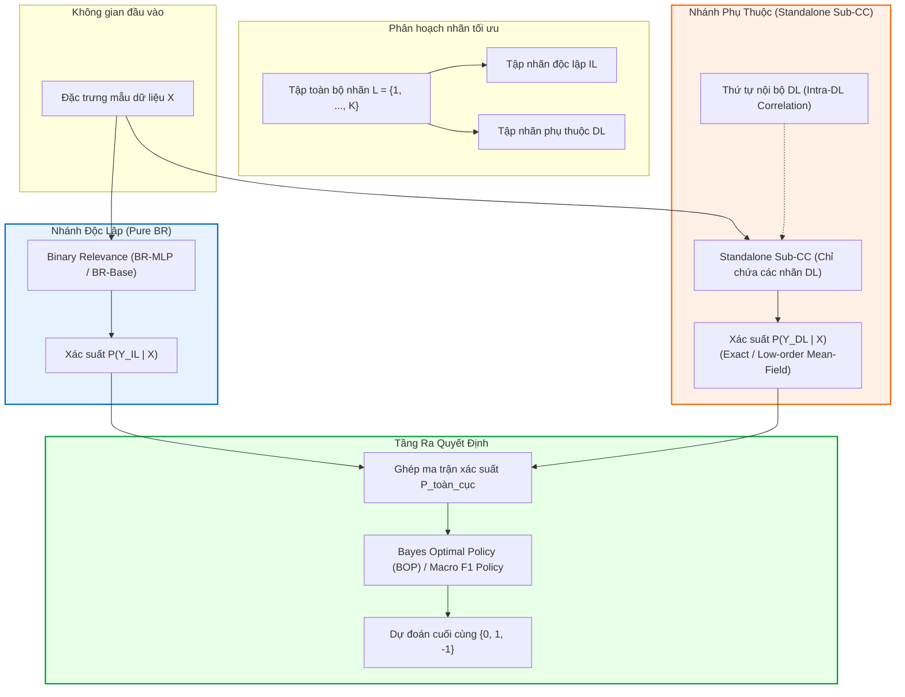

# ĐẶC TẢ THIẾT KẾ VÀ PHÂN TÍCH KHẢ THI: KIẾN TRÚC GSI-MLC-PA v3.1 (DECOUPLED DL/IL)

> **Tài liệu tham chiếu:** [`specify.md`](specify.md), [`meeting_summary.md`](meeting_summary.md), [`src/models/gsi_mlc_pa.py`](src/models/gsi_mlc_pa.py)  
> **Phiên bản:** v3.1-Draft  
> **Tác giả:** Đội ngũ Nghiên cứu Machine Learning (BR_CC)  
> **Mục tiêu chính:** Nghiên cứu và đặc tả cơ chế tách rời hoàn toàn không gian mô hình hóa giữa tập nhãn độc lập ($IL$) và tập nhãn phụ thuộc ($DL$), loại bỏ tiền tố nhãn $IL$ khỏi chuỗi Classifier Chain (CC) để cải thiện độ chính xác và giảm thiểu sai số lan truyền.

---

## 1. Động lực nghiên cứu và Đặt vấn đề

### 1.1. Hiện trạng kiến trúc tại v3 (Prefixed CC Chain)
Trong kiến trúc **v3** (đang thực thi tại [`src/models/gsi_mlc_pa.py`](src/models/gsi_mlc_pa.py)):
1. Toàn bộ $K$ nhãn được phân hoạch thành $IL$ (Independent Labels) và $DL$ (Dependent Labels).
2. Chuỗi phân loại CC được xây dựng trên **toàn bộ $K$ nhãn** theo thứ tự:
   $$\pi_{\text{v3}} = [\underbrace{\text{sorted}(IL)}_{\text{Tiền tố (Prefix)}}, \quad \underbrace{\delta_1, \delta_2, \dots, \delta_{|DL|}}_{\text{Các nhãn DL xếp theo tương quan}}]$$
3. Khi tính xác suất suy diễn:
   - Các nhãn $i \in IL$ lấy trực tiếp từ mô hình Binary Relevance ($BR$): $\hat{P}(Y_i=1 \mid X) = P_{\text{BR}}(Y_i=1 \mid X)$.
   - Các nhãn $j \in DL$ nằm ở cuối chuỗi và nhận đầu vào điều kiện gồm **tất cả các nhãn tiền nhiệm**, bao gồm **toàn bộ các nhãn $IL$ phía trước**:
     $$\tilde{X}_j = [X, \quad \hat{P}_{\text{all } IL}, \quad \hat{P}_{\text{preceding } DL}]$$

### 1.2. Các điểm nghẽn (Bottlenecks) cốt lõi của v3
Phân tích lý thuyết và thực nghiệm cho thấy cơ chế của v3 bộc lộ 3 nhược điểm nghiêm trọng:
1. **Ô nhiễm đặc trưng từ nhãn $IL$ (Feature Contamination & Noise Injection):**
   Các nhãn được chọn vào $IL$ bản chất là các nhãn hoạt động độc lập tốt hơn hoặc không có mối tương quan mạnh mang tính quy luật với các nhãn khác. Việc ép toàn bộ các nhãn $IL$ vào đầu vào của các bộ phân loại $DL$ phía sau vô tình bổ sung các đặc trưng nhiễu, làm tăng nguy cơ quá khớp (overfitting) và phương sai dự đoán (variance) của các classifier trong $DL$.
2. **Kéo dài chuỗi CC không cần thiết (Chain Bloating & Covariate Shift):**
   Nếu tập dữ liệu có $K = 14$ nhãn, trong đó $|IL| = 10$ và $|DL| = 4$:
   - Nhãn $DL$ đầu tiên ($\delta_1$) trong v3 đã phải nhận $10$ đặc trưng nhãn tiền nhiệm (cả 10 nhãn $IL$).
   - Số lượng đặc trưng soft-probability tăng cao làm trầm trọng hóa hiện tượng **Covariate Shift** khi chuyển từ tập huấn luyện (sử dụng ground truth $\{0, 1\}$) sang tập kiểm tra (sử dụng xác suất mềm $[0, 1]$ qua Mean-Field).
3. **Mâu thuẫn ngữ nghĩa giữa Phân hoạch và Kiến trúc:**
   Định nghĩa $IL$ là "nhãn độc lập", nhưng trong v3, các nhãn $DL$ vẫn phụ thuộc chặt chẽ vào $IL$. Điều này làm suy giảm ý nghĩa của việc chia phân hoạch $IL/DL$.

---

## 2. Kiến trúc Đề xuất: GSI-MLC-PA v3.1 (Decoupled DL/IL)

### 2.1. Ý tưởng cốt lõi (Core Philosophy)
Kiến trúc **v3.1** thiết lập nguyên tắc **Cô lập nhãn độc lập (Strict Independence Isolation)**:
* **Tập $IL$**: Được mô hình hóa **thuần túy bởi Binary Relevance (BR)**. Tập này hoàn toàn độc lập, không tham gia vào chuỗi CC, không làm đầu vào cho bất kỳ nhãn nào khác.
* **Tập $DL$**: Được mô hình hóa bởi một **Classifier Chain thu gọn (Sub-CC)** chỉ hoạt động trong không gian nhãn $DL$. Chuỗi CC **không có bất kỳ nhãn $IL$ nào** ở đầu chuỗi.
* **Hợp nhất (Recombination)**: Ma trận xác suất toàn cục $\hat{P} \in [0, 1]^{N \times K}$ được tái hợp nhất từ $\hat{P}_{IL}$ và $\hat{P}_{DL}$ theo đúng chỉ số gốc của từng nhãn, sau đó chuyển tới tầng ra quyết định tối ưu Bayes (BOP).



---

## 3. Đánh giá Tính khả thi (Feasibility Analysis)

### 3.1. Tính khả thi về mặt Toán học & Thống kê
* **Mô hình xác suất đồng thời:**
  Trong v3.1, hàm phân phối đồng thời có điều kiện được xấp xỉ theo cấu trúc khối:
  $$P(Y \mid X) \approx \left( \prod_{i \in IL} P(Y_i \mid X) \right) \times \left( \prod_{k=1}^{|DL|} P(Y_{\delta_k} \mid X, Y_{\delta_1}, \dots, Y_{\delta_{k-1}}) \right)$$
  với $(\delta_1, \dots, \delta_{|DL|})$ là một hoán vị của $DL$.
* **Độ chính xác của phép xấp xỉ biên duyên (Marginalization Quality):**
  - Trong v3, một nhãn $DL$ ở vị trí thứ 10 phải xấp xỉ Mean-Field qua $m = 9$ tiền nhiệm.
  - Trong v3.1, độ dài chuỗi của $DL$ giảm từ $K$ xuống $|DL|$.
    - Nếu $|DL| = 1$: Nhãn duy nhất này trở thành root của Sub-CC, tính chính xác $h(X)$ (không cần điều kiện).
    - Nếu $|DL| = 2$: Nhãn thứ hai có đúng $m=1$ tiền nhiệm $\rightarrow$ **100% Exact Marginalization** (không cần xấp xỉ Mean-Field).
    - Nếu $|DL| \ge 3$: Số lượng đặc trưng soft-probability đưa vào Mean-Field chỉ còn $|DL|-1$ chiều (thay vì $K-1$), giúp sai số tích lũy của Mean-Field giảm mạnh.
* **Kết luận:** **Cực kỳ khả thi và có cơ sở toán học vững chắc hơn v3.**

### 3.2. Tính khả thi về mặt Kỹ thuật & Cài đặt
* **Độ phức tạp tính toán huấn luyện (Training Complexity):**
  - v3: Huấn luyện $K$ mô hình BR + $K$ mô hình CC (tổng $2K$ classifiers).
  - v3.1: Huấn luyện $|IL|$ mô hình BR + $|DL|$ mô hình CC (tổng $|IL| + |DL| = K$ classifiers trong pha refit cuối cùng).
  - $\rightarrow$ **Thời gian huấn luyện trong pha refit giảm gần một nửa (50%)**.
* **Độ phức tạp trong pha lựa chọn tham lam (Greedy Selection Phase):**
  - *Thách thức:* Trong v3, mô hình `selection_cc` được fit trước một lần cho toàn bộ $K$ nhãn; việc chuyển nhãn chỉ cần hoán đổi vector xác suất. Trong v3.1, mỗi khi thay đổi tập ứng viên $DL$, chuỗi Sub-CC cho $DL$ có số lượng nhãn thay đổi.
  - *Giải pháp kỹ thuật (được chi tiết ở Mục 4.2):* Áp dụng cơ chế **Dynamic Sub-CC Training** trên tập con $DL$ hoặc **Order-Preserved Sub-Model Extraction**. Vì kích thước tập nhãn trong MLC thông thường nhỏ ($K \le 30$) và số mẫu validation nhỏ, việc fit Sub-CC trên $DL$ diễn ra trong khoảng vài mili-giây đối với Logistic/SVM và vài chục mili-giây đối với PyTorch-MLP.
* **Khả năng tương thích ngược (Backward Compatibility):**
  - Toàn bộ pipeline v3 (schema 3, metric bundle, policy calibration, visualization) hoàn toàn không bị ảnh hưởng vì giao diện đầu ra của mô hình vẫn là ma trận xác suất `predict_proba(X)` kích thước $(N, K)$.

---

## 4. Đặc tả Thiết kế Chi tiết Thuật toán v3.1

### 4.1. Quy trình Biểu diễn Thứ tự Nội bộ của $DL$ (Intra-DL Ordering)
Khi tập $DL$ đã được xác định, thứ tự chuỗi $\pi_{DL} = (\delta_1, \delta_2, \dots, \delta_{|DL|})$ được sinh ra độc lập qua ma trận tương quan $\mathbf{R}_{DL, DL}$:

1. **Trường hợp $|DL| = 0$:** Chuỗi CC rỗng, toàn bộ mô hình là BR.
2. **Trường hợp $|DL| = 1$:** Chuỗi gồm đúng 1 nhãn $\pi_{DL} = [\delta_1]$.
3. **Trường hợp $|DL| \ge 2$:**
   - **Chọn nút gốc $\delta_1$ (Root):** Chọn nhãn trong $DL$ có tổng tương quan tuyệt đối lớn nhất với các nhãn còn lại **trong nội bộ $DL$**:
     $$\delta_1 = \arg\max_{l \in DL} \sum_{k \in DL \setminus \{l\}} |r_{lk}|$$
   - **Xếp các nhãn tiếp theo:** Tại bước $t \in [2, |DL|]$, chọn nhãn chưa xếp có độ tương quan mạnh nhất với ít nhất một nhãn đã có trong chuỗi $\pi_{DL}$:
     $$\delta_t = \arg\max_{l \in DL \setminus \pi_{DL}} \left( \max_{p \in \pi_{DL}} |r_{lp}| \right)$$
   *(Giải quyết hòa điểm bằng chỉ số nhãn nhỏ hơn để đảm bảo tính tất định).*

### 4.2. Thuật toán Lựa chọn Phân hoạch Tham lam (Decoupled Greedy Selection)
Hàm mục tiêu lựa chọn tối ưu trên tập Validation split:

```python
def select_partition_v3_1(X_val, Y_val, X_train_sub, Y_train_sub, base_learner):
    """
    Greedy Forward Selection cho v3.1 với Sub-CC độc lập.
    """
    # Bước 1: Huấn luyện mô hình BR trên toàn bộ nhãn để sẵn sàng cung cấp xác suất cho IL
    br_model = create_multilabel_estimator(base_learner)
    br_model.fit(X_train_sub, Y_train_sub)
    direct_probabilities = br_model.predict_proba(X_val) # Shape: (N_val, K)

    # Khởi tạo: Ban đầu IL rỗng, toàn bộ nhãn nằm trong DL
    current_IL = set()
    current_DL = set(range(K))
    
    # Đánh giá baseline: Toàn bộ nhãn chạy qua Full CC (khi DL = All)
    current_probs = evaluate_sub_cc(X_train_sub, Y_train_sub, X_val, direct_probabilities, current_IL, current_DL)
    current_score = evaluate_objective(Y_val, current_probs)
    
    # Duyệt tham lam từng nhãn để thử đưa vào IL
    for candidate_label in range(K):
        trial_IL = current_IL | {candidate_label}
        trial_DL = current_DL - {candidate_label}
        
        # Huấn luyện/Đánh giá Sub-CC trên tập trial_DL (không chứa trial_IL)
        trial_probs = evaluate_sub_cc(X_train_sub, Y_train_sub, X_val, direct_probabilities, trial_IL, trial_DL)
        trial_score = evaluate_objective(Y_val, trial_probs)
        
        # Tiêu chuẩn chấp nhận tăng nghiêm ngặt (Strictly positive improvement)
        if trial_score - current_score > 1e-12:
            current_IL = trial_IL
            current_DL = trial_DL
            current_score = trial_score
            current_probs = trial_probs
            
    return sorted(current_IL), sorted(current_DL), current_score
```

### 4.3. Cơ chế Huấn luyện và Suy diễn Xác suất của Sub-CC

#### A. Huấn luyện Sub-CC trên tập huấn luyện $(X, Y_{DL})$:
- Kích thước ma trận nhãn huấn luyện cho CC chỉ là $(N, |DL|)$.
- Với mỗi vị trí $k \in \{1, \dots, |DL|\}$ trong chuỗi $\pi_{DL}$:
  - Nếu $k = 1$: Classifier $h_1^{CC}$ học trên đặc trưng đầu vào $X$ và nhãn đích $Y_{\delta_1}$.
  - Nếu $k > 1$: Classifier $h_k^{CC}$ học trên đặc trưng mở rộng $[X, \quad Y_{\delta_1}, \dots, Y_{\delta_{k-1}}]$ và nhãn đích $Y_{\delta_k}$.
  - **Lưu ý quan trọng:** Không có bất kỳ cột nhãn nào của $Y_{IL}$ xuất hiện trong dữ liệu huấn luyện của $h_k^{CC}$.

#### B. Suy diễn xác suất trên tập dữ liệu kiểm tra $X_{\text{test}}$:
Tạo ma trận $\hat{P}_{DL} \in [0, 1]^{N_{\text{test}} \times |DL|}$:
- **Vị trí $k = 1$:**
  $$\hat{P}_{DL}[:, \delta_1] = h_1^{CC}(X_{\text{test}})$$
- **Vị trí $k = 2$ ($m = 1$ tiền nhiệm):**
  Áp dụng **Biên duyên hóa chính xác 2 trạng thái**:
  $$p_1 = \hat{P}_{DL}[:, \delta_1]$$
  $$\hat{P}_{DL}[:, \delta_2] = (1 - p_1) \cdot h_2^{CC}([X_{\text{test}}, 0]) + p_1 \cdot h_2^{CC}([X_{\text{test}}, 1])$$
- **Vị trí $k \ge 3$ ($m \ge 2$ tiền nhiệm):**
  Áp dụng **Xấp xỉ trường trung bình nội bộ (Intra-DL Mean-Field)**:
  $$\tilde{X}_k = [X_{\text{test}}, \quad \hat{P}_{DL}[:, \delta_1], \quad \dots, \quad \hat{P}_{DL}[:, \delta_{k-1}]]$$
  $$\hat{P}_{DL}[:, \delta_k] = h_k^{CC}(\tilde{X}_k)$$

#### C. Tái lập ma trận xác suất toàn cục $\hat{P}_{\text{final}}$:
$$\hat{P}_{\text{final}}[:, i] = \begin{cases} 
\hat{P}_{BR}[:, i] & \text{nếu } i \in IL \\ 
\hat{P}_{DL}[:, i] & \text{nếu } i \in DL 
\end{cases}$$

### 4.4. Xử lý các trường hợp biên (Edge Cases Handling)
Để mô hình hoạt động bền bỉ, 4 trường hợp biên sau phải được kiểm soát chặt chẽ:
1. **$DL = \emptyset$ (Toàn bộ nhãn là Độc lập):**
   - Không khởi tạo và không huấn luyện Sub-CC.
   - $\hat{P}_{\text{final}} = \hat{P}_{BR}$.
   - Tránh phát sinh lỗi mảng rỗng trong scikit-learn / PyTorch.
2. **$IL = \emptyset$ (Toàn bộ nhãn là Phụ thuộc):**
   - Sub-CC chứa toàn bộ $K$ nhãn.
   - Tự động quay về hành vi của một CC tối ưu theo ma trận tương quan nội bộ.
3. **$|DL| = 1$ (Chỉ có 1 nhãn phụ thuộc):**
   - Sub-CC chỉ có 1 classifier, nhận đầu vào là $X$ (không có đặc trưng nhãn tiền nhiệm).
   - Tương đương với một mô hình BR độc lập nhưng được huấn luyện bằng base-learner của nhánh CC.
4. **Tập dữ liệu mất cân bằng nghiêm trọng (Degenerate Single-Class Labels):**
   - Sử dụng cơ chế fallback `_ConstantClassifier` như đã thiết kế trong [`src/models/classifier_chain.py`](src/models/classifier_chain.py) để tránh crash khi nhãn trong $DL$ chỉ chứa toàn giá trị 0 hoặc toàn giá trị 1 trên tập huấn luyện.

---

## 5. Bảng So sánh Kiến trúc: v3 vs. v3.1

| Tiêu chí so sánh | Phiên bản hiện tại (v3) | Phiên bản đề xuất (v3.1) | Lợi ích thu được ở v3.1 |
| :--- | :--- | :--- | :--- |
| **Cấu trúc chuỗi CC** | Chứa cả $IL$ và $DL$ ($\|\pi\| = K$) | Chỉ chứa $DL$ ($\|\pi\| = \|DL\|$) | Chuỗi ngắn hơn, loại bỏ hoàn toàn tiền tố thừa. |
| **Đặc trưng vào $DL$ classifier** | $[X, Y_{IL}, Y_{\text{prev } DL}]$ | $[X, Y_{\text{prev } DL}]$ | Không bị nhiễu bởi các nhãn độc lập $IL$. |
| **Mức độ Covariate Shift** | Cao (do nhiều đặc trưng soft-prob) | Thấp (chỉ có $|DL|-1$ đặc trưng) | Giảm sai số phân phối giữa Train và Test. |
| **Tần suất Exact Marginalization** | Rất thấp (chỉ vị trí thứ 2 trong chuỗi toàn cục) | Cao (nhãn thứ 2 trong $DL$ luôn được tính chính xác) | Nâng cao độ chuẩn xác xác suất (Calibration). |
| **Số classifier cần fit khi Refit** | $2K$ ($K$ cho BR + $K$ cho CC) | $K$ ($|IL|$ cho BR + $|DL|$ cho CC) | Tốc độ huấn luyện tăng ~40-50%. |
| **Tính độc lập ngữ nghĩa** | $IL$ chỉ "độc lập một nửa" (vẫn nuôi $DL$) | $IL$ độc lập hoàn toàn | Đạt chuẩn lý thuyết thống kê. |

---

## 6. Kế hoạch Hiện thực hóa (Implementation Plan)

### 6.1. Các file mã nguồn cần can thiệp
1. **[`src/models/classifier_chain.py`](src/models/classifier_chain.py):**
   - Bổ sung tham số hỗ trợ huấn luyện trên tập nhãn con (Sub-label index mapping).
2. **[`src/models/gsi_mlc_pa.py`](src/models/gsi_mlc_pa.py):**
   - Thêm cờ cấu hình `decoupled_dl: bool = True` (mặc định bật cho v3.1).
   - Tái cấu trúc hàm `_configured_probabilities()` để tách luồng xử lý giữa $IL$ và $DL$.
   - Cập nhật hàm `_correlation_order()` để sinh thứ tự tương quan chỉ giới hạn trong tập $DL$.
   - Tối ưu hóa hàm `_select_partition()` với cơ chế caching cho Sub-CC.
3. **[`tests/test_v3_1_decoupled.py`](tests/):**
   - Tạo bộ unit test chuyên biệt kiểm tra:
     - Tính bất biến của xác suất $IL$ trước và sau khi thay đổi $DL$.
     - Khả năng xử lý 4 trường hợp biên ($DL=\emptyset$, $IL=\emptyset$, $|DL|=1$, single-class).
     - Kiểm tra không có rò rỉ dữ liệu hoặc sai lệch kích thước ma trận xác suất.

### 6.2. Kế hoạch Thẩm định Thực nghiệm (Benchmark & Verification)
1. **Smoke Test:** Chạy trên 2 tập nhỏ (`emotions`, `chd49`) để kiểm tra tính ổn định số học và thời gian chạy.
2. **Ablation Benchmark (10 Datasets):**
   Chạy so sánh đối đầu trực tiếp giữa:
   - Baseline 1: Standard BR
   - Baseline 2: Standard CC
   - Baseline 3: MLC-PA
   - Model A: GSI-MLC-PA v3 (Prefixed Chain)
   - Model B: GSI-MLC-PA v3.1 (Decoupled Sub-CC)
3. **Các chỉ số đánh giá trọng tâm:**
   - **Selective Macro-F1 & Instance-F1:** Kỳ vọng v3.1 vượt trội v3 đặc biệt ở các tập có số nhãn phụ thuộc phức tạp (`yeast`, `scene`, `genbase`).
   - **Tỉ lệ lỗi trên tập DL (DL-specific Macro-F1 / Error rate):** Chứng minh việc loại bỏ tiền tố $IL$ trực tiếp cải thiện chất lượng dự đoán của riêng nhóm nhãn $DL$.
   - **Expected Calibration Error (ECE):** Đánh giá độ tin cậy của xác suất sinh ra từ Sub-CC so với chuỗi dài của v3.

---

## 7. Kết luận và Khuyến nghị

Kiến trúc **v3.1 (Decoupled DL/IL)** là một bước hoàn thiện tự nhiên và tất yếu của phương pháp GSI-MLC-PA. Nó khắc phục triệt để các tồn tại về mặt lý thuyết xác suất và hiện tượng Covariate Shift trong v3, đồng thời giúp mô hình tinh gọn, chạy nhanh hơn và có giải thích học thuật thuyết phục hơn khi đưa vào bài báo khoa học.

Khuyến nghị: **Phê duyệt đặc tả v3.1 và tiến hành triển khai mã nguồn thực nghiệm.**
