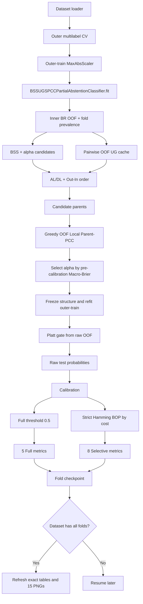

# Đặc tả triển khai chính thức mô hình BSS-UG-SPCC-PA

> Tên đầy đủ: **BSS-guided Usable-Gain Sparse Probabilistic Classifier Chain with Partial Abstention**
>
> Tài liệu nguồn chính: [`quy_trinh_BSS_UG_SPCC_PA(2).md`](quy_trinh_BSS_UG_SPCC_PA(2).md)
>
> Trạng thái tài liệu: đặc tả triển khai; **không phải kết quả thực nghiệm**.
>
> Quy ước bắt buộc: không dùng test để chọn cấu trúc, siêu tham số, calibration, ngưỡng hoặc chi phí từ chối; không ghi kết quả chưa chạy như một sự thật.

## 1. Bối cảnh và vấn đề cần giải quyết

Dự án hiện đã có pipeline phân loại đa nhãn cho BR, CC, MLC-PA và GSI-MLC-PA; có 10 bộ dữ liệu, outer cross-validation phân tầng đa nhãn, registry bộ học cơ sở, checkpoint theo fold, metric contract, cơ chế Hamming Bayes-optimal prediction (BOP), export bảng và hình theo phong cách ESWA. Tuy nhiên, mô hình trong `quy_trinh_BSS_UG_SPCC_PA(2).md` chưa được cài đặt.

Mô hình mới phải giải quyết đồng thời bốn vấn đề:

1. Tách các nhãn có thể dự đoán trực tiếp tốt từ đặc trưng thành Anchor Labels (AL) bằng Brier Skill Score (BSS) tính từ xác suất out-of-fold (OOF).
2. Xây dựng DAG thưa cho Dependent Labels (DL) bằng Usable Gain (UG), thứ tự `Out-In` và chọn cha tham lam hoàn toàn trên dữ liệu train.
3. Thay xấp xỉ mean-field nhiều cha hiện có trong `GSIMLCPartialAbstentionClassifier` bằng **Local Parent-PCC** và phép cộng biên chính xác trên tối đa `2^5 = 32` cấu hình cha.
4. Chỉ áp dụng từ chối sau khi mọi xác suất đã được suy luận và calibration; xuất đúng các chỉ số và hình được yêu cầu.

Mô hình phải được mô tả đúng là BSS-UG Sparse Probabilistic Classifier Chain with Partial Abstention. Không được gọi là GBNC đầy đủ, không được tuyên bố DAG tối ưu toàn cục và không được tuyên bố các Local Parent-PCC tạo thành một joint distribution duy nhất trên toàn bộ không gian nhãn.

## 2. Mục tiêu

### 2.1. Mục tiêu tổng quát

Tích hợp một mô hình `BSS_UG_SPCC_PA_Logistic` có thể chạy/resume trên 9 dataset được chọn từ dự án (loại `bibtex` khỏi primary run), tái sử dụng tối đa hạ tầng dự án, bảo đảm không rò rỉ outer-test, sinh đầy đủ checkpoint/bảng/hình, và không làm thay đổi hành vi mặc định của các mô hình/cấu hình đã tồn tại.

### 2.2. Mục tiêu cụ thể

- Cài đúng 10 bước huấn luyện/suy luận trong tài liệu nguồn: BR-OOF/BSS, chọn `alpha`, UG, lọc cạnh, thứ tự DL, tập cha ứng viên, OOF-PCC greedy, refit, calibration và Hamming BOP.
- Mặc định và primary run chỉ dùng Logistic Regression từ factory hiện có.
- Cho phép mở rộng sang `mlp` hoặc `svm_calibrated` qua tham số của lớp, nhưng không đăng ký, không thêm vào default run và không chạy chúng trong phạm vi hiện tại.
- Tái sử dụng loader, scaler, cross-validation, registry, Hamming policy, cache-v3, tổng hợp fold và style hình hiện có.
- Chỉ xuất các chỉ số được khóa tại Mục 6; không xuất các metric rejected/optimistic/deployment/Jaccard/precision/recall/Hamming Loss trong profile của mô hình mới.
- Cập nhật toàn bộ hình sau khi hoàn thành mỗi dataset, chỉ dùng các dataset đã đủ mọi fold.
- Bắt buộc tạo và cập nhật `phase_status.md` trong quá trình triển khai theo các phase ở Mục 17.

## 3. Phạm vi thực hiện

### 3.1. Trong phạm vi

- 9 dataset primary lấy từ `src/data/loader.py::DATASET_CONFIG`: `emotions`, `music`, `scene`, `yeast`, `cal500`, `enron`, `genbase`, `medical`, `reuters-k500`. Dataset `bibtex` vẫn được loader của dự án hỗ trợ nhưng không nằm trong queue BSS-UG-SPCC-PA này.
- Outer 5-fold multilabel-stratified CV và inner OOF CV chỉ trên outer-train.
- Một model ID primary: `BSS_UG_SPCC_PA_Logistic`.
- Logistic Regression dùng đúng manifest `configs/experiment.json` hiện có.
- Hamming BOP với linear/separable rejection cost (SEP) và biên quyết định đúng tài liệu nguồn.
- JSON/CSV/checkpoint, audit tự động, 10 hình theo dataset và 5 hình `rejection_cost`.
- Unit test, integration test và synthetic smoke test; không chạy full benchmark trong phase triển khai.

### 3.2. Ngoài phạm vi

- Không chạy thực nghiệm benchmark thật; người dùng tự chạy.
- Không sửa số liệu hiện có trong `results/`, `results_pa/`, `papers/` hoặc `TaiLieuThamKhao/`.
- Không tự động sửa nội dung các bài báo `.tex`/`.pdf`.
- Không triển khai GOBNILP, GBNC đầy đủ, Monte Carlo PCC, beam search hoặc penalty BIC/EBIC.
- Không bỏ giới hạn `q_max=5` trong phiên bản này.
- Không chạy ablation chính thức. Các lựa chọn `alpha=0`, `q_max in {1,3,5}`, stability filter, mean-field, hard-CC và base learner khác chỉ là hook cho phase sau.
- Không chọn rejection cost hoặc report cost bằng outer-test.
- Không ghi nhận mô hình tốt hơn/kém hơn baseline cho đến khi có kết quả đã audit.

## 4. Thuật ngữ và ký hiệu

| Thuật ngữ/ký hiệu | Định nghĩa khóa |
|---|---|
| `N`, `d`, `K` | Số mẫu, số đặc trưng và số nhãn. |
| `X`, `Y` | Ma trận đặc trưng `N x d` và nhãn nhị phân `N x K`. |
| `p_raw`, `p_final` | Xác suất trước và sau calibration. |
| OOF | Dự đoán ngoài mẫu; mẫu không được dùng để fit mô hình sinh dự đoán đó. |
| BSS | `1 - BS_BR / BS_ref`, với baseline prevalence tính riêng từ training portion của từng inner fold. |
| AL | Anchor Labels: nhãn dự đoán trực tiếp bằng BR; đứng trước DL và chỉ có thể làm cha. |
| DL | Dependent Labels: nhãn có thể nhận cha từ AL hoặc DL đứng trước. |
| UG | Chênh lệch average conditional log-likelihood giữa mô hình có một cha và BR cơ sở. |
| `P_j` | Tập cha cuối cùng của nhãn `j`, có tối đa `q_max=5` phần tử. |
| Local Parent-PCC | PCC cục bộ ước lượng joint distribution của tập cha của một nhãn con; các cạnh nội bộ không được thêm vào DAG cấu trúc. |
| `bot`, `-1` | Trạng thái từ chối. Không bao giờ được truyền vào PCC. |
| Full prediction | Dự đoán nhị phân đầy đủ bằng ngưỡng `0.5` trên `p_final`. |
| Selective prediction | Dự đoán `{0,-1,1}` sau Hamming BOP. |
| Example-F1 / Instance-F1 | Cùng một metric. Output chuẩn chỉ ghi `Instance-F1`; nhãn hiển thị hình là “Example-F1 (Instance F1)”. |
| ABS | Tỷ lệ instance có ít nhất một nhãn bị từ chối. |
| AABS | Tỷ lệ vị trí instance-label bị từ chối; bằng `1 - Coverage`. |

## 5. Hiện trạng dự án và nguyên tắc tái sử dụng

### 5.1. Thành phần phải tái sử dụng

| Thành phần hiện có | API/đường dẫn phải dùng | Cách dùng trong mô hình mới |
|---|---|---|
| Dataset loader | `src/data/loader.py::load_dataset`, `DATASET_CONFIG` | Không tạo loader mới, không sao chép metadata dataset. |
| Outer/inner splitter | `src/evaluation/cv.py::get_multilabel_cv` | Dùng cùng seed và split strategy; ghi split hash vào cache. |
| Scaling | `sklearn.preprocessing.MaxAbsScaler` theo `main.py`/`pipeline_v3.py` | Fit trên outer-train, transform outer-test; không fit trên test. |
| Base learner factory | `src/models/base_learners.py::create_binary_estimator`, `create_multilabel_estimator`, `base_learner_manifest` | Mọi binary Logistic phải đi qua factory; không hard-code một factory Logistic thứ hai. |
| BR | `src/models/binary_relevance.py::BinaryRelevanceClassifier` | Dùng cho refit BR đầy đủ và API xác suất; OOF helper phải dùng cùng binary factory/fallback semantics. |
| Quyết định từ chối | `src/decision/hamming.py::HammingBOPPolicy` | Mở rộng bằng boundary mode mới, không viết lại policy trong model. |
| Metric đầy đủ | `src/evaluation/complete_metrics.py::compute_complete_metrics` | Lấy 5 metric được phép rồi filter theo profile. |
| Metric từ chối | `src/evaluation/abstention_metrics.py::compute_abstention_metrics` | Tái sử dụng 7 metric đã có; bổ sung riêng Selective Instance-F1. |
| Metric facade | `src/evaluation/metric_facade.py` | Thêm profile hẹp cho BSS-UG-SPCC-PA; giữ profile v3 hiện có. |
| Fold checkpoint | `src/evaluation/cache_v3.py` | Không tạo định dạng checkpoint cạnh tranh; config hash phải chứa toàn bộ tham số mới. |
| Runner v3 | `src/evaluation/pipeline_v3.py::run_experiment_v3` | Mở rộng bằng profile và refresh artifact theo dataset, mặc định cũ không đổi. |
| Export | `src/evaluation/export_v3.py` | Profile mới chỉ export metric allowlist. |
| Hình | `src/visualization/plots.py`, mẫu `scripts/generate_eswa_figures.py`, `results/eswa_figures/` | Tổng quát hóa hàm có sẵn, giữ style 300 DPI, không tạo một plotting stack trùng lặp. |
| Audit | `scripts/audit_v3_results.py` | Thêm audit profile mới, không viết script audit độc lập có logic lặp. |

### 5.2. Khoảng trống hiện tại

- Chưa có BSS, fold-local prevalence reference, UG có hướng, thứ tự `Out-In`, DAG thưa hoặc Local Parent-PCC.
- `GSIMLCPartialAbstentionClassifier._configured_probabilities` đang dùng exact two-state cho một predecessor nhưng mean-field cho nhiều predecessor; không được dùng lại nhánh mean-field cho mô hình mới.
- `HammingBOPPolicy` hiện quyết định tại biên `p=c` và `p=1-c`; tài liệu nguồn yêu cầu hai biên này thuộc vùng từ chối.
- Metric hiện có chưa có `Selective Instance-F1`.
- Pipeline hiện chỉ sinh artifact cuối lượt chạy/quota, chưa refresh sau mỗi dataset hoàn tất.
- Script ESWA hiện hard-code model/metric của thí nghiệm cũ và có một số metric xấp xỉ; mô hình mới không được suy diễn metric từ metric khác.

### 5.3. Ranh giới tương thích

- Không đổi `MATCHED_MODEL_IDS` hiện tại; lệnh `python main.py` cũ vẫn mặc định 12 model cũ.
- Không đổi `METRIC_CONTRACT_VERSION`, `COMPLETE_METRIC_NAMES` hoặc `SELECTIVE_METRIC_NAMES` của schema-v3 hiện tại.
- Profile BSS-UG-SPCC-PA có version và allowlist riêng, do đó cache v2/v3 cũ không bị diễn giải lại.
- Không sửa hoặc xóa kết quả/cấu hình frozen hiện có.

## 6. Contract chỉ số đầu ra

### 6.1. Chỉ số dự đoán đầy đủ

Output `Full` phải có **đúng 5 khóa**, theo thứ tự:

1. `Hamming Accuracy`
2. `Subset Accuracy`
3. `Macro-F1`
4. `Micro-F1`
5. `Instance-F1`

Không serialize alias `Example-F1` thành cột thứ hai. UI/caption có thể ghi “Example-F1 (Instance F1)”.

### 6.2. Chỉ số có cơ chế từ chối

Mỗi cost trong `Costs` phải có `Selective` với **đúng 8 khóa**, theo thứ tự:

1. `Coverage`
2. `AABS`
3. `ABS`
4. `Generalized Loss`
5. `Selective Macro-F1`
6. `Selective Micro-F1`
7. `Selective Instance-F1`
8. `Selective Hamming Accuracy`

Không xuất các chỉ số còn lại trong profile này, gồm nhưng không giới hạn: Hamming Loss, Selective Hamming Loss, Jaccard, precision/recall, rejected, optimistic, AURC, risk-at-coverage, error capture, calibration metrics và deployment utility. Metadata khoa học, cấu trúc DAG, timing và raw counts phục vụ audit không được gọi là metric và được lưu ở `Model Metadata`/checkpoint, không chen vào bảng metric.

### 6.3. Định nghĩa Selective Instance-F1

Với instance `n`, gọi `D_n` là tập nhãn đã quyết định. Chỉ các vị trí trong `D_n` tham gia TP/FP/FN:

```text
F1_n^sel = 2*TP_n^D / (2*TP_n^D + FP_n^D + FN_n^D)
Selective Instance-F1 = mean_n(F1_n^sel)
```

Quy ước biên:

- Nếu `|D_n| = 0`, `F1_n^sel = 0`; all-abstain không được thưởng.
- Nếu `|D_n| > 0` và cả tập dương thật lẫn dự đoán trên `D_n` đều rỗng, `F1_n^sel = 1` vì phần đã quyết định là chính xác.
- Mọi instance, kể cả instance không có quyết định, vẫn nằm trong mẫu số `N`.

### 6.4. Các công thức metric còn lại

```text
Hamming Accuracy = sum(Y_full == Y) / (N*K)
Subset Accuracy  = mean_n(all_k(Y_full[n,k] == Y[n,k]))
Macro-F1         = mean_k(2TP_k / (2TP_k + FP_k + FN_k)), zero_division=0
Micro-F1         = 2*sum(TP) / (2*sum(TP) + sum(FP) + sum(FN)), zero_division=0
Instance-F1      = mean_n(2TP_n / (2TP_n + FP_n + FN_n))
Coverage         = decided_positions / (N*K)
AABS             = abstained_positions / (N*K) = 1 - Coverage
ABS              = instances_with_any_abstention / N
Selective Hamming Accuracy = correct_decided_positions / decided_positions
Generalized Loss = sum_n(decided_errors_n + c*abstentions_n) / (N*K)
```

Nếu không có vị trí nào được quyết định, `Selective Hamming Accuracy = NaN`, còn Selective Macro/Micro/Instance-F1 bằng `0`. JSON strict phải chuyển `NaN` thành `null`; CSV để ô trống, không thay bằng `0` hoặc `1`.

## 7. Yêu cầu chức năng

### FR-01 — Model API

Tạo `BSSUGSPCCPartialAbstentionClassifier` tuân thủ sklearn-style API:

```python
fit(X, Y)
predict_raw_proba(X)
predict_proba(X)
predict_full(X)
predict_full_from_proba(probabilities)
predict(X)
predict_from_proba(probabilities, cost=None)
decision_function(X)
get_structure_audit()
```

`predict_proba` trả `N x K` xác suất đã calibration; `predict_raw_proba` trả xác suất trước calibration. Không phương thức dự đoán nào nhận `Y_test`.

### FR-02 — BR OOF và BSS

- Tạo OOF probability cho mọi nhãn bằng cùng inner splits.
- Mỗi xác suất của mẫu chỉ được sinh bởi mô hình không fit mẫu đó.
- `BS_ref` dùng prevalence của training portion của đúng fold, không dùng prevalence toàn outer-train.
- Nếu `BS_ref <= epsilon`, gắn cờ `degenerate`; nhãn được dự đoán trực tiếp bằng constant/prior model, được đặt trong AL để không làm con, đồng thời bị loại khỏi UG/PCC parent candidate vì không mang biến thiên hữu ích.
- Lưu `BS_BR`, `BS_ref`, `BSS`, fold diagnostics và degenerate reason trong audit.

### FR-03 — Chọn alpha

- Primary grid: `{0.1, 0.2, 0.3, 0.4, 0.5}`.
- Với mỗi alpha, xây đầy đủ AL/DL, order, candidates, parent map và raw OOF probability.
- Score bằng Macro-Brier trước calibration.
- Chọn alpha có score nhỏ nhất. Nếu chênh lệch không vượt `alpha_tie_tolerance`, chọn alpha nhỏ hơn để ưu tiên nhiều AL và cấu trúc đơn giản hơn.
- `alpha=0` chỉ là optional ablation, không nằm trong primary grid.

### FR-04 — Usable Gain

- Xét cạnh `i -> j` nếu `i != j`; sau khi biết alpha chỉ cho phép child thuộc DL, không cho `DL -> AL`, không xét cạnh giữa AL.
- Conditional Logistic được fit trên `[X, Y_i_true]` trong training portion của inner fold.
- Trên validation portion, đánh giá hai trạng thái cha `0/1`, rồi cộng biên bằng xác suất BR-OOF của cha; không truyền `Y_i_true` của validation vào prediction.
- CLL là **trung bình theo mẫu**, không phải tổng.
- `UG = CLL_with_parent - CLL_BR`; giữ cạnh khi và chỉ khi `UG > 0.0005`.
- Có thể tính ma trận UG dùng chung một lần rồi lọc theo từng alpha; đây là cache nội bộ hợp lệ.

### FR-05 — Thứ tự DL và DAG

- Chỉ cạnh DL-to-DL đã qua ngưỡng tham gia `Out-In`.
- Tại mỗi vòng chọn nhãn có `Out-In` lớn nhất; tie-break lần lượt bằng `Out` lớn hơn, BSS lớn hơn, label index nhỏ hơn.
- Global order phục vụ parent order là: toàn bộ AL giảm dần theo BSS (tie bằng label index), sau đó DL theo `Out-In`.
- Parent candidate của child chỉ gồm AL hoặc DL đứng trước và có `UG > threshold`; vì vậy DAG phải acyclic theo construction.

### FR-06 — Chọn cha OOF-PCC

- Bắt đầu `P_j = empty`; baseline CLL là BR-OOF của child.
- Mỗi candidate addition phải được đánh giá bằng xác suất OOF sinh từ chính Local Parent-PCC sẽ dùng ở test.
- Chọn candidate có `Delta_PCC` lớn nhất; tie-break bằng pairwise UG lớn hơn, vị trí global order sớm hơn, label index nhỏ hơn.
- Chấp nhận khi và chỉ khi `Delta_PCC > 0.0005` và `|P_j| < 5`.
- Dừng ngay nếu không còn gain đạt ngưỡng.
- Cache OOF-PCC theo `(child, ordered_parent_tuple, inner_split_hash, learner_manifest)` để các alpha/candidate không fit lại cấu hình trùng.

### FR-07 — Local Parent-PCC

- Parent order kế thừa global order; giữ cố định trong OOF, refit, calibration và test.
- Fit `m` parent conditional model và một child conditional model bằng nhãn cha thật chỉ trên training data.
- Inference liệt kê chính xác `2^m` state; không dùng mean-field, hard chain path hoặc Monte Carlo.
- Trọng số joint của mọi state phải không âm, hữu hạn và tổng bằng `1` trong sai số `1e-10`.
- Child marginal là tổng `g_child(x,z) * w_parent(z|x)`.
- Với `m=1`, kết quả phải đúng công thức two-state trong tài liệu nguồn.
- Với `m=0`, caller dùng BR fallback; không fit một PCC rỗng.

### FR-08 — Refit và calibration

- Sau khi alpha/AL/DL/order/parents được freeze, refit BR và các Local Parent-PCC trên toàn outer-train.
- Tạo raw OOF probability của đúng pipeline đã chọn để fit Platt calibrator theo từng nhãn.
- Calibrator nhận `logit(clip(p_raw, epsilon, 1-epsilon))`.
- Quyết định giữ calibration bằng cross-fitted Brier trên outer-train OOF: chỉ giữ nếu `BS_cal + calibration_tolerance < BS_raw`; sau gate, refit calibrator trên toàn bộ OOF pair. Nếu không đủ hai lớp hoặc fit lỗi, dùng identity và ghi reason.
- Calibration chỉ áp dụng sau khi mọi raw probability đã tính xong; calibrated probability không được đưa lại vào Local Parent-PCC.

### FR-09 — Full và partial decision

- Full prediction dùng `p_final >= 0.5`.
- Hamming BOP của mô hình mới phải đúng biên:

```text
p < c       -> 0
c <= p <= 1-c -> abstain (-1)
p > 1-c     -> 1
```

- Thêm `linear_boundary="strict_symmetric_thresholds"` vào `HammingBOPPolicy`; các mode cũ giữ nguyên để không regression.
- Primary cost phải thỏa `0 < c < 0.5`.
- `-1` chỉ xuất hiện sau cùng và không được truyền vào mô hình xác suất.

### FR-10 — Registry và base learner

- Đăng ký `BSS_UG_SPCC_PA_Logistic` nhưng không thêm vào `MATCHED_MODEL_IDS` cũ.
- Manifest phải ghi `family="BSS_UG_SPCC_PA"`, `base_learner="logistic"`, toàn bộ structural/calibration/rejection settings.
- Lớp có thể nhận `mlp` hoặc `svm_calibrated` từ factory, nhưng official config/runner phải từ chối base khác Logistic trừ khi người dùng truyền explicit override trong một run riêng và output directory/hash riêng.
- Không hỗ trợ `svm_raw` vì xác suất chưa calibration không phù hợp cho BSS/UG/BOP.

### FR-11 — Checkpoint/resume

- Mỗi outer fold hoàn thành được ghi atomically bằng `cache_v3.py`.
- Hash phải thay đổi nếu đổi dataset fingerprint, split, base learner, alpha grid, threshold, `q_max`, calibration, cost grid, report cost, metric profile hoặc code-visible model parameters.
- Resume không fit lại fold hoàn thành và không trộn cache khác hash.
- Artifact chỉ tổng hợp dataset có đủ `n_splits`; fold dở dang vẫn ở checkpoint nhưng không vào bảng/hình tổng hợp.

### FR-12 — Bảng và JSON

- `results.json`, `fold_results.csv`, `summary_results.csv` chỉ chứa metric allowlist ở Mục 6.
- `summary_results.csv` có `Dataset`, `Model`, `Scope`, `Cost`, rồi cặp `Mean`/`Std` cho đúng metric của scope.
- `structure_audit.json` tách riêng BSS, alpha scores, AL/DL, UG edges, order, parent map, selection history, calibration decision, timing và config hash.
- Không ghi giả trị thiếu thành `0`; dùng `null`/ô trống theo quy ước.

### FR-13 — Hình và refresh theo dataset

Sau khi một dataset đủ mọi fold cho toàn bộ model được yêu cầu trong profile, runner phải atomically dựng lại hình từ tất cả dataset đã hoàn tất. Không chờ toàn bộ 9 dataset primary.

Hình theo dataset tại `report_cost=0.30`:

1. `dataset_hamming_accuracy_comparison.png`
2. `dataset_subset_accuracy_comparison.png`
3. `dataset_macro_f1_comparison.png`
4. `dataset_micro_f1_comparison.png`
5. `dataset_instance_f1_comparison.png`
6. `dataset_generalized_loss_comparison.png`
7. `dataset_selective_macro_f1_comparison.png`
8. `dataset_selective_micro_f1_comparison.png`
9. `dataset_selective_instance_f1_comparison.png`
10. `dataset_selective_hamming_accuracy_comparison.png`

Không tạo hình độc lập cho `Coverage`, `AABS`, `ABS`.

Hình rejection-cost theo mẫu `results/eswa_figures/rejection_cost_*.png`:

1. `rejection_cost_generalized_loss.png`
2. `rejection_cost_selective_macro_f1.png`
3. `rejection_cost_selective_micro_f1.png`
4. `rejection_cost_selective_instance_f1.png`
5. `rejection_cost_selective_hamming_accuracy.png`

Mỗi rejection-cost panel có một hàng cho mỗi cost. Cột trái so sánh full-decision counterpart với selective metric; với Generalized Loss, full-decision counterpart là generalized loss tại `a=0` chứ không xuất một metric Hamming Loss mới. Cột phải được phép hiển thị ABS bằng bar và AABS bằng dot để mô tả mức từ chối như hình mẫu; đây không phải hình ABS/AABS độc lập. Caption phải ghi số dataset hoàn tất, cost grid, mean/std qua outer folds, hướng tốt/xấu và thời điểm cập nhật. Không điền `0` cho dataset/model thiếu.

### FR-14 — Phase status

Ngay đầu Phase 0 triển khai phải tạo `phase_status.md`. Cuối mỗi phase phải cập nhật file này trước khi chuyển phase. Nội dung bắt buộc:

```text
# Phase status — BSS-UG-SPCC-PA
- Updated at
- Current phase
- Status: not_started | in_progress | partial | complete | blocked
- Objective of this phase
## Completed
## Files created/modified
## Verification/tests and evidence
## Leakage/reproducibility audit
## Remaining issues/blockers
## Next phase and exact first task
## Experiment status
```

Khi code và test hoàn tất nhưng benchmark chưa chạy, `Experiment status` phải ghi `pending_user_run`; không được ghi dự án nghiên cứu đã hoàn tất.

### FR-15 — So sánh cùng bộ học cơ sở Logistic

Mọi lần chạy chính phải dựng hình so sánh theo đúng thứ tự `BR_Logistic`, `CC_Logistic`, `MLC_PA_Logistic`, `BSS_UG_SPCC_PA_Logistic`. Không được đưa kết quả `BR`/`CC` dùng LinearSVC vào rồi đổi nhãn thành Logistic.

- Tái sử dụng `results_pa/tables/raw_results.json::BR_Logistic` cho BR và `results_pa/tables/MLC_PA.json` cho MLC-PA khi metadata xác nhận `base_estimator="logistic"`, `n_splits=5`, `random_state=42`, cost grid, report cost và penalty khớp config chính.
- Dự án hiện không có cache `CC_Logistic` tương thích và cache MLC-PA Logistic hiện thiếu `genbase`; runner phải tạo/resume riêng các fold thiếu trong `results_bss_ug_spcc_pa_cc_logistic/` và `results_bss_ug_spcc_pa_mlc_pa_logistic/`. Hai queue này dùng cùng dataset, outer folds, seed, scaler và Logistic manifest với run chính.
- `--max-new-folds N` tiến thêm tối đa `N` fold mới cho từng queue còn thiếu rồi tiến thêm tối đa `N` fold BSS, nhờ đó mỗi lần gọi đều làm tiến triển cả baseline thiếu và mô hình mới. Không chạy lại BR/MLC-PA đã có và tương thích.
- Có thể dùng `--skip-comparison-preparation` để chỉ dùng cache hiện có, nhưng audit chính thức phải fail nếu bất kỳ dataset so sánh nào còn thiếu.
- Hình dataset: BR/CC dùng metric full; MLC-PA/BSS dùng metric selective ở `report_cost` đối với năm hình selective. Với `Generalized Loss`, counterpart của BR/CC là `1 - Hamming Accuracy` trên đúng fold. Đây là đồng nhất thức, không phải metric ước lượng.
- Hình rejection-cost theo mẫu `results/eswa_figures`: cột trái có full prediction của cả bốn mô hình và cột gạch “with rejection” chỉ cho MLC-PA/BSS; cột phải có ABS bar và AABS dot chỉ cho MLC-PA/BSS.
- Cache MLC-PA schema-v2 không có `Selective Instance-F1`; runner phải tạo/resume một run MLC-PA Logistic riêng trên đủ 9 dataset, lưu dự đoán selective theo fold và tính `compute_selective_instance_f1` chính xác ở mọi cost. Chỉ được hiển thị `N/A` trong artifact tạm khi queue này chưa hoàn tất; audit chính thức phải fail nếu còn dataset thiếu. Không dùng full Instance-F1, không nội suy và không điền `0`.
- Ghi nguồn, SHA-256, model key, schema, settings đã xác minh, dataset thiếu và cảnh báo metric thiếu vào `comparison_audit.json`. `artifact_manifest.json` phải hash cả file này.
- Dữ liệu baseline chỉ phục vụ hình so sánh và audit nguồn, không được chèn vào `results.json`, `fold_results.csv` hoặc `summary_results.csv` của metric profile BSS.

## 8. Yêu cầu phi chức năng

### NFR-01 — Không rò rỉ dữ liệu

- Outer-test chỉ được đưa vào `predict*` và metric sau khi `fit` kết thúc.
- BSS, alpha, UG, order, parents, calibration gate và mọi cache structure chỉ dùng outer-train.
- Không dùng metric outer-test để chọn model/cost/threshold.
- Spy test phải chứng minh fit/selection/calibration không nhận index/array outer-test.

### NFR-02 — Tái lập

- Mọi split/tie có quy tắc xác định và seed mặc định `42`.
- Thứ tự duyệt label, candidate, parent state và JSON key phải ổn định.
- Manifest chứa Python/library-visible settings, dataset fingerprint, split hash và config hash.

### NFR-03 — Hiệu năng

- Vector hóa đánh giá tối đa 32 state; không loop từng sample nếu có thể biểu diễn bằng ma trận.
- Cache BR-OOF, conditional state probabilities, UG và OOF-PCC candidate trong một `fit`.
- Dừng greedy sớm khi best gain không đạt ngưỡng.
- Không bật nested process parallelism mặc định; primary Logistic giữ `n_jobs=1` để tránh oversubscription.
- Ghi riêng thời gian BR/BSS, UG, từng alpha, parent selection, refit, calibration và inference vào audit, nhưng không đưa timing vào metric table.

### NFR-04 — Độ bền và tính nguyên tử

- JSON/checkpoint/CSV/PNG ghi vào file tạm cùng thư mục rồi `os.replace`.
- Plot lỗi không được làm mất checkpoint metric đã hoàn thành.
- Cache không tương thích phải fail closed hoặc đi sang hash/output khác; không tự xóa cache cũ.

### NFR-05 — Bảo trì

- Không sao chép Logistic factory, CV splitter, BOP formula, metric formulas hoặc style plotting sang nhiều nơi.
- Public API có docstring về shape, dtype, fitted attributes và leakage boundary.
- Hàm model-specific nằm trong module model; runner chỉ orchestration, không chứa công thức BSS/UG/PCC.

### NFR-06 — Khả năng kiểm chứng

- Mỗi con số trong summary truy ngược được dataset, outer fold, cost, config hash và raw fold record.
- Mỗi DAG truy ngược được BSS, UG, order score và conditional PCC gain.
- Audit script trả exit code khác `0` nếu thiếu metric/hình, có metric ngoài allowlist, sai fold count hoặc sai invariant.

## 9. Kiến trúc và quy trình đề xuất



## 10. Luồng xử lý chi tiết

Mỗi bước dưới đây có đầu vào, thao tác, đầu ra và cách xác minh bắt buộc.

| Bước | Đầu vào | Thao tác | Đầu ra | Xác minh |
|---|---|---|---|---|
| 1. Load/split | Dataset name, seed, `n_splits` | `load_dataset`; tạo outer splits; fit scaler trên outer-train | Train/test arrays, label names, split hash | Shape/dtype/binary checks; scaler không fit test; split hash ổn định |
| 2. Inner splits | Scaled outer-train, seed | Tạo một bộ inner OOF splits dùng chung | Danh sách train/validation indices | Mỗi mẫu xuất hiện validation đúng một lần; không có overlap train/validation trong fold |
| 3. BR OOF | Inner splits, Logistic manifest | Fit K binary model/fold; dự đoán validation; tính fold-local prevalence | `P_BR_OOF`, `P_ref_OOF` | Không còn ô chưa điền; mọi p hữu hạn trong `[0,1]`; spy sample không tự fit nó |
| 4. BSS | `Y_train`, hai ma trận OOF | Tính `BS_BR`, `BS_ref`, BSS; xử lý degenerate | Vector BSS và audit | Fixture hand-computed; không chia gần 0; constant label ổn định |
| 5. UG cache | X/Y outer-train, BR OOF, inner splits | Fit conditional pairwise Logistic OOF; two-state marginal; average CLL | `K x K` UG matrix và optional fold signs | Diagonal invalid; mean CLL; validation parent truth không đi vào input |
| 6. Alpha candidate | BSS, alpha | Chia AL/DL; forced-degenerate AL | Partition candidate | AL/DL rời nhau, hợp bằng toàn label; AL đứng trước DL |
| 7. Order | Partition, thresholded UG | Greedy `Out-In` trên DL với tie-break khóa | DL/global order | Permutation hợp lệ; kết quả deterministic; AL edges không làm đổi DL order |
| 8. Candidate parents | Global order, UG | Giữ predecessor có UG vượt ngưỡng | `C_j` | Mọi candidate đứng trước child; graph candidate acyclic |
| 9. Greedy parents | `C_j`, OOF-PCC cache | Thêm từng cha theo positive conditional gain, tối đa 5 | `P_j`, selection history | Mọi accepted delta `> threshold`; `len(P_j)<=5`; score là OOF |
| 10. Alpha score | Partition/order/parent map | Ghép raw OOF: AL/parentless dùng BR, parented dùng Local PCC; tính Macro-Brier | Alpha record | Dùng pre-calibration p; không có outer-test; score tái lập |
| 11. Freeze/refit | Best alpha record, full outer-train | Refit BR và final Local Parent-PCC | Fitted probability graph | Parent order khớp frozen order; state weights sum 1 |
| 12. Calibration | Selected raw OOF, Y outer-train | Cross-fit Platt, Brier gate, refit accepted calibrator | Per-label calibrator/identity audit | Calibrator không dùng outer-test; rejected calibration không thay p |
| 13. Test inference | Scaled outer-test X | Tính toàn bộ raw marginal, sau đó calibration | `P_final` | Shape `N_test x K`, finite `[0,1]`; không dùng Y_test |
| 14. Decision/metric | `P_final`, Y_test, cost grid | Full threshold và strict Hamming BOP; metric profile | Exact Full/Selective dicts | Key set đúng allowlist; `AABS=1-Coverage`; cost boundary fixtures |
| 15. Checkpoint/export | Fold records và manifest | Atomic fold save; nếu dataset đủ fold thì summarize/export/plot | Checkpoint, JSON, CSV, 15 PNG | Resume không duplicate; audit script pass; hình chỉ chứa completed dataset |

## 11. Công thức và thuật toán

### 11.1. Brier Skill Score

Với sample `n` thuộc validation fold `r(n)`:

```text
p_ref[n,j] = mean(Y_train_fold[:,j])
BS_BR[j]   = mean_n((p_BR_OOF[n,j] - Y[n,j])^2)
BS_ref[j]  = mean_n((p_ref_OOF[n,j] - Y[n,j])^2)
BSS[j]     = 1 - BS_BR[j] / BS_ref[j]
```

Không thay `p_ref` bằng prevalence toàn outer-train.

### 11.2. Usable Gain

Với cạnh `i -> j`, conditional model cho hai trạng thái:

```text
q1[n] = P(Y_j=1 | X_n, Y_i=1)
q0[n] = P(Y_j=1 | X_n, Y_i=0)
p_edge[n] = p_BR_OOF[n,i]*q1[n] + (1-p_BR_OOF[n,i])*q0[n]
CLL(p) = mean_n(Y[n,j]*log(clip(p[n])) + (1-Y[n,j])*log(clip(1-p[n])))
UG[i,j] = CLL(p_edge) - CLL(P_BR_OOF[:,j])
```

Clipping dùng `epsilon=1e-12`.

### 11.3. Order score

```text
Out_t(i) = sum_{j in R_t, j!=i} max(UG[i,j], 0) * I(UG[i,j] > delta_UG)
In_t(i)  = sum_{h in R_t, h!=i} max(UG[h,i], 0) * I(UG[h,i] > delta_UG)
OrderScore_t(i) = Out_t(i) - In_t(i)
```

### 11.4. Local Parent-PCC

Với ordered parents `(i_1,...,i_m)` và state `z`:

```text
w(z|x) = product_r h_r(x,z_<r)^z_r * (1-h_r(x,z_<r))^(1-z_r)
p_child_raw(x) = sum_{z in {0,1}^m} g_child(x,z) * w(z|x)
```

Pseudocode inference vector hóa:

```text
states = all_binary_states(m)                 # shape 2^m x m
weights = ones(n_samples, 2^m)
for r in 0..m-1:
    features = broadcast_concat(X, states[:, :r])
    q = parent_model[r].predict_proba(features)
    weights *= where(states[:, r] == 1, q, 1-q)
weights /= row_sum(weights) only as numeric safeguard if deviation <= tolerance
child_q = child_model.predict_proba(broadcast_concat(X, states))
return row_sum(weights * child_q)
```

Nếu weight sum lệch quá `1e-10`, raise error thay vì âm thầm normalize một phân phối hỏng.

### 11.5. Greedy parent selection

```text
P = empty
current = CLL_BR_OOF(child)
while len(P) < q_max:
    for i in candidates - P:
        trial = sort_by_global_order(P union {i})
        score[i] = CLL(OOF_LocalParentPCC(child, trial))
        delta[i] = score[i] - current
    i_star = deterministic_argmax(delta, pairwise_UG, global_position, label_index)
    if delta[i_star] <= delta_UG: break
    P = P union {i_star}
    current = score[i_star]
return P
```

### 11.6. Alpha selection

```text
MacroBrier(alpha) = mean_j(mean_n((P_raw_OOF_alpha[n,j] - Y[n,j])^2))
alpha_star = deterministic_argmin(MacroBrier, then smaller alpha)
```

### 11.7. Platt scaling

```text
z = log(clip(p_raw)/(1-clip(p_raw)))
p_cal = sigmoid(a*z + b)
```

Chỉ giữ nếu cross-fitted `BS_cal + tolerance < BS_raw`.

## 12. Đầu vào, đầu ra và cấu trúc dữ liệu

### 12.1. Đầu vào chạy chính

Lệnh chính dự kiến:

```powershell
python scripts/run_bss_ug_spcc_pa.py --config configs/bss_ug_spcc_pa.json
```

Các override vận hành hợp lệ không đổi scientific hash: `--max-new-folds`. Mọi override khoa học khác phải đi vào config/hash và output directory tương ứng.

Runner chính đồng thời đọc cache BR/MLC-PA Logistic tương thích và làm tiến triển các checkpoint `CC_Logistic`/`MLC_PA_Logistic` còn thiếu trước khi tiến triển BSS. `--dry-run` chỉ báo trạng thái nguồn, không nạp dataset và không huấn luyện. `--skip-comparison-preparation` không làm mất khả năng vẽ từ cache đã có, nhưng chỉ dành cho chẩn đoán/chạy tạm vì audit chính thức yêu cầu baseline đủ cả 9 dataset.

### 12.2. Config chính

`configs/bss_ug_spcc_pa.json`:

```json
{
  "schema_version": 1,
  "status": "primary",
  "datasets": [
    "emotions", "music", "scene", "yeast", "genbase",
    "medical", "enron", "cal500", "reuters-k500"
  ],
  "models": ["BSS_UG_SPCC_PA_Logistic"],
  "base_learner": "logistic",
  "n_splits": 5,
  "inner_oof_splits": 5,
  "random_state": 42,
  "alpha_grid": [0.1, 0.2, 0.3, 0.4, 0.5],
  "ug_threshold": 0.0005,
  "parent_gain_threshold": 0.0005,
  "q_max": 5,
  "epsilon": 1e-12,
  "alpha_tie_tolerance": 1e-12,
  "calibration": "platt_oof_gated",
  "calibration_splits": 3,
  "calibration_tolerance": 1e-12,
  "abstention_costs": [0.2, 0.25, 0.3, 0.35, 0.4],
  "report_cost": 0.3,
  "abstention_penalty": "linear",
  "metric_profile": "bss_ug_spcc_pa_v1",
  "refresh_artifacts_per_dataset": true,
  "comparison": {
    "enabled": true,
    "base_learner": "logistic",
    "models": ["BR_Logistic", "CC_Logistic", "MLC_PA_Logistic"],
    "legacy_results_path": "results_pa/tables/raw_results.json",
    "mlc_pa_cache_path": "results_pa/tables/MLC_PA.json",
    "cc_logistic_output_dir": "results_bss_ug_spcc_pa_cc_logistic",
    "mlc_pa_logistic_output_dir": "results_bss_ug_spcc_pa_mlc_pa_logistic",
    "prepare_missing_cc_logistic": true,
    "prepare_missing_mlc_pa_logistic": true,
    "require_mlc_pa_selective_instance_f1": true
  },
  "output_dir": "results_bss_ug_spcc_pa"
}
```

Runner phải validate unknown/missing keys và fail closed; không âm thầm dùng typo.

### 12.3. Cấu trúc output

```text
results_bss_ug_spcc_pa/
├── checkpoints/
│   └── BSS_UG_SPCC_PA_Logistic/
│       └── <dataset>.<pair_hash>.json
├── tables/<run_hash>/
│   ├── results.json
│   ├── fold_results.csv
│   ├── summary_results.csv
│   ├── structure_audit.json
│   ├── comparison_audit.json
│   └── artifact_manifest.json
└── figures/<run_hash>/
    ├── dataset_*.png                 # 10 file khóa ở FR-13
    └── rejection_cost_*.png          # 5 file khóa ở FR-13
```

`artifact_manifest.json` ghi danh sách dataset hoàn tất được dùng để dựng hình, SHA-256 từng artifact, config hash, report cost, cost grid và timestamp UTC.

### 12.4. Result JSON tối thiểu

```json
{
  "Schema Version": 3,
  "Metric Profile": "bss_ug_spcc_pa_v1",
  "Config Hash": "...",
  "Status": "partial_or_complete",
  "Results": {
    "emotions": {
      "BSS_UG_SPCC_PA_Logistic": {
        "Completed Folds": [1, 2, 3, 4, 5],
        "Full": {"Mean": {}, "Std": {}, "Raw Folds": []},
        "Costs": {
          "0.20": {"Selective": {"Mean": {}, "Std": {}, "Raw Folds": []}}
        },
        "Model Metadata": []
      }
    }
  }
}
```

Các `{}` metric ở ví dụ phải được điền đúng exact key set Mục 6 khi chạy thật; ví dụ không chứa số giả.

## 13. Danh sách tệp cần tạo hoặc chỉnh sửa

### 13.1. Tệp tạo mới trong phase triển khai

| Tệp | Lớp/hàm/nội dung bắt buộc |
|---|---|
| `phase_status.md` | Handoff sống theo FR-14; tạo đầu Phase 0, cập nhật cuối mỗi phase. |
| `configs/bss_ug_spcc_pa.json` | Scientific config chính ở Mục 12.2. |
| `src/models/local_parent_pcc.py` | `LocalParentPCC`; `_binary_states`; `_fit_binary_with_constant_fallback`; `predict_parent_joint`; `predict_child_proba`; validation weight sum. |
| `src/models/bss_ug_spcc_pa.py` | `BSSUGSPCCPartialAbstentionClassifier`; các helper `_make_inner_splits`, `_fit_br_oof`, `_compute_bss`, `_compute_pairwise_ug`, `_order_dependent_labels`, `_candidate_parents`, `_local_pcc_oof`, `_select_parents`, `_evaluate_alpha`, `_fit_calibrators`; public API FR-01. |
| `scripts/run_bss_ug_spcc_pa.py` | Đọc/validate config, verify primary Logistic, gọi `main.run_experiment`, hỗ trợ `--dry-run`, `--max-new-folds`, in run hash/queue; không chứa thuật toán model. |
| `tests/test_local_parent_pcc.py` | Joint normalization, one/two-parent hand fixture, constant label, permutation/order, no mean-field. |
| `tests/test_bss_ug_spcc_pa.py` | BSS/UG/order/parents/alpha/calibration/leakage/API/determinism. |
| `tests/test_bss_metric_profile.py` | Exact key allowlist, Selective Instance-F1, edge cases, JSON strict. |
| `tests/test_bss_artifacts.py` | Refresh sau dataset, completed-only, filenames, atomic overwrite, audit failure cases. |

### 13.2. Tệp chỉnh sửa

| Tệp | Tác động chính xác |
|---|---|
| `.gitignore` | Thêm `results_bss_ug_spcc_pa*/`; không ignore config/source/status. |
| `configs/experiment.json` | Thêm model spec `BSS_UG_SPCC_PA_Logistic`; không thêm vào `matched_model_ids`. |
| `src/models/__init__.py` | Export hai class mới; lazy import nếu cần tránh cycle. |
| `src/models/registry.py` | Nhận family `BSS_UG_SPCC_PA`, đánh dấu selective, tạo class với Logistic và manifest; giữ 12 matched IDs cũ. |
| `src/decision/hamming.py` | Thêm `strict_symmetric_thresholds`; không đổi hai boundary mode cũ. |
| `src/evaluation/metric_contract.py` | Thêm hằng profile riêng `BSS_SPCC_FULL_METRIC_NAMES`, `BSS_SPCC_SELECTIVE_METRIC_NAMES`, `BSS_SPCC_METRIC_PROFILE_VERSION`; không sửa contract v3 cũ. |
| `src/evaluation/abstention_metrics.py` | Thêm `compute_selective_instance_f1`; không chèn key vào mapping selective v3 cũ. |
| `src/evaluation/metric_facade.py` | Thêm `compute_bss_spcc_metric_bundle` trả đúng allowlist và không tạo rejected/optimistic/deployment output. |
| `src/evaluation/pipeline_v3.py` | Đưa BSS config/profile vào pair/run hash; thu structure audit; thêm `refresh_artifacts_per_dataset=False` mặc định và callback chỉ cho completed dataset. |
| `src/evaluation/export_v3.py` | Nhánh export profile BSS với đúng ba output metric files và `structure_audit.json`; giữ export chuẩn cũ. |
| `src/visualization/plots.py` | Tổng quát hóa plot dataset/rejection-cost đang có; thêm orchestrator `generate_bss_spcc_plots`; không suy metric từ F1/Jaccard và không điền model thiếu bằng 0. |
| `src/visualization/__init__.py` | Export orchestrator mới. |
| `main.py` | Nhận model family/config mới trong `_is_selective_model`, `_create_model`, `_cache_settings`, `_evaluate_model_v3`, `run_experiment` và CLI `--bss_config_path`; không đổi default model list. |
| `scripts/audit_v3_results.py` | Thêm `--profile bss_ug_spcc_pa_v1`; audit exact metrics, 10+5 figures, fold completeness, `AABS=1-Coverage`, strict JSON và manifest hash. |
| `README.md` | Thêm mô tả/lệnh chạy/resume/audit; nói rõ experiment do người dùng thực hiện và output chỉ có metric profile mới. |
| `tests/test_model_registry.py` | Kiểm tra model mới được resolve nhưng không làm thay đổi matched default IDs. |
| `tests/test_decision_hamming.py` | Lock hai biên strict mới và regression hai mode cũ. |
| `tests/test_pipeline_v3.py` | Lock hash/profile/resume/per-dataset refresh; bảo toàn schema-v3 chuẩn. |

Không tạo thêm module `utils`, `helpers`, `common` chung chung. Chỉ tách file khi có trách nhiệm độc lập đã nêu ở bảng trên.

### 13.3. Tệp bổ sung cho FR-15

| Tệp | Tác động chính xác |
|---|---|
| `src/evaluation/bss_comparison.py` | Adapter strict cho cache BR/CC/MLC-PA Logistic; xác minh settings, chuẩn hóa metric dùng cho hình, giữ metric thiếu là thiếu, ghi provenance và SHA-256. |
| `tests/test_bss_comparison.py` | Kiểm tra nguồn Logistic, exact complement, alias Example-F1/Instance-F1, fail-closed khi settings lệch, `N/A` cho Selective Instance-F1 thiếu và render đủ 15 hình. |
| `scripts/run_bss_ug_spcc_pa.py` | Ngoài nhiệm vụ ở Mục 13.1, kiểm tra/tạo-resume baseline Logistic còn thiếu và hỗ trợ `--skip-comparison-preparation`. |
| `src/evaluation/pipeline_v3.py` | Nạp comparison bundle tại mỗi lần refresh dataset và không đưa baseline vào metric result BSS. |
| `src/evaluation/export_v3.py` | Xuất `comparison_audit.json` riêng và đưa file vào artifact manifest. |
| `src/visualization/plots.py` | Dựng bốn model theo style hình mẫu; biểu diễn metric thiếu bằng `N/A`, không bằng 0. |
| `scripts/audit_v3_results.py` | Khi comparison bật, bắt buộc đúng ba baseline Logistic, không thiếu dataset, có source audit và hash hợp lệ. |

## 14. Tham số, mặc định và quy tắc cấu hình

| Tham số | Mặc định primary | Quy tắc |
|---|---:|---|
| `base_learner` | `logistic` | Primary bắt buộc; optional future: `mlp`, `svm_calibrated`; cấm `svm_raw`. |
| Logistic `C` | `1.0` | Lấy từ `configs/experiment.json`, không lặp trong model config. |
| Logistic `solver` | `liblinear` | Như manifest hiện có. |
| Logistic `tol` | `0.001` | Như manifest hiện có. |
| Logistic `max_iter` | `500` | Khóa theo manifest của 9 dataset BSS đã hoàn tất; baseline Logistic chạy bổ sung phải dùng cùng giá trị. |
| `n_splits` | `5` | Outer evaluation. |
| `inner_oof_splits` | `5` | Structure/BSS/UG/parent selection; giảm deterministic nếu số mẫu không đủ và ghi audit. |
| `alpha_grid` | `0.1..0.5` bước `0.1` | Không chứa `0` trong primary. |
| `ug_threshold` | `0.0005` | So sánh strict `>`. |
| `parent_gain_threshold` | `0.0005` | So sánh strict `>`. |
| `q_max` | `5` | `1 <= q_max <= 5` trong primary implementation. |
| `epsilon` | `1e-12` | Clip xác suất/kiểm tra BS reference. |
| `alpha_tie_tolerance` | `1e-12` | Trong tolerance chọn alpha nhỏ hơn. |
| `calibration` | `platt_oof_gated` | Không có isotonic trong primary. |
| `calibration_splits` | `3` | Giảm theo minority count; không đủ thì identity. |
| `costs` | `0.20,0.25,0.30,0.35,0.40` | Mỗi cost trong `(0,0.5)`, unique, sorted. |
| `report_cost` | `0.30` | Phải có trong cost grid; khóa trước test. |
| `penalty` | `linear` | SEP chính; PAR ngoài phạm vi run này. |
| `abstain_value` | `-1` | Không được bằng `0/1`. |
| `random_state` | `42` | Áp dụng split và estimator. |

Mọi cấu hình list phải được canonicalize trước khi hash; thay thứ tự dataset/model không được làm thay đổi pair hash nhưng được phép thay đổi presentation order trong manifest nếu đã khóa rõ.

## 15. Xử lý lỗi và trường hợp biên

| Trường hợp | Hành vi bắt buộc |
|---|---|
| Dataset/file thiếu | Raise `FileNotFoundError` có dataset/path; giữ nguyên checkpoint đã có. |
| `X/Y` sai shape, NaN/Inf, Y không nhị phân | Fail trước fit với message cụ thể. |
| Outer/inner fold rỗng | Fail closed; không fallback im lặng sang đánh giá in-sample. |
| Nhãn constant trong fold | Dùng constant probability fallback; ghi class/value/sample count. |
| `BS_ref <= epsilon` | Không chia; forced direct AL, loại khỏi edge/PCC, ghi degenerate reason. |
| Logistic convergence warning | Ghi audit; không coi warning là result failure nếu probability hợp lệ; NaN/fit exception thì fail fold. |
| Không có AL | Cho phép; global order bắt đầu bằng DL. |
| Không có DL | Toàn bộ dùng BR; UG/parent selection rỗng nhưng fit/predict/metric vẫn chạy. |
| Child không có candidate/accepted parent | BR fallback. |
| UG/Delta đúng `0.0005` | Không giữ/không chấp nhận vì điều kiện strict. |
| PCC weight âm/NaN/sum sai tolerance | Raise; không normalize che lỗi lớn. |
| Calibrator không đủ hai lớp hoặc không cải thiện | Identity, reason trong audit. |
| `p=c` hoặc `p=1-c` | Từ chối. |
| All-abstain | Metric theo Mục 6.3/6.4; JSON `null` cho selective accuracy. |
| Không có dataset hoàn tất | Không tạo chart giả; artifact manifest ghi `partial` và danh sách rỗng. |
| Dataset hoàn tất một phần | Checkpoint giữ lại; không xuất vào chart/summary completed-only. |
| Plot/export lỗi | Checkpoint vẫn hợp lệ; runner báo lỗi artifact và có thể dựng lại không cần refit. |
| Cache hash mismatch | Tạo đường dẫn/hash mới hoặc báo incompatibility; không overwrite/xóa cache cũ. |
| Optional non-Logistic được yêu cầu | Bắt buộc explicit flag/config/output dir khác; manifest/model label phải phản ánh base learner. |

## 16. Kế hoạch kiểm thử và đánh giá thực nghiệm

### 16.1. Test triển khai được phép chạy

Đây là test code/synthetic, không phải benchmark thực nghiệm của người dùng.

1. `test_local_parent_pcc.py`
   - `m=1` khớp two-state hand calculation.
   - `m=2` joint weights khớp enumeration thủ công và tổng bằng 1.
   - State order deterministic; đổi parent order phải đổi model manifest/cache key.
   - Constant parent/child trả probability hợp lệ.
2. `test_bss_ug_spcc_pa.py`
   - BSS hand fixture dùng fold-local prevalence.
   - UG dùng average CLL và parent uncertainty, khác teacher-forced validation.
   - AL/DL/order/tie/candidate/DAG invariants.
   - Greedy parent chỉ nhận positive OOF gain và dừng tại 5.
   - Alpha chọn bằng pre-calibration Macro-Brier.
   - Platt chỉ giữ khi cross-fitted Brier cải thiện.
   - Spy outer-test không xuất hiện trong fit/selection/calibration.
   - Same seed -> same partition/order/parents/probability.
3. `test_bss_metric_profile.py`
   - Full có đúng 5 key, Selective đúng 8 key.
   - Selective Instance-F1 hand fixtures: normal, decided-both-empty, one instance zero decisions, all-abstain.
   - `AABS + Coverage = 1`; ABS semantics đúng theo instance.
   - Không có các metric bị cấm trong JSON/CSV.
4. `test_bss_artifacts.py`
   - Hoàn thành dataset thứ nhất tạo 15 hình; dataset thứ hai refresh và manifest chứa cả hai.
   - Partial dataset không vào hình.
   - Stable filenames, 300 DPI, file không rỗng, atomic replacement.
5. Regression
   - Toàn bộ `python -m unittest discover -s tests -v` và `python tests_unit.py` phải pass.
   - `python scripts/audit_v3_results.py` chuẩn cũ vẫn pass fixture cũ.

### 16.2. Synthetic integration smoke

- Dataset nhỏ deterministic, 2 outer folds, 2 inner folds, 3-5 labels.
- Chạy model Logistic, cost `0.30`, output directory tạm.
- Resume lần hai không tăng fit call cho fold hoàn tất.
- Không dùng bất kỳ dataset benchmark thật nào để xác nhận performance.

### 16.3. Kế hoạch thực nghiệm do người dùng tự chạy

Sau khi implementation/test hoàn tất, người dùng chạy:

```powershell
python scripts/run_bss_ug_spcc_pa.py --config configs/bss_ug_spcc_pa.json
python scripts/audit_v3_results.py results_bss_ug_spcc_pa --profile bss_ug_spcc_pa_v1
```

Quy tắc thực nghiệm:

- Dùng đúng outer folds và seed đã khóa.
- Không xem outer-test metric để thay alpha grid, threshold, parent count, calibration hoặc cost.
- Nếu đổi scientific setting, tạo config/hash/output mới; không sửa primary cache tại chỗ.
- Mean/std báo cáo theo outer folds trong từng dataset. Không coi các fold là dataset độc lập để đưa ra kiểm định thống kê.
- Không tuyên bố cải thiện cho đến khi đủ dataset dự kiến và audit pass.

### 16.4. Optional ablation cho phase sau, không tự chạy

- Alpha `0` baseline.
- Order BSS so với `Out-In`.
- `q_max` trong `{1,3,5}`.
- Có/không `UG > 0.0005`.
- Local Parent-PCC so với mean-field và hard CC.
- Parent PCC order global so với BSS-local.
- Có/không calibration.
- Base learner MLP/calibrated SVM, chỉ khi được yêu cầu rõ.

## 17. Thứ tự triển khai theo giai đoạn

### Phase 0 — Khóa contract và tạo status

**Đầu vào:** `specify.md`, code hiện tại.

**Thao tác:** tạo `phase_status.md`; thêm metric profile constants/config schema/test fixtures; xác nhận baseline tests.

**Đầu ra:** status `in_progress`, config validation, contract tests.

**Xác minh:** tests cũ pass; exact allowlist test pass; không sửa result files.

**Công việc phase sau:** Local Parent-PCC.

### Phase 1 — Local Parent-PCC

**Đầu vào:** base learner factory và PCC equations.

**Thao tác:** cài `LocalParentPCC`, constant fallback, vectorized enumeration.

**Đầu ra:** fitted local joint/marginal estimator.

**Xác minh:** hand fixtures, normalization, shape, deterministic order.

**Công việc phase sau:** BSS/UG/structure selection.

### Phase 2 — BSS/UG/SPCC model core

**Đầu vào:** Phase 1, inner splitter, BR/factory.

**Thao tác:** cài OOF BSS, UG, alpha loop, order, parent greedy, refit, calibration và public API.

**Đầu ra:** fitted classifier và structure audit.

**Xác minh:** leakage spies, formula fixtures, DAG/parent invariants, deterministic test.

**Công việc phase sau:** registry/pipeline/decision/metric integration.

### Phase 3 — Pipeline, profile và resume

**Đầu vào:** model core, pipeline-v3/cache-v3.

**Thao tác:** registry, strict boundary, evaluator profile, config hash, checkpoint/resume, runner.

**Đầu ra:** synthetic end-to-end JSON/CSV/checkpoint.

**Xác minh:** exact keys, resume no-refit, hash sensitivity, standard pipeline regression.

**Công việc phase sau:** figures/artifact refresh/audit.

### Phase 4 — Figures và audit

**Đầu vào:** completed synthetic summaries, plot code/mẫu ESWA.

**Thao tác:** tổng quát hóa plotting, 15 filenames, refresh per dataset, artifact manifest, audit profile.

**Đầu ra:** synthetic artifact set đầy đủ.

**Xác minh:** completed-only, 300 DPI, atomic refresh, no forbidden standalone figures/metrics.

**Công việc phase sau:** regression/docs/handoff.

### Phase 5 — Regression, tài liệu và bàn giao

**Đầu vào:** toàn bộ implementation.

**Thao tác:** chạy unit/integration/synthetic smoke, cập nhật README, dry-run config/audit, tự rà soát.

**Đầu ra:** implementation sẵn sàng để người dùng chạy benchmark.

**Xác minh:** mọi test pass, `git diff --check`, dry-run in đúng 9 dataset/1 Logistic model/5 costs, `phase_status.md` ghi `implementation_complete` và `pending_user_run`.

**Công việc phase sau:** người dùng chạy thực nghiệm; nếu có lỗi runtime thì mở phase sửa riêng, không tự thay scientific setting.

### Phase 6 — Baseline Logistic và hình so sánh

**Đầu vào:** implementation Phase 5, cache `BR_Logistic`, cache `MLC_PA` có metadata Logistic, hình mẫu `results/eswa_figures/`.

**Thao tác:** thêm adapter nguồn strict; phát hiện/tạo-resume CC Logistic và MLC-PA Logistic còn thiếu; ghép bốn model vào 10 hình dataset và 5 hình rejection-cost; xuất/audit provenance.

**Đầu ra:** runner song hành theo checkpoint, `comparison_audit.json`, 15 hình có BR/CC/MLC-PA/BSS cùng Logistic.

**Xác minh:** fixture adapter, mismatch fail-closed, metric thiếu kích hoạt run MLC-PA riêng, synthetic render đủ 15 PNG, dry-run báo đúng nguồn/khoảng trống, audit yêu cầu Selective Instance-F1 đủ 9 dataset, full regression không phát sinh lỗi mới.

**Công việc phase sau:** người dùng chạy thực nghiệm; audit chỉ pass khi cả BSS và ba baseline đủ 9 dataset.

Không phase nào được đánh dấu complete nếu test/verification tương ứng chưa chạy hoặc thất bại. Nếu dừng giữa phase, ghi `partial`, phần đã làm, blocker và lệnh đầu tiên để tiếp tục.

## 18. Tiêu chí nghiệm thu có thể kiểm chứng

- [ ] `BSS_UG_SPCC_PA_Logistic` resolve qua registry nhưng không xuất hiện trong `MATCHED_MODEL_IDS` cũ.
- [ ] Primary dry-run chỉ có 9 dataset (không có `bibtex`), một model Logistic, 5 outer folds và cost grid đã khóa.
- [ ] BSS dùng BR OOF và fold-local prevalence; test không tham gia.
- [ ] UG dùng average CLL và two-state marginalization bằng parent BR-OOF.
- [ ] Mọi edge cuối đi từ label đứng trước sang DL đứng sau; DAG acyclic.
- [ ] Mọi parent set có tối đa 5 cha và mọi accepted conditional gain vượt strict threshold.
- [ ] Local Parent-PCC liệt kê tối đa 32 state, joint weights tổng bằng 1 và không dùng mean-field.
- [ ] Alpha được chọn bằng pre-calibration OOF Macro-Brier, tie chọn alpha nhỏ hơn.
- [ ] Calibration gate dùng OOF/cross-fit, không outer-test, và không feed back vào PCC.
- [ ] `p=c` và `p=1-c` trả `-1`; policy cũ không regression.
- [ ] Full output có đúng 5 metric; mỗi cost có đúng 8 selective metric; không có metric ngoài allowlist trong JSON/CSV.
- [ ] Selective Instance-F1 khớp fixture và all-abstain không được thưởng.
- [ ] Sau mỗi dataset hoàn tất, 10 hình dataset và 5 hình rejection-cost được refresh từ completed datasets; không có hình Coverage/AABS/ABS độc lập.
- [ ] Checkpoint resume không fit lại fold hoàn thành; config mismatch không trộn cache.
- [ ] Dry-run xác nhận BR_Logistic có cache tương thích, báo chính xác dataset thiếu của CC_Logistic/MLC_PA_Logistic và không nhận `CC` LinearSVC làm baseline Logistic.
- [ ] Khi run hoàn tất, `comparison_audit.json` có đúng ba baseline Logistic, nguồn/SHA-256/settings, không còn dataset thiếu; artifact manifest kiểm tra được hash file này.
- [ ] Cả 15 hình có đúng thứ tự BR, CC, MLC-PA, BSS; rejection-cost chỉ vẽ cột “with rejection” và ABS/AABS cho MLC-PA/BSS; Selective Instance-F1 của MLC-PA được tính lại từ prediction từng fold cho đủ 9 dataset, không nội suy và không điền `0`.
- [ ] Audit profile mới pass synthetic output và fail khi xóa metric/hình hoặc thêm metric bị cấm.
- [ ] Toàn bộ regression tests hiện có pass.
- [ ] `phase_status.md` tồn tại, ghi đầy đủ việc đã làm, tồn đọng và task đầu tiên của phase sau.
- [ ] Không có benchmark result hoặc claim performance mới được tạo trong phase triển khai.

## 19. Rủi ro, hạn chế và phương án khôi phục

| Rủi ro/hạn chế | Giảm thiểu | Khôi phục |
|---|---|---|
| Pairwise UG gần `O(K^2)` và inner OOF nặng trên CAL500/Reuters-K500 | Tính UG một lần cho union child cần thiết; cache trong fit; Logistic-only; dừng sớm; timing audit | Resume từ outer-fold checkpoint; không giảm grid/threshold sau khi xem test |
| OOF-PCC cho nhiều alpha fit lặp | Cache theo ordered parent tuple/split/manifest | Nếu cache nội bộ lỗi, tắt cache trong synthetic debug; scientific output phải giống nhau |
| Rare/constant labels làm Logistic/calibration lỗi | Constant fallback, adaptive calibration folds, identity calibration | Fold chỉ fail khi probability/shape không hợp lệ; không bỏ label |
| Local PCC phụ thuộc parent order | Order khóa từ global order và ghi manifest | Optional BSS-local order là ablation mới, output/hash riêng |
| Multiple local PCC không tạo global joint | Ghi rõ limitation trong README/audit | Không dùng output để tuyên bố exact global BOP |
| Alpha/UG threshold là heuristic | Config khóa và future ablation | Không tune bằng outer-test; thay đổi tạo config mới |
| Plot refresh làm chậm run | Chỉ refresh khi dataset đủ fold; atomic files | Cho phép chạy lại artifact-only từ checkpoint, không refit |
| Thay metric contract làm hỏng cache cũ | Profile riêng, không đổi contract cũ | Regression/audit cũ; revert profile branch không chạm cache |
| Optional base learner gây confound | Primary chỉ Logistic; explicit override và label/hash riêng | Từ chối implicit fallback; không nhập vào primary summary |
| Process bị dừng giữa fold | Outer-fold checkpoint hiện chỉ lưu fold hoàn tất | Rerun đúng fold; checkpoint trước đó giữ nguyên. Stage-level model checkpoint ngoài phạm vi phiên bản đầu |
| Dữ liệu test bị dùng nhầm trong selection | API `fit(X_train,Y_train)` độc lập; spy test | Fail test/review, invalidate affected hash/output, chạy lại từ config sạch |
| Cache baseline thiếu hoặc sai base learner | Xác minh model key/settings/SHA-256; không nhận `CC` LinearSVC; checkpoint riêng phần thiếu | Resume queue Logistic còn thiếu; audit fail cho đến khi đủ 9 dataset; không xóa cache cũ |

Không dùng `git reset --hard`, không xóa cache/result cũ để “sửa” mismatch. Nếu cần quay lui, revert riêng commit implementation và giữ output theo config hash để audit.

## 20. Tự rà soát tính đầy đủ, khả thi và nhất quán

### 20.1. Ma trận yêu cầu

| Yêu cầu người dùng | Vị trí đáp ứng |
|---|---|
| Đọc dự án và quy trình, tận dụng code hiện có | Mục 5, 9, 13 |
| Không tạo code rác | NFR-05, danh sách file đóng ở Mục 13 |
| 5 metric dự đoán đầy đủ | Mục 6.1 |
| 8 metric có từ chối, bỏ metric khác | Mục 6.2, FR-12 |
| Hình mọi metric trừ Coverage/AABS/ABS | FR-13 |
| Hình rejection-cost theo mẫu ESWA | FR-13 |
| So sánh BR, CC, MLC-PA và BSS cùng Logistic; tận dụng cache hiện có | FR-15, Mục 12.2, Mục 13.3, Phase 6 |
| Refresh hình sau mỗi dataset | FR-13, Bước 15, Phase 4 |
| Chỉ Logistic primary; learner khác optional | FR-10, Mục 14 |
| Tạo/cập nhật `phase_status.md` | FR-14, Mục 17 |
| Không dùng test chọn model/tối ưu | NFR-01, Mục 16 |
| Không sửa file ngoài yêu cầu/không claim chưa chứng minh | Mục 3.2, 18 |
| Mỗi bước có input/action/output/verify | Mục 10 và 17 |
| Dẫn đúng file/module/class/function/dữ liệu/công thức/hình/nguồn | Mục 5, 11, 12, 13, 21 |

### 20.2. Kiểm tra mâu thuẫn

- “Bỏ các chỉ số còn lại” được thực hiện ở output profile; metadata audit không được trộn vào metric table.
- “Không có hình Coverage/AABS/ABS” không mâu thuẫn với cột phải ABS/AABS trong rejection-cost panel vì đây là phần ngữ cảnh bắt buộc của hình mẫu, không phải hình metric độc lập.
- Optional learner tồn tại ở class/factory nhưng primary config/registry run chỉ có Logistic.
- Calibration dùng OOF train; outer-test chỉ đánh giá cuối cùng.
- Full prediction dùng threshold `0.5`; rejection dùng strict boundary theo tài liệu nguồn.
- Existing schema-v3 và 12-model defaults không bị thay đổi bởi profile/model mới.

## 21. Tài liệu và artifact nguồn

1. Quy trình thuật toán bắt buộc: [`quy_trinh_BSS_UG_SPCC_PA(2).md`](quy_trinh_BSS_UG_SPCC_PA(2).md).
2. Hiện trạng/hướng dẫn chạy dự án: [`README.md`](README.md), [`main.py`](main.py).
3. Binary Relevance: `TaiLieuThamKhao/FCS'17.pdf`.
4. Classifier Chains: `TaiLieuThamKhao/s10994-011-5256-5.pdf`.
5. Partial abstention/Hamming BOP: `TaiLieuThamKhao/sminton,+12610-Article+(PDF)-28712-1-11-20211029.pdf`.
6. Cấu hình Logistic dùng chung: [`configs/experiment.json`](configs/experiment.json), [`src/models/base_learners.py`](src/models/base_learners.py).
7. Mô hình mean-field cần thay thế, không sao chép: [`src/models/gsi_mlc_pa.py`](src/models/gsi_mlc_pa.py).
8. Metric/decision/cache hiện có: [`src/evaluation/metric_contract.py`](src/evaluation/metric_contract.py), [`src/evaluation/abstention_metrics.py`](src/evaluation/abstention_metrics.py), [`src/decision/hamming.py`](src/decision/hamming.py), [`src/evaluation/cache_v3.py`](src/evaluation/cache_v3.py).
9. Mẫu hình: `results/eswa_figures/`, đặc biệt `rejection_cost_macro_f1.png` và `dataset_macro_f1_comparison_10datasets.png`; code nguồn [`scripts/generate_eswa_figures.py`](scripts/generate_eswa_figures.py).

---

Tài liệu này là nguồn đặc tả chính thức cho implementation. Khi code và đặc tả khác nhau, implementation phải được sửa để khớp đặc tả hoặc phải cập nhật đặc tả bằng một quyết định có lý do, test và ghi nhận trong `phase_status.md` trước khi chạy lại; không được âm thầm thay scientific setting sau khi xem outer-test.
