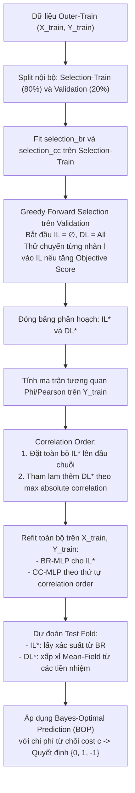

Viewed tmp.md:1-48
Listed directory BR_CC
Searched for "IL"
Listed directory src
Listed directory selection
Listed directory models
Listed directory mlc_pa
Viewed partition.py:1-184
Viewed objectives.py:1-244
Viewed gsi_mlc_pa.py:1-200
Viewed gsi_mlc_pa.py:201-450
Viewed gsi_mlc_pa.py:451-700
Viewed gsi_mlc_pa.py:701-823
Searched for "IL"
Viewed meeting_summary.md:1-68
Searched for "correlation"
Searched for "independent"
Viewed specify.md:1-60
Searched for "partition"
Searched for "IL/DL"
Viewed README.md:245-305
Viewed phase_Q6.md:1-100
Viewed phase_Q7.md:1-100

Dưới đây là chi tiết toàn bộ về **bản chất tập IL/DL**, **quy trình phân loại nhãn**, **cách tính tương quan** và **cơ chế phụ thuộc giữa các nhãn** trong kiến trúc mô hình **GSI-MLC-PA** (dựa trực tiếp trên mã nguồn tại [`src/models/gsi_mlc_pa.py`](file:///d:/University_Subject/ML%20Research/BR_CC/src/models/gsi_mlc_pa.py), [`src/selection/objectives.py`](file:///d:/University_Subject/ML%20Research/BR_CC/src/selection/objectives.py), và [`src/selection/partition.py`](file:///d:/University_Subject/ML%20Research/BR_CC/src/selection/partition.py)).

---

## 1. Bản chất và định nghĩa hai tập $IL$ và $DL$

Trong bài toán Phân loại đa nhãn (Multi-Label Classification - MLC):
* **$IL$ (Independent Labels - Tập nhãn độc lập):**
  * Gồm các nhãn được dự đoán trực tiếp từ đặc trưng đầu vào $X$ mà **không phụ thuộc** vào dự đoán của bất kỳ nhãn nào khác.
  * Sử dụng cơ chế của **Binary Relevance (BR)**: mỗi nhãn $l \in IL$ có một bộ phân loại độc lập dự đoán xác suất biên:
    $$P(Y_l = 1 \mid X) = P_{\text{BR}}(Y_l = 1 \mid X)$$
  * *Ưu điểm:* Không bị ảnh hưởng bởi lỗi lan truyền (error propagation) từ các nhãn khác, tính toán nhanh.

* **$DL$ (Dependent Labels - Tập nhãn phụ thuộc):**
  * Gồm các nhãn có sự tương quan/phụ thuộc mạnh vào các nhãn đi trước nó trong chuỗi.
  * Sử dụng cơ chế của **Classifier Chain (CC)**: nhãn $k \in DL$ được mô hình hóa theo điều kiện có biết các nhãn đi trước:
    $$P(Y_k = 1 \mid X, Y_{\text{predecessors}})$$
  * *Ưu điểm:* Tận dụng được cấu trúc tương quan nhãn để nâng cao độ chính xác ở những nhãn khó.

---

## 2. Quy trình phân loại nhãn vào tập $IL$ và $DL$ (Greedy Forward Selection)

Quy trình chọn phân hoạch diễn ra hoàn toàn bên trong bước huấn luyện (`fit`) và đảm bảo **nguyên tắc bảo mật dữ liệu (Leakage-Safe)**: tập kiểm tra bên ngoài (outer test fold) tuyệt đối không được tham gia vào bước này.

### Bước 2.1: Chia tập dữ liệu nội bộ (Internal Split)
Từ tập huấn luyện của fold hiện tại $(X_{\text{train}}, Y_{\text{train}})$:
* Chia thành 2 tập con bằng `MultilabelStratifiedShuffleSplit` (hoặc stratified split):
  * **Selection-Train** ($1 - \text{validation\_size}$, mặc định 80%): dùng để fit các mô hình tạm thời.
  * **Validation** ($\text{validation\_size}$, mặc định 20%): dùng để đánh giá và chấm điểm cấu hình nhãn.
* Huấn luyện 2 mô hình sơ bộ trên **Selection-Train**:
  * `selection_br`: Mô hình BR-MLP dự đoán xác suất biên độc lập.
  * `selection_cc`: Mô hình CC-MLP học chuỗi phân loại theo thứ tự ban đầu (`selection_order_`).
* Tính trước ma trận xác suất biên trực tiếp trên tập Validation: `validation_direct = selection_br.predict_proba(X_val)`.

---

### Bước 2.2: Thuật toán lựa chọn tham lam (Greedy Selection)
Hàm thực thi: [`_select_partition()`](file:///d:/University_Subject/ML%20Research/BR_CC/src/models/gsi_mlc_pa.py#L523-L581).

1. **Khởi tạo:**
   * Tập độc lập ban đầu: $IL = \emptyset$
   * Tập phụ thuộc ban đầu: $DL = \{0, 1, \dots, K-1\}$ (mọi nhãn đều là phụ thuộc).
2. **Đánh giá cấu hình cơ sở ($IL = \emptyset$):**
   * Sinh xác suất cho tập Validation khi tất cả các nhãn đều chạy qua chuỗi CC.
   * Chấm điểm cấu hình cơ sở bằng hàm mục tiêu lựa chọn (Selection Objective), ví dụ `full_macro_f1`:
     $$S_{\text{current}} = \text{Score}(Y_{\text{val}}, \hat{P}_{IL=\emptyset})$$
3. **Duyệt tuần tự từng nhãn $l \in \text{order}$:**
   * Thử chuyển nhãn $l$ từ $DL$ sang $IL$: tạo ứng viên $IL_{\text{cand}} = IL \cup \{l\}$.
   * Cập nhật xác suất tập Validation dưới cấu hình mới:
     * Nhãn $l$ (và các nhãn đã thuộc $IL$) sẽ lấy xác suất biên từ `validation_direct[:, l]`.
     * Các nhãn $DL$ nằm sau vị trí của $l$ trong chuỗi sẽ nhận xác suất mới của $l$ làm đầu vào điều kiện.
   * Đánh giá điểm ứng viên:
     $$S_{\text{cand}} = \text{Score}(Y_{\text{val}}, \hat{P}_{IL_{\text{cand}}})$$
   * **Quy tắc chấp nhận:**
     $$\Delta S = S_{\text{cand}} - S_{\text{current}}$$
     * Nếu $\Delta S > 10^{-12}$ (điểm số **thực sự tăng strictly positive**):
       * Chấp nhận chuyển: $IL \leftarrow IL \cup \{l\}$, $DL \leftarrow DL \setminus \{l\}$.
       * Cập nhật điểm chuẩn: $S_{\text{current}} \leftarrow S_{\text{cand}}$.
     * Nếu $\Delta S \le 10^{-12}$:
       * Từ chối chuyển: Nhãn $l$ tiếp tục được giữ lại ở tập $DL$.
4. **Kết quả:** Ta thu được bộ phân hoạch $IL^*$ và $DL^*$ tối ưu tham lam trên tập validation.

---

### Bước 2.3: Mục tiêu lựa chọn (Selection Objectives)
Mô hình hỗ trợ nhiều hàm mục tiêu khác nhau thông qua [`src/selection/objectives.py`](file:///d:/University_Subject/ML%20Research/BR_CC/src/selection/objectives.py):
* `full_macro_f1` *(Mặc định)*: Tính Macro-F1 trung bình số học sau khi phân ngưỡng $\ge 0.5$ (không áp dụng từ chối ở bước này).
* `bop_instance_f1`, `bop_jaccard`: Cho phép áp dụng luật quyết định Bayes (BOP) có tính đến chi phí từ chối $c$ và phạt độ phủ (abstention penalty) ngay khi đánh giá ứng viên.
* `macro_precision`, `macro_recall`, `f_beta_0_5`, `f_beta_2`: Tối ưu hóa hướng tới độ chính xác hoặc độ bao phủ theo yêu cầu bài toán.

---

## 3. Cách tính tương quan giữa các nhãn (Label Correlation)

Hàm thực thi: [`_compute_label_correlation()`](file:///d:/University_Subject/ML%20Research/BR_CC/src/models/gsi_mlc_pa.py#L344-L357).

### 3.1. Thời điểm tính (Timing)
> **CỰC KỲ QUAN TRỌNG:** Tương quan được tính **SAU KHI** phân hoạch $IL/DL$ đã được chốt (frozen).
> Việc tính tương quan sau giúp tránh phụ thuộc vòng (circular dependence) và bảo đảm việc phân loại nhãn không bị thiên kiến. Tương quan được tính trên toàn bộ ma trận nhãn huấn luyện $Y_{\text{train}}$ của outer fold.

### 3.2. Công thức toán học
Đối với dữ liệu đa nhãn nhị phân $Y \in \{0, 1\}^{N \times K}$, ma trận tương quan giữa hai nhãn $j$ và $k$ là hệ số tương quan Pearson, tương đương với **hệ số Phi ($\phi$)** trong bảng ngẫu nhiên $2 \times 2$:

$$r_{jk} = \phi_{jk} = \frac{\text{Cov}(Y_j, Y_k)}{\sigma(Y_j) \sigma(Y_k)} = \frac{n_{11} n_{00} - n_{10} n_{01}}{\sqrt{n_{1\cdot} n_{0\cdot} n_{\cdot 1} n_{\cdot 0}}}$$

Trong đó:
* $n_{11}$: Số mẫu có cả hai nhãn cùng bằng $1$.
* $n_{00}$: Số mẫu có cả hai nhãn cùng bằng $0$.
* $n_{10}, n_{01}$: Số mẫu có một nhãn bằng $1$ và nhãn kia bằng $0$.
* $n_{1\cdot}, n_{0\cdot}, n_{\cdot 1}, n_{\cdot 0}$: Các tổng biên (marginal totals).

### 3.3. Xử lý ổn định số học trong code
Trong thực tế, một số nhãn có thể có phương sai bằng $0$ (tất cả mẫu đều bằng 0 hoặc 1), dẫn đến chia cho $0$ ($0/0$ ra `NaN`):
```python
with np.errstate(divide="ignore", invalid="ignore"):
    correlation = np.corrcoef(Y, rowvar=False)
correlation = np.nan_to_num(correlation, nan=0.0, posinf=0.0, neginf=0.0)
correlation = np.clip(correlation, -1.0, 1.0)
np.fill_diagonal(correlation, 1.0)
```
* Các giá trị không xác định (`NaN`) hoặc vô hạn được gán về `0.0` (xem như không có tương quan).
* Đường chéo chính luôn được đặt bằng `1.0`.

---

## 4. Cách sử dụng tương quan để sắp xếp chuỗi (Correlation Ordering)

Sau khi có ma trận tương quan $R = (r_{jk})$ và phân hoạch $IL, DL$, mô hình sắp xếp lại toàn bộ các nhãn thành một chuỗi dự đoán mới (`order_`) qua hàm [`_correlation_order()`](file:///d:/University_Subject/ML%20Research/BR_CC/src/models/gsi_mlc_pa.py#L359-L394):

### Quy tắc sắp xếp:
1. **Đưa toàn bộ nhãn $IL$ lên đầu chuỗi:**
   $$\text{Order} = \text{sorted}(IL)$$
   *Ý nghĩa:* Nhãn độc lập không cần phụ thuộc vào nhãn nào, nên được dự đoán trước làm "gốc" (roots) cung cấp ngữ cảnh cho các nhãn phụ thuộc phía sau.
2. **Nếu $IL = \emptyset$ (ví dụ mode `all_dl`):**
   Nhãn đầu tiên được chọn là nhãn có **tổng tương quan tuyệt đối lớn nhất** với các nhãn còn lại:
   $$\text{root} = \arg\max_{l \in DL} \sum_{k} |r_{lk}|$$
3. **Bổ sung lần lượt các nhãn $DL$ còn lại:**
   Tại mỗi bước, trong số các nhãn chưa được xếp vào chuỗi ($DL_{\text{remaining}}$), ta chọn nhãn có **độ tương quan tuyệt đối lớn nhất với ít nhất một nhãn ĐÃ CÓ trong chuỗi**:
   $$l^* = \arg\max_{l \in DL_{\text{remaining}}} \left( \max_{p \in \text{Order}} |r_{l, p}| \right)$$
   *(Nếu có hai nhãn bằng điểm, giải quyết bằng chỉ số nhãn nhỏ hơn để bảo đảm tính tất định).*
   * Thêm $l^*$ vào $\text{Order}$, loại $l^*$ khỏi $DL_{\text{remaining}}$.
   * Lặp lại cho đến khi xếp hết toàn bộ nhãn.

### Xác định nút cha phụ thuộc mạnh nhất (Parent Mapping)
Hàm [`_dependent_parent_map()`](file:///d:/University_Subject/ML%20Research/BR_CC/src/models/gsi_mlc_pa.py#L396-L418): Với mỗi nhãn $l \in DL$, nút cha chính của nó được định nghĩa là nhãn đứng trước nó có độ tương quan mạnh nhất:
$$\text{parent}(l) = \arg\max_{p \in \text{predecessors}(l)} |r_{l, p}|$$

---

## 5. Một nhãn thuộc $DL$ phụ thuộc vào các nhãn $IL$ (và các tiền nhiệm) như thế nào?

Trong quá trình suy diễn xác suất ([`_configured_probabilities()`](file:///d:/University_Subject/ML%20Research/BR_CC/src/models/gsi_mlc_pa.py#L266-L342)), xác suất của một nhãn $l$ được tính toán như sau:

### Trường hợp 1: Nhãn $l \in IL$
Dự đoán trực tiếp từ mô hình BR:
$$P(Y_l = 1 \mid X) = P_{\text{BR}}(Y_l = 1 \mid X)$$

### Trường hợp 2: Nhãn $l \in DL$
Nhãn $l$ có tập các nhãn đi trước trong chuỗi là $\text{predecessors} = [p_1, p_2, \dots, p_m]$. Các nhãn đi trước này có thể gồm cả nhãn thuộc $IL$ và nhãn thuộc $DL$ đã được tính xong xác suất trước đó:
$$P(Y_{p_i} = 1 \mid X) = \hat{p}_{p_i}$$

Bộ phân loại thứ $l$ của chuỗi CC được huấn luyện trên không gian đặc trưng mở rộng: $f_l(X, Y_{p_1}, \dots, Y_{p_m})$. Lúc dự đoán, vì không biết nhãn thực $Y_{p_i}$, mô hình xử lý như sau:

1. **Nếu chỉ có 1 nhãn tiền nhiệm ($m = 1$ với xác suất $\hat{p}$):**
   Áp dụng **Biên hóa chính xác 2 trạng thái (Exact Two-State Marginalization)**:
   $$P(Y_l = 1 \mid X) = (1 - \hat{p}) \cdot f_l(X, 0) + \hat{p} \cdot f_l(X, 1)$$
   *Ý nghĩa:* Tính kỳ vọng toán học chính xác theo phân phối Bernoulli của nhãn cha duy nhất.

2. **Nếu có nhiều hơn 1 nhãn tiền nhiệm ($m > 1$):**
   Nếu tính chính xác theo mọi tổ hợp trạng thái $2^m$, độ phức tạp tính toán sẽ bùng nổ hàm mũ. Do đó, mô hình sử dụng **Xấp xỉ trường trung bình (Mean-Field Plug-in Approximation)**:
   Thay thế giá trị nhị phân $\{0, 1\}$ của từng nhãn tiền nhiệm bằng chính xác suất mềm (soft probability) tương ứng đã được chốt:
   $$P(Y_l = 1 \mid X) = f_l\left( X, \hat{p}_{p_1}, \hat{p}_{p_2}, \dots, \hat{p}_{p_m} \right)$$
   *Ý nghĩa:* Giúp nhãn $l$ tiếp nhận trực tiếp "độ tin cậy" từ các nhãn $IL$ và các nhãn $DL$ đi trước mà chỉ tốn 1 lần lan truyền tiến qua mạng nơ-ron (forward pass).

---

## 6. Tóm tắt toàn bộ vòng đời tính toán (Pipeline Workflow)



### Các điểm mấu chốt có thể đưa vào bài báo (Paper Write-up):
1. **Giải quyết vấn đề phân bố sai số (Error Propagation vs. Label Correlation):** Việc đưa các nhãn có hiệu năng độc lập tốt vào $IL$ giúp ngăn chặn việc gieo rắc nhãn sai vào các bước sau của chuỗi CC.
2. **Thứ tự chuỗi tối ưu theo thông tin tương quan:** Các nhãn $DL$ được kết nối trực tiếp với các nhãn có độ tương quan cao nhất đi trước nó, tối đa hóa thông tin tương hỗ mà bộ phân loại nhận được.
3. **Chi phí tính toán hiệu quả:** Dùng xấp xỉ Mean-field tránh độ phức tạp $O(2^m)$ của Probabilistic Classifier Chains truyền thống.
4. **Không bị rò rỉ dữ liệu (No Data Leakage):** Việc chọn $IL/DL$ tách rời trên validation fold, và ma trận tương quan chỉ tính trên training fold.