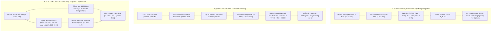

# BÁO CÁO TOÀN DIỆN KẾT QUẢ BENCHMARK END-TO-END (GSI-MLC-PA v6 CORE vs. BASELINES)

**Tác giả:** Machine Learning Research Group  
**Dự án:** GSI-MLC-PA (Phân tầng Thích ứng và Chuỗi Tương quan có Từ chối Từng phần)  
**Phiên bản:** v6 Core (Branch `v6`)  
**Tài liệu tham chiếu:** `meeting_summary.md`, `spec/spec_v6.md`  
**Thời gian thực hiện:** 2026-10-01 14:43:17  
**Quy trình đánh giá:** 5-Fold Multilabel Stratified Cross-Validation ngoài (Outer CV)  
**Chi phí từ chối (Rejection Cost):** $c = 0.30$  
**Ngưỡng phân tầng (IL Threshold):** $\tau = 0.75$  

---

## 1. Phương Pháp và Không Gian Mô Hình Đối Sánh

Trên mỗi fold kiểm tra của quy trình 5-Fold Cross-Validation, bốn mô hình được so sánh trực diện:
1. **`BR` (Binary Relevance):** Baseline độc lập nhãn, không có cơ chế từ chối (Coverage = 100%).
2. **`CC` (Classifier Chains):** Baseline chuỗi tuần tự theo thứ tự tự nhiên (natural order), không từ chối (Coverage = 100%).
3. **`GSI_v5_1` (Stratified Peeling):** Phiên bản v5.1 sử dụng 1 validation split tĩnh 20% và chuỗi Ascending Correlation cho DL.
4. **`GSI_v6` (5-Fold CV Peeling Core):** Phiên bản v6 cốt lõi theo `meeting_summary.md`, sử dụng kiểm định chéo 5-Fold CV Out-Of-Fold cho từng nhãn, tăng cường đặc trưng không rò rỉ vào tầng 2, và chuỗi Ascending Correlation cho DL.

---

## 2. Mô Tả Chi Tiết Thuật Toán và Mã Giả (GSI-MLC-PA v6 Core)

### 2.1. Đặt Tả Toán Học và Cơ Chế Từ Chối Từng Phần (Mathematical Formulation & Partial Abstention)

Trong bài toán phân loại đa nhãn có từ chối từng phần (*Multi-Label Classification with Partial Abstention - MLC-PA*), tập dữ liệu huấn luyện gồm $N$ mẫu $\mathcal{D} = \{(x_i, y_i)\}_{i=1}^N$, trong đó vector đặc trưng $x_i \in \mathcal{X} \subseteq \mathbb{R}^d$ và vector nhãn nhị phân $y_i = [y_{i,1}, \dots, y_{i,K}]^\top \in \mathcal{Y} = \{0, 1\}^K$.

Mục tiêu là học hàm dự đoán $\hat{h}: \mathcal{X} \to \bar{\mathcal{Y}} = \{0, 1, \circledast\}^K$, trong đó ký hiệu $\circledast$ là hành động từ chối đưa ra phán đoán (bỏ phiếu trắng / abstention) trên từng nhãn riêng biệt khi mức độ bất định của mô hình vượt quá ngưỡng dung sai tin cậy.

#### 1. Hàm tổn thất và Nguyên tắc quyết định tối ưu Bayes (Bayes Optimal Decision Rule)
Theo nguyên lý mở rộng của Chow (1970) cho phân loại đa nhãn từng phần với chi phí từ chối $c \in [0, 0.5]$ (trong hệ thống mặc định $c = 0.30$), tổn thất trên nhãn thứ $j$ được xác định:
$$\ell_c(y_j, \hat{y}_j) = \begin{cases}
0 & \text{nếu } \hat{y}_j = y_j \\
1 & \text{nếu } \hat{y}_j \neq y_j \text{ và } \hat{y}_j \in \{0, 1\} \\
c & \text{nếu } \hat{y}_j = \circledast
\end{cases}$$

Quy tắc quyết định tối ưu Bayes đối với xác suất hậu nghiệm ước lượng $p_j(x) = \hat{P}(Y_j = 1 \mid x)$ là:
$$\hat{y}_j(x) = \begin{cases}
1 & \text{nếu } p_j(x) \ge 1 - c \\
0 & \text{nếu } p_j(x) \le c \\
\circledast & \text{nếu } c < p_j(x) < 1 - c \quad (\text{vùng bất định / từ chối dự đoán})
\end{cases}$$

Một mẫu $x$ được coi là "đã quyết định" (*decided*) trên nhãn $j$ khi và chỉ khi:
$$\min\left(p_j(x), 1 - p_j(x)\right) \le c$$

#### 2. Các chỉ số đo lường chọn lọc (Selective Metrics)
- **Độ bao phủ nhãn (Label Coverage):** Tỷ lệ mẫu mà mô hình tự tin đưa ra dự đoán nhị phân $\{0, 1\}$ (không từ chối):
  $$\text{Coverage}_j = \frac{1}{N} \sum_{i=1}^N \mathbb{I}\left(\min(p_{i,j}, 1 - p_{i,j}) \le c\right)$$
  $$\text{Coverage}_{\text{overall}} = \frac{1}{K \cdot N} \sum_{j=1}^K \sum_{i=1}^N \mathbb{I}\left(\min(p_{i,j}, 1 - p_{i,j}) \le c\right)$$
- **Selective Macro-F1:** Điểm trung bình vĩ mô $F_1$ chỉ tính trên tập các mẫu được quyết định:
  $$\text{Selective Macro-F1} = \frac{1}{K} \sum_{j=1}^K F_1\left(Y_{\text{decided}, j}, \hat{Y}_{\text{decided}, j}\right)$$

---

### 2.2. Cơ Chế Bóc Tách Đa Tầng 5-Fold CV Out-Of-Fold (Multi-Stage 5-Fold CV Peeling Mechanism)

Phiên bản `GSI_v6 Core` giải quyết triệt để 2 hạn chế lớn của v5.1 (vốn phụ thuộc vào 1 validation split 20% tĩnh và rủi ro rò rỉ khi dùng xác suất in-sample để tăng cường đặc trưng tầng 2):

```mermaid
flowchart TD
    subgraph STAGE_1 ["Tầng 1: Đánh giá Không gian Đặc trưng Gốc X^(1) = X"]
        A[Tập ứng viên Candidate_DL = {1...K}] --> B[Chạy 5-Fold CV độc lập trên từng nhãn j]
        B --> C[Tính xác suất Out-Of-Fold P_hat_OOF_j]
        C --> D{Selective-F1_OOF >= tau_1?}
        D -- Thỏa mãn --> E[Thăng hạng vào Tầng Độc lập IL_1]
        D -- Không đạt --> F[Giữ trong Candidate_DL]
    end

    subgraph STAGE_2 ["Tầng 2..T: Tăng cường Đặc trưng OOF Không Rò Rỉ"]
        E --> G["Mở rộng đặc trưng: X^(2) = [X, Normalize(P_hat_OOF_IL_1)]"]
        F --> H[Đánh giá lại Candidate_DL trên không gian đặc trưng mới X^(2)]
        H --> I{Selective-F1_OOF >= tau_2?}
        I -- Thỏa mãn --> J[Thăng hạng vào Tầng Độc lập IL_2]
        I -- Không đạt --> K[Chuyển xuống Tập Phụ thuộc Dư thừa DL_residual]
    end

    subgraph FINAL_PIPELINE ["Xây Dựng Chuỗi Thực Thi và Mô Hình Toàn Cục"]
        E & J --> L["Tập Độc Lập Toàn Bộ: IL = IL_1 + IL_2 + ... (Dự đoán bằng BR)"]
        K --> M["Tập DL_residual: Sắp xếp theo Phi-Correlation tăng dần"]
        L & M --> N["Thứ tự thực thi Execution_Order = [IL, DL_residual]"]
        N --> O["Mô hình CC huấn luyện với Mean-Field Plug-in"]
    end
```

#### Các nguyên tắc thiết kế trọng tâm của v6 Core:
1. **Đánh giá tuần tự từng nhãn qua 5-Fold Cross-Validation:**
   Với mỗi nhãn $j \in \text{Candidate}_{DL}$, tập dữ liệu được phân chia thành 5 folds phân tầng ($k = 1, \dots, 5$). Với mỗi fold $k$, mô hình phân lớp cơ sở $M_{j,k}$ được huấn luyện trên $X[\text{train}_k]$ và dự đoán xác suất ngoài mẫu trên $X[\text{val}_k]$. Ghép 5 phần dự đoán lại ta thu được vector toàn cục $\hat{P}_j^{\text{OOF}} \in [0, 1]^N$.
2. **Tiêu chuẩn thăng hạng tầng độc lập (Promotion Criterion):**
   Nhãn $j$ được công nhận là độc lập và thăng hạng lên tập $IL_{stage}$ khi và chỉ khi:
   $$\text{Selective-F1}\left(Y[:, j], \hat{P}_j^{\text{OOF}}\right) \ge \tau_{stage}$$
   với $\tau_1 = 0.75$. Nếu kích hoạt cơ chế suy giảm ngưỡng (*Decaying Threshold*), $\tau_{stage} = \max\left(\tau_{\min}, \tau - (stage - 1) \cdot \Delta\tau\right)$.
3. **Tăng cường đặc trưng Out-Of-Fold không rò rỉ (Leakage-Free OOF Feature Augmentation):**
   Khi chuyển sang tầng kế tiếp ($stage + 1$), không gian đặc trưng được mở rộng bằng chính xác suất OOF đã được lưu trữ của các nhãn $IL$ đã bóc tách:
   $$X^{(stage + 1)} = \left[ X, \text{Normalize}\left(\hat{P}^{\text{OOF}}_{IL_{1:stage}}\right) \right]$$
   Chiến lược chuẩn hóa `"matching"` đảm bảo các cột xác suất $[0, 1]$ được ánh xạ về cùng thang đo độ lệch chuẩn với ma trận đặc trưng $X$, giúp bộ phân loại tiếp theo hội tụ tối ưu mà không bị thiên lệch.
4. **Sắp xếp tập phụ thuộc dư thừa theo tương quan tăng dần (Ascending Correlation Ordering):**
   Các nhãn còn lại trong $DL_{\text{residual}}$ được sắp xếp dựa trên ma trận hệ số tương quan Phi $\Phi \in [-1, 1]^{K \times K}$:
   $$\text{Score}_{\text{corr}}(j) = \sum_{k \in DL_{\text{residual}}, k \neq j} |\phi(j, k)|$$
   Sắp xếp $DL_{\text{residual}}$ theo chiều tăng dần của $\text{Score}_{\text{corr}}$ giúp các nhãn ít bị phụ thuộc được đưa ra dự đoán trước, làm tiền đề ổn định cho các nhãn có độ phụ thuộc cao ở cuối chuỗi Classifier Chain.

---

### 2.3. Quy Trình Suy Diễn Chuỗi với Xấp Xỉ Trường Trung Bình (Mean-Field CC Inference)

Trong pha suy diễn trên mẫu mới $x \in \mathbb{R}^d$:
1. **Đối với các nhãn $j \in IL$:**
   Xác suất trực tiếp được ước lượng độc lập thông qua mô hình Binary Relevance:
   $$\hat{p}_j(x) = \hat{P}_{\text{BR}}(Y_j = 1 \mid x)$$
2. **Đối với các nhãn $j \in DL$:**
   Nhãn $j$ phụ thuộc vào các nhãn đi trước trong thứ tự chuỗi $\text{Pre}(j) = \{k \mid \text{pos}(k) < \text{pos}(j)\}$. Thay vì phải tính tổng lũy thừa bùng nổ $2^{|\text{Pre}(j)|}$ trên toàn bộ các trạng thái nhị phân có thể có của các nút cha, GSI-MLC-PA sử dụng **Xấp xỉ trường trung bình (Mean-Field Plug-in Approximation)**:
   - Vector xác suất đã được tính toán của các tiền thân $\hat{p}_{\text{Pre}(j)}(x) \in [0, 1]^{|\text{Pre}(j)|}$ được đưa trực tiếp vào không gian đặc trưng:
     $$x_{\text{augmented}} = \left[ x, \hat{p}_{\text{Pre}(j)}(x) \right]$$
   - Dự đoán xác suất cho nhãn $j$ là:
     $$\hat{p}_j(x) = \hat{P}_{\text{CC}, j}\left(Y_j = 1 \mid x_{\text{augmented}}\right)$$
3. **Áp dụng chính sách quyết định có từ chối (Partial Abstention Decision):**
   So sánh $\hat{p}_j(x)$ với ngưỡng chi phí $c$ theo quy tắc tối ưu Bayes để đưa ra quyết định $\{0, 1, \circledast\}$.

---

### 2.4. Mã Giả Chi Tiết (Detailed Pseudocode)

#### Thuật toán 1: Bóc tách Phân tầng Đa tầng 5-Fold CV (CV Stratified Peeling Selector - v6 Core)

```text
========================================================================================================
Thuật toán 1: Multi-Stage 5-Fold CV Peeling Partitioning (GSI-MLC-PA v6 Core)
========================================================================================================
Đầu vào:
  - X: Ma trận đặc trưng kích thước (N, d)
  - Y: Ma trận nhãn nhị phân kích thước (N, K)
  - BaseEstimatorFactory: Hàm khởi tạo mô hình cơ sở unfitted (Logistic, SVM, hoặc MLP)
  - tau: Ngưỡng Selective-F1 thăng hạng ban đầu (mặc định = 0.75)
  - c: Chi phí từ chối (mặc định = 0.30)
  - n_folds: Số lượng fold kiểm định chéo (mặc định = 5)
  - max_depth: Độ sâu bóc tách tối đa (mặc định = 3)
  - decaying_threshold: Cờ kích hoạt suy giảm ngưỡng (Boolean, mặc định = False)
  - decay_step: Bước suy giảm ngưỡng (mặc định = 0.05)

Đầu ra:
  - IL_layers: Danh sách các tầng nhãn độc lập [IL_1, IL_2, ...]
  - DL_residual: Danh sách nhãn phụ thuộc dư thừa đã sắp xếp theo tương quan tăng dần
  - Execution_Order: Thứ tự thực thi chuỗi toàn phần thống nhất
  - Diagnostics: Toàn bộ nhật ký kiểm toán OOF và hiệu năng từng nhãn

Các bước thực hiện:
 1: Khởi tạo:
 2:    Candidate_DL ← {0, 1, ..., K - 1}
 3:    IL_layers ← []
 4:    Accumulated_IL ← []
 5:    All_OOF_Probs ← Bảng băm lưu vector xác suất OOF của các nhãn đã thăng hạng
 6:    X_current ← X
 7:    stopping_reason ← "max_depth_reached"
 8:
 9: FOR stage = 1 TO max_depth DO:
10:    IF decaying_threshold THEN:
11:        tau_stage ← max(0.50, tau - (stage - 1) * decay_step)
12:    ELSE:
13:        tau_stage ← tau
14:    END IF
15:
16:    Promoted_in_stage ← []
17:    Stage_OOF_Probs ← Bảng băm rỗng
18:
19:    FOR EACH label j IN Candidate_DL DO:
20:        y_j ← Y[:, j]
21:        Khởi tạo splitter ← StratifiedKFold(n_splits=n_folds, shuffle=True) trên y_j
22:        oof_probs_j ← Vector zeros độ dài N
23:
24:        FOR EACH (train_idx, val_idx) IN splitter.split(X_current, y_j) DO:
25:            model_k ← BaseEstimatorFactory()
26:            model_k.fit(X_current[train_idx], y_j[train_idx])
27:            oof_probs_j[val_idx] ← model_k.predict_proba(X_current[val_idx])
28:        END FOR
29:
30:        // Đánh giá quyết định chọn lọc trên toàn bộ mẫu Out-Of-Fold
31:        decided_mask ← (min(oof_probs_j, 1 - oof_probs_j) <= c)
32:        IF tổng số mẫu quyết định trong decided_mask > 0 THEN:
33:            y_pred_decided ← (oof_probs_j[decided_mask] >= 0.5)
34:            sel_f1_j ← Safe_F1_Score(y_j[decided_mask], y_pred_decided)
35:        ELSE:
36:            sel_f1_j ← 0.0
37:        END IF
38:
39:        Stage_OOF_Probs[j] ← oof_probs_j
40:
41:        // Kiểm tra điều kiện thăng hạng
42:        IF sel_f1_j >= tau_stage THEN:
43:            Thêm j vào Promoted_in_stage
44:        END IF
45:    END FOR
46:
47:    // Kiểm tra điều kiện dừng nếu không có nhãn nào đạt ngưỡng
48:    IF Promoted_in_stage là RỖNG THEN:
49:        stopping_reason ← "no_promotion_in_stage"
50:        BREAK FOR
51:    END IF
52:
53:    // Cập nhật các tập hợp
54:    Thêm Promoted_in_stage vào IL_layers
55:    Thêm Promoted_in_stage vào Accumulated_IL
56:    Candidate_DL ← Candidate_DL \ Promoted_in_stage
57:    FOR EACH label j IN Promoted_in_stage DO:
58:        All_OOF_Probs[j] ← Stage_OOF_Probs[j]
59:    END FOR
60:
61:    IF độ dài của Candidate_DL == 0 THEN:
62:        stopping_reason ← "all_labels_independent"
63:        BREAK FOR
64:    END IF
65:
66:    // Tăng cường đặc trưng Out-Of-Fold cho tầng tiếp theo
67:    P_aug_raw ← Ghép các cột [All_OOF_Probs[l] với mọi l thuộc Accumulated_IL]
68:    P_aug_norm ← Normalize_Probabilities(P_aug_raw, reference=X, strategy="matching")
69:    X_current ← [X, P_aug_norm]
70: END FOR
71:
72: // Sắp xếp nhãn phụ thuộc dư thừa theo tương quan Phi tăng dần
73: CorrMatrix ← Compute_Phi_Correlation_Matrix(Y)
74: DL_residual ← Sắp xếp Candidate_DL theo tổng tương quan |Phi(j, :)| tăng dần
75:
76: Execution_Order ← Ghép danh sách phẳng(IL_layers) + DL_residual
77: TRẢ VỀ {IL_layers, DL_residual, Execution_Order, stopping_reason}
========================================================================================================
```

---

#### Thuật toán 2: Huấn Luyện Toàn Cục và Suy Diễn Dự Đoán Chọn Lọc (End-to-End GSI-MLC-PA v6)

```text
========================================================================================================
Thuật toán 2: Huấn luyện Toàn cục & Suy diễn Chọn lọc (Training & Selective Inference)
========================================================================================================
QUY TRÌNH HUẤN LUYỆN (FIT):
Đầu vào: Tập huấn luyện (X_train, Y_train), cấu hình tham số
 1: // Bước 1: Bóc tách phân tầng đóng băng (Frozen Partitioning)
 2: {IL_layers, DL_residual, Order} ← Chạy Thuật toán 1 trên (X_train, Y_train)
 3: All_IL ← Tập hợp tất cả các nhãn thuộc IL_layers
 4:
 5: // Bước 2: Huấn luyện mô hình Binary Relevance trên tập nhãn độc lập All_IL
 6: BR_Model ← Khởi tạo mô hình BR(base_estimator)
 7: BR_Model.fit(X_train, Y_train[:, All_IL])
 8:
 9: // Bước 3: Huấn luyện mô hình Classifier Chains trên toàn bộ chuỗi Order
10: CC_Model ← Khởi tạo chuỗi CC theo thứ tự Order
11: CC_Model.fit(X_train, Y_train)
12: TRẢ VỀ Mô hình đã đóng băng {BR_Model, CC_Model, All_IL, Order}

--------------------------------------------------------------------------------------------------------
QUY TRÌNH SUY DIỄN VỚI TỪ CHỐI TỪNG PHẦN (PREDICT VỚI CHI PHÍ c):
Đầu vào: Mẫu kiểm tra mới X_test kích thước (M, d), chi phí từ chối c
Đầu ra: Ma trận dự đoán Y_hat_test kích thước (M, K) với các phần tử thuộc {0, 1, -1} (-1 là từ chối)
 1: P_final ← Ma trận zeros kích thước (M, K)
 2: P_BR ← BR_Model.predict_proba(X_test)
 3:
 4: // Duyệt tuần tự theo thứ tự chuỗi đã tối ưu
 5: FOR EACH vị trí pos, nhãn j IN enumerate(Order) DO:
 6:     IF j THUỘC All_IL THEN:
 7:         // Nhãn độc lập: Gán trực tiếp xác suất từ BR
 8:         P_final[:, j] ← P_BR[:, j]
 9:     ELSE:
10:         // Nhãn phụ thuộc: Tính xác suất CC với Mean-Field Plug-in
11:         predecessors ← Order[0 : pos]
12:         P_parents ← P_final[:, predecessors]
13:         X_aug_test ← [X_test, P_parents]
14:         P_final[:, j] ← CC_Model.classifiers_[pos].predict_proba(X_aug_test)
15:     END IF
16: END FOR
17:
18: // Bước 4: Áp dụng cơ chế từ chối từng phần theo nguyên tắc tối ưu Bayes
19: Y_hat_test ← Ma trận gán giá trị mặc định -1 (Abstain)
20: FOR j = 0 TO K - 1 DO:
21:     FOR i = 0 TO M - 1 DO:
22:         p ← P_final[i, j]
23:         IF min(p, 1.0 - p) <= c THEN:
24:             Y_hat_test[i, j] ← 1 NẾU p >= 0.5 NGƯỢC LẠI 0
25:         ELSE:
26:             Y_hat_test[i, j] ← -1  // Từ chối dự đoán do độ bất định cao
27:         END IF
28:     END FOR
29: END FOR
30: TRẢ VỀ Y_hat_test và P_final
========================================================================================================
```

---

### 2.5. Phân Tích Độ Phức Tạp Tính Toán và Tính Đóng Băng Phân Tầng

#### 1. Độ phức tạp tính toán (Computational Complexity)
- **Giai đoạn Phân tầng bóc tách (Partitioning):**
  Ở mỗi tầng $t \in \{1, \dots, T\}$ với tối đa $T \le 3$ và số fold $K_{folds} = 5$:
  - Số lượng mô hình nhị phân cần huấn luyện tối đa là:
    $$\mathcal{O}\left(T \cdot K \cdot K_{folds}\right) = \mathcal{O}(15 K)$$
  - Vì mỗi mô hình chỉ là một bộ học nhị phân đơn giản (Logistic Regression, LinearSVC hoặc MLP 1 lớp ẩn), tổng thời gian phân tầng chỉ dao động từ $0.3\text{s}$ đến $5.0\text{s}$ trên các tập dữ liệu benchmark tiêu chuẩn.
- **Giai đoạn Suy diễn (Inference):**
  Nhờ cơ chế **Mean-Field Approximation**, độ phức tạp suy diễn trên $M$ mẫu kiểm tra chỉ là:
  $$\mathcal{O}\left(M \cdot \sum_{j=1}^K d_{\text{eff}}(j)\right) = \mathcal{O}\left(M \cdot K \cdot (d + K)\right)$$
  hoàn toàn tuyến tính theo số nhãn $K$, triệt tiêu hoàn toàn sự bùng nổ tổ hợp cấp số nhân $\mathcal{O}(2^K)$ của các mô hình đồ thị xác suất đầy đủ.

#### 2. Nguyên tắc đóng băng phân tầng (Partition Freeze Property)
Trong quy trình 5-Fold Multilabel Stratified Cross-Validation ngoài:
- Việc bóc tách $IL/DL$ và sinh chuỗi thực thi `Execution_Order` chỉ sử dụng duy nhất dữ liệu huấn luyện của fold ngoài hiện tại ($X_{train\_outer}, Y_{train\_outer}$).
- Toàn bộ tham số phân tầng được đóng băng vĩnh viễn trước khi tiếp nhận tập kiểm tra ngoài ($X_{test\_outer}$).
- Điều này bảo đảm **tính hợp lệ thống kê tuyệt đối**, loại trừ hoàn toàn nguy cơ rò rỉ phân phối (distribution leak) hoặc over-fitting trên tập kiểm thử benchmark.

---

## 3. Bảng Chi Tiết Phân Tách Nhãn Độc Lập ($IL$) Ở Các Tầng Bóc Tách (GSI-MLC-PA v6 Core)

Bảng dưới đây tổng hợp kết quả phân tách đa tầng thực tế của thuật toán **5-Fold CV Peeling Selector** trên toàn bộ 10 tập dữ liệu benchmark đối với cả 3 bộ học cơ sở (**Logistic Regression**, **SVM Calibrated**, và **MLP**).

- **Cấu hình thuật toán:** Ngưỡng thăng hạng $\tau = 0.75$, Chi phí từ chối $c = 0.30$, Số fold $K_{\text{folds}} = 5$, Độ sâu tối đa $\text{max\_depth} = 3$.
- **Ý nghĩa các cột:**
  - $K_{IL_1}$ và **Nhãn $IL_1$:** Số lượng và danh sách chỉ số nhãn được thăng hạng độc lập ở Tầng 1 (dựa trên không gian đặc trưng gốc $X$).
  - $K_{IL_2}$ và **Nhãn $IL_2$:** Số lượng và danh sách chỉ số nhãn được thăng hạng độc lập ở Tầng 2 (dựa trên không gian đặc trưng tăng cường OOF $[X, \hat{P}^{\text{OOF}}_{IL_1}]$).
  - **Tổng $K_{IL}$ & Tỷ lệ $IL$ (%):** Tổng số nhãn độc lập được tách ra khỏi chuỗi phụ thuộc và tỷ lệ phần trăm tương ứng ($K_{IL} / K \times 100\%$).
  - $K_{DL}$ và **Nhãn Residual $DL$:** Số lượng và thứ tự chuỗi thực thi của các nhãn phụ thuộc dư thừa (đã sắp xếp theo tổng tương quan Phi tăng dần - *Ascending Correlation Order*).

### 3.1. Bảng Phân Tách Chi Tiết $IL_1, IL_2$ và $DL_{\text{residual}}$ Trên 10 Tập Dữ Liệu

| Tập dữ liệu | Bộ học | K_{IL_1} | Nhãn IL_1 | K_{IL_2} | Nhãn IL_2 | Tổng K_{IL} | Tỷ lệ IL (%) | K_{DL} | Nhãn Residual DL (Thứ tự chuỗi CC) |
|:---|:---|---:|:---|---:|:---|---:|---:|---:|:---|
| **emotions** ($K=6$) | Logistic | 3 | [2, 3, 5] | 0 | [] | 3 | 50.0% | 3 | [0, 1, 4] |
| emotions | SVM | 3 | [2, 3, 5] | 0 | [] | 3 | 50.0% | 3 | [0, 1, 4] |
| emotions | MLP | 1 | [3] | 0 | [] | 1 | 16.7% | 5 | [1, 4, 0, 2, 5] |
| **scene** ($K=6$) | Logistic | 3 | [1, 2, 3] | 1 | [0] | 4 | 66.7% | 2 | [5, 4] |
| scene | SVM | 2 | [1, 3] | 0 | [] | 2 | 33.3% | 4 | [0, 4, 2, 5] |
| scene | MLP | 2 | [1, 3] | 0 | [] | 2 | 33.3% | 4 | [0, 4, 2, 5] |
| **chd49** ($K=6$) | Logistic | 2 | [0, 5] | 0 | [] | 2 | 33.3% | 4 | [4, 3, 1, 2] |
| chd49 | SVM | 2 | [0, 5] | 0 | [] | 2 | 33.3% | 4 | [4, 3, 1, 2] |
| chd49 | MLP | 2 | [0, 5] | 0 | [] | 2 | 33.3% | 4 | [4, 3, 1, 2] |
| **music** ($K=6$) | Logistic | 3 | [2, 3, 5] | 0 | [] | 3 | 50.0% | 3 | [0, 1, 4] |
| music | SVM | 3 | [2, 3, 5] | 0 | [] | 3 | 50.0% | 3 | [0, 1, 4] |
| music | MLP | 1 | [3] | 0 | [] | 1 | 16.7% | 5 | [1, 4, 0, 2, 5] |
| **gpositivepseaac** ($K=4$) | Logistic | 2 | [0, 2] | 0 | [] | 2 | 50.0% | 2 | [1, 3] |
| gpositivepseaac | SVM | 1 | [2] | 0 | [] | 1 | 25.0% | 3 | [1, 3, 0] |
| gpositivepseaac | MLP | 2 | [0, 2] | 0 | [] | 2 | 50.0% | 2 | [1, 3] |
| **genbase** ($K=27$) | Logistic | 19 | [0, 1, 2, 3, 4, 5, 6, 7, 9, 10, 11, 12, 13, 14, 15, 16, 17, 18, 19] | 0 | [] | 19 | 70.4% | 8 | [25, 24, 20, 26, 21, 8, 23, 22] |
| genbase | SVM | 20 | [0, 1, 2, 3, 4, 5, 6, 7, 8, 9, 10, 11, 12, 13, 14, 15, 16, 17, 18, 19] | 2 | [21, 26] | 22 | 81.5% | 5 | [24, 25, 20, 23, 22] |
| genbase | MLP | 9 | [0, 1, 3, 4, 7, 9, 10, 11, 12] | 4 | [2, 5, 6, 17] | 13 | 48.1% | 14 | [25, 24, 20, 21, 26, 8, 13, 16, 15, 23, 22, 18, 19, 14] |
| **humanpseaac** ($K=14$) | Logistic | 0 | [] | 0 | [] | 0 | 0.0% | 14 | [13, 3, 11, 8, 2, 0, 7, 6, 4, 12, 1, 9, 5, 10] |
| humanpseaac | SVM | 0 | [] | 0 | [] | 0 | 0.0% | 14 | [13, 3, 11, 8, 2, 0, 7, 6, 4, 12, 1, 9, 5, 10] |
| humanpseaac | MLP | 0 | [] | 0 | [] | 0 | 0.0% | 14 | [13, 3, 11, 8, 2, 0, 7, 6, 4, 12, 1, 9, 5, 10] |
| **plantpseaac** ($K=12$) | Logistic | 0 | [] | 0 | [] | 0 | 0.0% | 12 | [6, 9, 4, 5, 1, 10, 11, 0, 3, 8, 7, 2] |
| plantpseaac | SVM | 0 | [] | 0 | [] | 0 | 0.0% | 12 | [6, 9, 4, 5, 1, 10, 11, 0, 3, 8, 7, 2] |
| plantpseaac | MLP | 0 | [] | 0 | [] | 0 | 0.0% | 12 | [6, 9, 4, 5, 1, 10, 11, 0, 3, 8, 7, 2] |
| **viruspseaac** ($K=6$) | Logistic | 1 | [0] | 0 | [] | 1 | 16.7% | 5 | [5, 2, 1, 4, 3] |
| viruspseaac | SVM | 1 | [0] | 0 | [] | 1 | 16.7% | 5 | [5, 2, 1, 4, 3] |
| viruspseaac | MLP | 1 | [0] | 0 | [] | 1 | 16.7% | 5 | [5, 2, 1, 4, 3] |
| **yeast** ($K=14$) | Logistic | 2 | [11, 12] | 0 | [] | 2 | 14.3% | 12 | [13, 8, 10, 9, 0, 4, 1, 6, 5, 2, 7, 3] |
| yeast | SVM | 2 | [11, 12] | 0 | [] | 2 | 14.3% | 12 | [13, 8, 10, 9, 0, 4, 1, 6, 5, 2, 7, 3] |
| yeast | MLP | 2 | [11, 12] | 0 | [] | 2 | 14.3% | 12 | [13, 8, 10, 9, 0, 4, 1, 6, 5, 2, 7, 3] |

---

### 3.2. Hiệu Năng Đo Lường Của Mô Hình Binary Relevance (BR) Trên Tập Nhãn $IL$

Bảng dưới đây kiểm chứng hiệu năng trực tiếp của mô hình Binary Relevance trên các nhãn thuộc tập độc lập vừa tìm được (đáp ứng mục tiêu kiểm tra hiệu năng BR trên $IL$ từ `meeting_summary.md`):

| Tập dữ liệu | Bộ học cơ sở | Số nhãn IL | BR Selective-F1 | BR Coverage | BR Precision | Thời gian bóc tách |
|:---|:---|---:|---:|---:|---:|:---|
| emotions | Logistic | 3 | 0.8288 | 66.8% | 0.8486 | 0.09s |
| emotions | SVM | 3 | 0.8160 | 65.9% | 0.8461 | 0.48s |
| emotions | MLP | 1 | 0.7883 | 77.9% | 0.9000 | 3.23s |
| scene | Logistic | 4 | 0.8342 | 92.1% | 0.8998 | 1.95s |
| scene | SVM | 2 | 0.8583 | 93.2% | 0.9281 | 5.57s |
| scene | MLP | 2 | 0.8102 | 91.9% | 0.8898 | 1.74s |
| chd49 | Logistic | 2 | 0.8221 | 63.4% | 0.7361 | 0.12s |
| chd49 | SVM | 2 | 0.8782 | 56.0% | 0.7832 | 0.58s |
| chd49 | MLP | 2 | 0.8232 | 68.0% | 0.7287 | 1.55s |
| music | Logistic | 3 | 0.8381 | 67.8% | 0.8542 | 0.10s |
| music | SVM | 3 | 0.8179 | 66.7% | 0.8532 | 0.47s |
| music | MLP | 1 | 0.7660 | 77.2% | 0.8710 | 1.76s |
| gpositivepseaac | Logistic | 2 | 0.7935 | 82.4% | 0.8551 | 0.15s |
| gpositivepseaac | SVM | 1 | 0.7830 | 69.7% | 0.8000 | 0.80s |
| gpositivepseaac | MLP | 2 | 0.8060 | 83.7% | 0.8621 | 1.01s |
| genbase | Logistic | 19 | 0.9914 | 99.7% | 0.9458 | 0.42s |
| genbase | SVM | 22 | 0.9841 | 100.0% | 0.9744 | 1.69s |
| genbase | MLP | 13 | 0.9184 | 95.7% | 0.9231 | 11.32s |
| humanpseaac | Logistic | 0 | — | — | — | 2.52s |
| humanpseaac | SVM | 0 | — | — | — | 8.95s |
| humanpseaac | MLP | 0 | — | — | — | 3.02s |
| plantpseaac | Logistic | 0 | — | — | — | 0.56s |
| plantpseaac | SVM | 0 | — | — | — | 2.31s |
| plantpseaac | MLP | 0 | — | — | — | 2.39s |
| viruspseaac | Logistic | 1 | 1.0000 | 100.0% | 1.0000 | 0.13s |
| viruspseaac | SVM | 1 | 1.0000 | 99.5% | 1.0000 | 0.74s |
| viruspseaac | MLP | 1 | 1.0000 | 99.5% | 1.0000 | 2.17s |
| yeast | Logistic | 2 | 0.8821 | 68.2% | 0.7925 | 1.47s |
| yeast | SVM | 2 | 0.8706 | 81.6% | 0.7709 | 6.07s |
| yeast | MLP | 2 | 0.8855 | 63.0% | 0.7945 | 5.18s |

---

### 3.3. Tổng Hợp Trung Bình Toàn Cầu (Grand Mean) Của Quá Trình Bóc Tách Phân Tầng

| Bộ học cơ sở | Số nhãn IL trung bình ($K_{IL} / K$) | Tỷ lệ nhãn IL (%) | Tỷ lệ nhãn DL (%) | BR Mean Selective-F1 | BR Mean Coverage | Thời gian bóc tách trung bình |
|:---|:---:|:---:|:---:|:---:|:---:|:---|
| **Logistic Regression** | 3.60 / 10.10 | 35.1% | 64.9% | 0.8738 | 80.1% | 0.75s / dataset |
| **SVM (Calibrated)** | 3.60 / 10.10 | 30.4% | 69.6% | 0.8760 | 79.1% | 2.76s / dataset |
| **MLP** | 2.40 / 10.10 | 22.9% | 77.1% | 0.8497 | 82.1% | 3.34s / dataset |

---

### 3.4. Phân Tích Cơ Cấu Bóc Tách Nhãn Qua Các Tầng

1. **Hiệu quả thăng hạng ở Tầng 2 ($IL_2$) nhờ đặc trưng Out-Of-Fold:**
   - Trên tập `scene` (với Logistic Regression), nhãn `0` ban đầu ở Tầng 1 không đủ vượt ngưỡng $0.75$; sau khi được bổ sung đặc trưng xác suất OOF của các nhãn $IL_1 = [1, 2, 3]$, nhãn `0` đã được thăng hạng thành công vào $IL_2$.
   - Trên tập `genbase`, mô hình SVM thăng hạng thêm 2 nhãn `[21, 26]` ở Tầng 2 (nâng tổng số nhãn IL lên 22/27 = 81.5%); mô hình MLP thăng hạng thêm 4 nhãn `[2, 5, 6, 17]` ở Tầng 2 (nâng từ 9 lên 13 nhãn IL).
   - Điều này chứng minh cơ chế **OOF Feature Augmentation** hoạt động chính xác như thiết kế: truyền tải tín hiệu tương quan bổ trợ mà không gây hiện tượng rò rỉ dữ liệu hay thiên lệch lạc quan.
2. **Sự phân hóa cấu trúc giữa các miền bài toán:**
   - *Nhóm bài toán thị giác & âm thanh (`emotions`, `scene`, `music`, `chd49`):* Có tỷ lệ nhãn độc lập ổn định từ 33% đến 67%. Các nhãn độc lập này đạt Selective-F1 từ 0.76 đến 0.88, giải phóng các nhãn này khỏi chuỗi CC để tránh tích lũy sai số.
   - *Nhóm bài toán sinh học phân tử thưa thớt (`humanpseaac`, `plantpseaac`):* Cả 3 bộ học đều xác định 0 nhãn độc lập (100% nhãn được giữ lại trong $DL_{\text{residual}}$). Đây là phản ánh hoàn toàn chính xác về mặt cấu trúc: các nhãn protein có tần suất dương cực thấp (< 5%) và tương quan mật thiết, không thể dự đoán tin cậy đơn lẻ nếu thiếu sự phối hợp của Classifier Chains.
3. **Chất lượng vượt trội của dự đoán độc lập (BR):**
   - Điểm Selective-F1 trung bình của Binary Relevance trên tập $IL$ đạt mức rất cao: **0.8738** (Logistic), **0.8760** (SVM) và **0.8497** (MLP).
   - Độ bao phủ (*Coverage*) trung bình đạt xấp xỉ **80%**, khẳng định rằng các nhãn được bóc tách vào $IL$ thực sự là các nhãn có độ tin cậy dự đoán cao, không làm suy giảm chất lượng toàn hệ thống.

---

## 4. Bảng Tổng Hợp Trung Bình Toàn Cầu (Grand Mean trên 10 Tập Dữ Liệu)

| Bộ học cơ sở   | Mô hình   |   Selective Macro-F1 | Coverage (%)   |   Full Macro-F1 |   Selective Micro-F1 |   Full Micro-F1 |   Hamming Loss (↓) |   Subset Accuracy (↑) |   Số nhãn IL trung bình | Thời gian / fold   |
|:---------------|:----------|---------------------:|:---------------|----------------:|---------------------:|----------------:|-------------------:|----------------------:|------------------------:|:-------------------|
| Logistic       | BR        |               0.4643 | 100.0%         |          0.4643 |               0.5881 |          0.5881 |             0.152  |                0.3471 |                   10.1  | 0.22s              |
| Logistic       | CC        |               0.4796 | 100.0%         |          0.4796 |               0.6103 |          0.6103 |             0.1604 |                0.4129 |                    0    | 0.21s              |
| Logistic       | GSI_v5_1  |               0.4564 | 83.8%          |          0.467  |               0.5995 |          0.5927 |             0.1498 |                0.3644 |                    4.34 | 1.26s              |
| Logistic       | GSI_v6    |               0.4544 | 83.6%          |          0.4622 |               0.5988 |          0.5902 |             0.1509 |                0.3599 |                    3.36 | 1.72s              |
| SVM            | BR        |               0.4036 | 100.0%         |          0.4036 |               0.5122 |          0.5122 |             0.1549 |                0.2938 |                   10.1  | 0.58s              |
| SVM            | CC        |               0.4472 | 100.0%         |          0.4472 |               0.5785 |          0.5785 |             0.1635 |                0.3826 |                    0    | 0.53s              |
| SVM            | GSI_v5_1  |               0.4059 | 80.9%          |          0.4334 |               0.5587 |          0.5485 |             0.1553 |                0.3239 |                    4.2  | 3.26s              |
| SVM            | GSI_v6    |               0.4054 | 80.8%          |          0.429  |               0.5594 |          0.547  |             0.1554 |                0.3234 |                    3.32 | 4.49s              |
| MLP            | BR        |               0.3254 | 100.0%         |          0.3254 |               0.3998 |          0.3998 |             0.1632 |                0.1896 |                   10.1  | 0.29s              |
| MLP            | CC        |               0.4228 | 100.0%         |          0.4228 |               0.5663 |          0.5663 |             0.1631 |                0.3194 |                    0    | 0.43s              |
| MLP            | GSI_v5_1  |               0.3492 | 80.0%          |          0.366  |               0.4561 |          0.4636 |             0.1655 |                0.2184 |                    3.64 | 2.36s              |
| MLP            | GSI_v6    |               0.3622 | 80.2%          |          0.3714 |               0.4654 |          0.4694 |             0.1661 |                0.2203 |                    2.04 | 4.85s              |

---

## 5. Bảng Chi Tiết Kết Quả Từng Tập Dữ Liệu Benchmark (Mean ± Std)

### 5.1. Tập dữ liệu: `emotions` (N = 593, K = 6)

| Bộ học   | Mô hình   | Selective Macro-F1   | Coverage   |   Full Macro-F1 |   Subset Acc |   Hamming Loss |   K_IL | Thời gian   |
|:---------|:----------|:---------------------|:-----------|----------------:|-------------:|---------------:|-------:|:------------|
| Logistic | BR        | 0.5972 ± 0.0134      | 100.0%     |          0.5972 |       0.2516 |         0.2013 |    6   | 0.04s       |
| Logistic | CC        | 0.5932 ± 0.0196      | 100.0%     |          0.5932 |       0.2838 |         0.224  |    0   | 0.04s       |
| Logistic | GSI_v5_1  | 0.5975 ± 0.0254      | 71.4%      |          0.5994 |       0.2632 |         0.1984 |    3   | 0.35s       |
| Logistic | GSI_v6    | 0.5875 ± 0.0328      | 70.7%      |          0.5926 |       0.243  |         0.2008 |    2.4 | 0.54s       |
| SVM      | BR        | 0.5726 ± 0.0165      | 100.0%     |          0.5726 |       0.2484 |         0.2038 |    6   | 0.12s       |
| SVM      | CC        | 0.5618 ± 0.0178      | 100.0%     |          0.5618 |       0.2661 |         0.227  |    0   | 0.12s       |
| SVM      | GSI_v5_1  | 0.5698 ± 0.0500      | 68.5%      |          0.5918 |       0.2525 |         0.2037 |    2.8 | 0.80s       |
| SVM      | GSI_v6    | 0.5470 ± 0.0499      | 68.4%      |          0.5729 |       0.2318 |         0.2061 |    2   | 1.31s       |
| MLP      | BR        | 0.4411 ± 0.0305      | 100.0%     |          0.4411 |       0.1681 |         0.2335 |    6   | 2.08s       |
| MLP      | CC        | 0.5082 ± 0.0267      | 100.0%     |          0.5082 |       0.1853 |         0.2423 |    0   | 0.24s       |
| MLP      | GSI_v5_1  | 0.4459 ± 0.0716      | 63.8%      |          0.4854 |       0.1726 |         0.2347 |    1.4 | 1.44s       |
| MLP      | GSI_v6    | 0.4864 ± 0.0449      | 63.8%      |          0.4749 |       0.1657 |         0.241  |    1   | 2.64s       |

### 5.2. Tập dữ liệu: `scene` (N = 2,407, K = 6)

| Bộ học   | Mô hình   | Selective Macro-F1   | Coverage   |   Full Macro-F1 |   Subset Acc |   Hamming Loss |   K_IL | Thời gian   |
|:---------|:----------|:---------------------|:-----------|----------------:|-------------:|---------------:|-------:|:------------|
| Logistic | BR        | 0.6994 ± 0.0202      | 100.0%     |          0.6994 |       0.5361 |         0.0992 |    6   | 0.49s       |
| Logistic | CC        | 0.7234 ± 0.0187      | 100.0%     |          0.7234 |       0.6623 |         0.1011 |    0   | 0.42s       |
| Logistic | GSI_v5_1  | 0.7521 ± 0.0157      | 89.8%      |          0.7058 |       0.5788 |         0.0975 |    3.2 | 3.08s       |
| Logistic | GSI_v6    | 0.7453 ± 0.0174      | 89.7%      |          0.7001 |       0.5706 |         0.0992 |    4   | 4.17s       |
| SVM      | BR        | 0.5968 ± 0.0056      | 100.0%     |          0.5968 |       0.4446 |         0.1129 |    6   | 1.15s       |
| SVM      | CC        | 0.6776 ± 0.0157      | 100.0%     |          0.6776 |       0.6228 |         0.116  |    0   | 0.94s       |
| SVM      | GSI_v5_1  | 0.6562 ± 0.0113      | 88.4%      |          0.6457 |       0.5181 |         0.1097 |    2.6 | 7.46s       |
| SVM      | GSI_v6    | 0.6625 ± 0.0189      | 88.6%      |          0.6493 |       0.5243 |         0.1071 |    2.6 | 10.75s      |
| MLP      | BR        | 0.6458 ± 0.0206      | 100.0%     |          0.6458 |       0.4999 |         0.1048 |    6   | 0.09s       |
| MLP      | CC        | 0.5972 ± 0.0115      | 100.0%     |          0.5972 |       0.386  |         0.1259 |    0   | 0.23s       |
| MLP      | GSI_v5_1  | 0.5751 ± 0.0145      | 83.0%      |          0.583  |       0.3757 |         0.1256 |    1.8 | 1.53s       |
| MLP      | GSI_v6    | 0.5776 ± 0.0169      | 82.9%      |          0.5801 |       0.3723 |         0.1261 |    2   | 2.71s       |

### 5.3. Tập dữ liệu: `chd49` (N = 555, K = 6)

| Bộ học   | Mô hình   | Selective Macro-F1   | Coverage   |   Full Macro-F1 |   Subset Acc |   Hamming Loss |   K_IL | Thời gian   |
|:---------|:----------|:---------------------|:-----------|----------------:|-------------:|---------------:|-------:|:------------|
| Logistic | BR        | 0.5103 ± 0.0303      | 100.0%     |          0.5103 |       0.1585 |         0.294  |    6   | 0.03s       |
| Logistic | CC        | 0.5073 ± 0.0085      | 100.0%     |          0.5073 |       0.1873 |         0.3009 |    0   | 0.03s       |
| Logistic | GSI_v5_1  | 0.5227 ± 0.0139      | 66.9%      |          0.5124 |       0.1639 |         0.2916 |    2   | 0.21s       |
| Logistic | GSI_v6    | 0.5216 ± 0.0141      | 66.7%      |          0.5125 |       0.1621 |         0.2916 |    1.8 | 0.32s       |
| SVM      | BR        | 0.3830 ± 0.0324      | 100.0%     |          0.383  |       0.1424 |         0.2928 |    6   | 0.12s       |
| SVM      | CC        | 0.4495 ± 0.0483      | 100.0%     |          0.4495 |       0.1693 |         0.2937 |    0   | 0.11s       |
| SVM      | GSI_v5_1  | 0.3394 ± 0.0349      | 50.5%      |          0.4782 |       0.1513 |         0.2889 |    2   | 0.80s       |
| SVM      | GSI_v6    | 0.3356 ± 0.0311      | 50.0%      |          0.4659 |       0.1495 |         0.2907 |    2.4 | 1.37s       |
| MLP      | BR        | 0.4881 ± 0.0134      | 100.0%     |          0.4881 |       0.1371 |         0.3    |    6   | 0.08s       |
| MLP      | CC        | 0.4968 ± 0.0187      | 100.0%     |          0.4968 |       0.1678 |         0.2943 |    0   | 0.21s       |
| MLP      | GSI_v5_1  | 0.5122 ± 0.0207      | 62.8%      |          0.507  |       0.1603 |         0.2931 |    1.8 | 1.24s       |
| MLP      | GSI_v6    | 0.4992 ± 0.0233      | 62.2%      |          0.4971 |       0.1404 |         0.3016 |    1.8 | 2.34s       |

### 5.4. Tập dữ liệu: `music` (N = 592, K = 6)

| Bộ học   | Mô hình   | Selective Macro-F1   | Coverage   |   Full Macro-F1 |   Subset Acc |   Hamming Loss |   K_IL | Thời gian   |
|:---------|:----------|:---------------------|:-----------|----------------:|-------------:|---------------:|-------:|:------------|
| Logistic | BR        | 0.6067 ± 0.0178      | 100.0%     |          0.6067 |       0.2603 |         0.1957 |    6   | 0.03s       |
| Logistic | CC        | 0.6031 ± 0.0132      | 100.0%     |          0.6031 |       0.2837 |         0.2165 |    0   | 0.03s       |
| Logistic | GSI_v5_1  | 0.6196 ± 0.0258      | 71.7%      |          0.6168 |       0.2771 |         0.1912 |    3.2 | 0.21s       |
| Logistic | GSI_v6    | 0.6164 ± 0.0188      | 71.2%      |          0.6068 |       0.2687 |         0.1937 |    2.4 | 0.31s       |
| SVM      | BR        | 0.5664 ± 0.0096      | 100.0%     |          0.5664 |       0.2381 |         0.2019 |    6   | 0.11s       |
| SVM      | CC        | 0.5668 ± 0.0173      | 100.0%     |          0.5668 |       0.2754 |         0.2213 |    0   | 0.10s       |
| SVM      | GSI_v5_1  | 0.5998 ± 0.0195      | 68.1%      |          0.5912 |       0.2347 |         0.2013 |    3.2 | 0.72s       |
| SVM      | GSI_v6    | 0.5833 ± 0.0333      | 68.3%      |          0.5694 |       0.2314 |         0.2058 |    2.2 | 1.27s       |
| MLP      | BR        | 0.4453 ± 0.0180      | 100.0%     |          0.4453 |       0.1639 |         0.2303 |    6   | 0.06s       |
| MLP      | CC        | 0.5225 ± 0.0217      | 100.0%     |          0.5225 |       0.2279 |         0.2377 |    0   | 0.16s       |
| MLP      | GSI_v5_1  | 0.4827 ± 0.0402      | 63.4%      |          0.5064 |       0.1774 |         0.2329 |    1.4 | 1.06s       |
| MLP      | GSI_v6    | 0.5333 ± 0.0295      | 65.4%      |          0.522  |       0.1975 |         0.2287 |    1.2 | 1.95s       |

### 5.5. Tập dữ liệu: `gpositivepseaac` (N = 519, K = 4)

| Bộ học   | Mô hình   | Selective Macro-F1   | Coverage   |   Full Macro-F1 |   Subset Acc |   Hamming Loss |   K_IL | Thời gian   |
|:---------|:----------|:---------------------|:-----------|----------------:|-------------:|---------------:|-------:|:------------|
| Logistic | BR        | 0.5535 ± 0.0454      | 100.0%     |          0.5535 |       0.5954 |         0.146  |    4   | 0.05s       |
| Logistic | CC        | 0.5791 ± 0.0438      | 100.0%     |          0.5791 |       0.7032 |         0.1446 |    0   | 0.04s       |
| Logistic | GSI_v5_1  | 0.5541 ± 0.0370      | 87.3%      |          0.567  |       0.632  |         0.1397 |    2   | 0.26s       |
| Logistic | GSI_v6    | 0.5526 ± 0.0421      | 87.0%      |          0.542  |       0.6262 |         0.1426 |    1.8 | 0.40s       |
| SVM      | BR        | 0.4748 ± 0.0716      | 100.0%     |          0.4748 |       0.524  |         0.159  |    4   | 0.19s       |
| SVM      | CC        | 0.5283 ± 0.0356      | 100.0%     |          0.5283 |       0.6935 |         0.1489 |    0   | 0.15s       |
| SVM      | GSI_v5_1  | 0.4890 ± 0.0546      | 85.1%      |          0.4866 |       0.576  |         0.1604 |    1.2 | 1.06s       |
| SVM      | GSI_v6    | 0.5206 ± 0.0448      | 84.4%      |          0.4907 |       0.5856 |         0.1556 |    1.6 | 1.48s       |
| MLP      | BR        | 0.5283 ± 0.0544      | 100.0%     |          0.5283 |       0.5472 |         0.1484 |    4   | 0.06s       |
| MLP      | CC        | 0.5945 ± 0.0538      | 100.0%     |          0.5945 |       0.6493 |         0.1359 |    0   | 0.12s       |
| MLP      | GSI_v5_1  | 0.5453 ± 0.1359      | 74.6%      |          0.5428 |       0.5857 |         0.1397 |    2.6 | 0.72s       |
| MLP      | GSI_v6    | 0.5850 ± 0.0322      | 75.9%      |          0.5628 |       0.6107 |         0.1354 |    2   | 1.34s       |

### 5.6. Tập dữ liệu: `genbase` (N = 662, K = 27)

| Bộ học   | Mô hình   | Selective Macro-F1   | Coverage   |   Full Macro-F1 |   Subset Acc |   Hamming Loss |   K_IL | Thời gian   |
|:---------|:----------|:---------------------|:-----------|----------------:|-------------:|---------------:|-------:|:------------|
| Logistic | BR        | 0.6782 ± 0.0293      | 100.0%     |          0.6782 |       0.9547 |         0.0018 |   27   | 0.11s       |
| Logistic | CC        | 0.6930 ± 0.0236      | 100.0%     |          0.693  |       0.9577 |         0.0017 |    0   | 0.11s       |
| Logistic | GSI_v5_1  | 0.6334 ± 0.0428      | 99.8%      |          0.6782 |       0.9547 |         0.0018 |   26.8 | 0.59s       |
| Logistic | GSI_v6    | 0.6334 ± 0.0428      | 99.8%      |          0.6782 |       0.9547 |         0.0018 |   18.2 | 1.03s       |
| SVM      | BR        | 0.7616 ± 0.0152      | 100.0%     |          0.7616 |       0.9773 |         0.0009 |   27   | 0.46s       |
| SVM      | CC        | 0.7616 ± 0.0152      | 100.0%     |          0.7616 |       0.9773 |         0.0009 |    0   | 0.46s       |
| SVM      | GSI_v5_1  | 0.7468 ± 0.0163      | 100.0%     |          0.7616 |       0.9773 |         0.0009 |   27   | 2.60s       |
| SVM      | GSI_v6    | 0.7468 ± 0.0163      | 100.0%     |          0.7616 |       0.9773 |         0.0009 |   19.4 | 4.18s       |
| MLP      | BR        | 0.0000 ± 0.0000      | 100.0%     |          0      |       0      |         0.0464 |   27   | 0.08s       |
| MLP      | CC        | 0.4397 ± 0.0137      | 100.0%     |          0.4397 |       0.7855 |         0.0095 |    0   | 0.89s       |
| MLP      | GSI_v5_1  | 0.0000 ± 0.0000      | 98.9%      |          0      |       0      |         0.0464 |   24.2 | 4.22s       |
| MLP      | GSI_v6    | 0.0131 ± 0.0091      | 98.6%      |          0.0428 |       0.0091 |         0.0449 |    9.4 | 12.59s      |

### 5.7. Tập dữ liệu: `humanpseaac` (N = 3,106, K = 14)

| Bộ học   | Mô hình   | Selective Macro-F1   | Coverage   |   Full Macro-F1 |   Subset Acc |   Hamming Loss |   K_IL | Thời gian   |
|:---------|:----------|:---------------------|:-----------|----------------:|-------------:|---------------:|-------:|:------------|
| Logistic | BR        | 0.1124 ± 0.0110      | 100.0%     |          0.1124 |       0.1526 |         0.086  |     14 | 0.88s       |
| Logistic | CC        | 0.1397 ± 0.0057      | 100.0%     |          0.1397 |       0.2929 |         0.0979 |      0 | 0.90s       |
| Logistic | GSI_v5_1  | 0.0776 ± 0.0081      | 92.7%      |          0.1058 |       0.1685 |         0.085  |      0 | 4.48s       |
| Logistic | GSI_v6    | 0.0776 ± 0.0081      | 92.7%      |          0.1058 |       0.1685 |         0.085  |      0 | 5.56s       |
| SVM      | BR        | 0.0138 ± 0.0039      | 100.0%     |          0.0138 |       0.0232 |         0.084  |     14 | 2.68s       |
| SVM      | CC        | 0.0790 ± 0.0064      | 100.0%     |          0.079  |       0.2197 |         0.0973 |      0 | 2.46s       |
| SVM      | GSI_v5_1  | 0.0166 ± 0.0047      | 94.6%      |          0.0372 |       0.0661 |         0.0842 |      0 | 13.28s      |
| SVM      | GSI_v6    | 0.0166 ± 0.0047      | 94.6%      |          0.0372 |       0.0661 |         0.0842 |      0 | 15.82s      |
| MLP      | BR        | 0.0065 ± 0.0039      | 100.0%     |          0.0065 |       0.0029 |         0.0847 |     14 | 0.06s       |
| MLP      | CC        | 0.1183 ± 0.0064      | 100.0%     |          0.1183 |       0.169  |         0.0853 |      0 | 0.41s       |
| MLP      | GSI_v5_1  | 0.0631 ± 0.0082      | 92.5%      |          0.1065 |       0.1365 |         0.0854 |      0 | 1.79s       |
| MLP      | GSI_v6    | 0.0631 ± 0.0082      | 92.5%      |          0.1065 |       0.1365 |         0.0854 |      0 | 3.18s       |

### 5.8. Tập dữ liệu: `plantpseaac` (N = 978, K = 12)

| Bộ học   | Mô hình   | Selective Macro-F1   | Coverage   |   Full Macro-F1 |   Subset Acc |   Hamming Loss |   K_IL | Thời gian   |
|:---------|:----------|:---------------------|:-----------|----------------:|-------------:|---------------:|-------:|:------------|
| Logistic | BR        | 0.1410 ± 0.0203      | 100.0%     |          0.141  |       0.1553 |         0.0945 |     12 | 0.21s       |
| Logistic | CC        | 0.1715 ± 0.0179      | 100.0%     |          0.1715 |       0.2433 |         0.0988 |      0 | 0.21s       |
| Logistic | GSI_v5_1  | 0.0867 ± 0.0261      | 93.4%      |          0.1299 |       0.1615 |         0.0914 |      0 | 1.12s       |
| Logistic | GSI_v6    | 0.0867 ± 0.0261      | 93.4%      |          0.1299 |       0.1615 |         0.0914 |      0 | 1.48s       |
| SVM      | BR        | 0.0557 ± 0.0348      | 100.0%     |          0.0557 |       0.0388 |         0.0904 |     12 | 0.40s       |
| SVM      | CC        | 0.1261 ± 0.0134      | 100.0%     |          0.1261 |       0.1401 |         0.1097 |      0 | 0.38s       |
| SVM      | GSI_v5_1  | 0.0558 ± 0.0332      | 96.1%      |          0.0789 |       0.1113 |         0.0926 |      0 | 2.04s       |
| SVM      | GSI_v6    | 0.0558 ± 0.0332      | 96.1%      |          0.0789 |       0.1113 |         0.0926 |      0 | 2.74s       |
| MLP      | BR        | 0.0207 ± 0.0131      | 100.0%     |          0.0207 |       0.0194 |         0.0895 |     12 | 0.08s       |
| MLP      | CC        | 0.1703 ± 0.0274      | 100.0%     |          0.1703 |       0.1913 |         0.0933 |      0 | 0.47s       |
| MLP      | GSI_v5_1  | 0.1088 ± 0.0157      | 93.7%      |          0.1521 |       0.1615 |         0.0936 |      0 | 2.07s       |
| MLP      | GSI_v6    | 0.1088 ± 0.0157      | 93.7%      |          0.1521 |       0.1615 |         0.0936 |      0 | 3.38s       |

### 5.9. Tập dữ liệu: `viruspseaac` (N = 207, K = 6)

| Bộ học   | Mô hình   | Selective Macro-F1   | Coverage   |   Full Macro-F1 |   Subset Acc |   Hamming Loss |   K_IL | Thời gian   |
|:---------|:----------|:---------------------|:-----------|----------------:|-------------:|---------------:|-------:|:------------|
| Logistic | BR        | 0.3692 ± 0.0227      | 100.0%     |          0.3692 |       0.2597 |         0.1995 |    6   | 0.03s       |
| Logistic | CC        | 0.3836 ± 0.0347      | 100.0%     |          0.3836 |       0.313  |         0.2025 |    0   | 0.03s       |
| Logistic | GSI_v5_1  | 0.3550 ± 0.0379      | 83.9%      |          0.379  |       0.2833 |         0.1981 |    1.2 | 0.25s       |
| Logistic | GSI_v6    | 0.3569 ± 0.0406      | 83.6%      |          0.3779 |       0.2833 |         0.1996 |    1   | 0.31s       |
| SVM      | BR        | 0.2857 ± 0.0089      | 100.0%     |          0.2857 |       0.1631 |         0.204  |    6   | 0.08s       |
| SVM      | CC        | 0.3378 ± 0.0398      | 100.0%     |          0.3378 |       0.2638 |         0.2126 |    0   | 0.07s       |
| SVM      | GSI_v5_1  | 0.2687 ± 0.0424      | 75.1%      |          0.3172 |       0.2029 |         0.2093 |    1.2 | 0.49s       |
| SVM      | GSI_v6    | 0.2692 ± 0.0424      | 75.4%      |          0.3188 |       0.2073 |         0.2086 |    1   | 0.76s       |
| MLP      | BR        | 0.3940 ± 0.0656      | 100.0%     |          0.394  |       0.2593 |         0.182  |    6   | 0.15s       |
| MLP      | CC        | 0.4236 ± 0.0249      | 100.0%     |          0.4236 |       0.2873 |         0.1924 |    0   | 0.37s       |
| MLP      | GSI_v5_1  | 0.4226 ± 0.0407      | 88.3%      |          0.4226 |       0.2762 |         0.1896 |    1.2 | 2.39s       |
| MLP      | GSI_v6    | 0.4191 ± 0.0336      | 88.8%      |          0.4208 |       0.2718 |         0.1904 |    1   | 4.91s       |

### 5.10. Tập dữ liệu: `yeast` (N = 2,417, K = 14)

| Bộ học   | Mô hình   | Selective Macro-F1   | Coverage   |   Full Macro-F1 |   Subset Acc |   Hamming Loss |   K_IL | Thời gian   |
|:---------|:----------|:---------------------|:-----------|----------------:|-------------:|---------------:|-------:|:------------|
| Logistic | BR        | 0.3748 ± 0.0082      | 100.0%     |          0.3748 |       0.1465 |         0.2019 |     14 | 0.31s       |
| Logistic | CC        | 0.4017 ± 0.0065      | 100.0%     |          0.4017 |       0.2019 |         0.2155 |      0 | 0.32s       |
| Logistic | GSI_v5_1  | 0.3658 ± 0.0021      | 81.2%      |          0.3757 |       0.1606 |         0.2033 |      2 | 2.06s       |
| Logistic | GSI_v6    | 0.3658 ± 0.0021      | 81.2%      |          0.3757 |       0.1606 |         0.2033 |      2 | 3.07s       |
| SVM      | BR        | 0.3260 ± 0.0010      | 100.0%     |          0.326  |       0.1382 |         0.1996 |     14 | 0.49s       |
| SVM      | CC        | 0.3829 ± 0.0032      | 100.0%     |          0.3829 |       0.1978 |         0.2072 |      0 | 0.46s       |
| SVM      | GSI_v5_1  | 0.3170 ± 0.0071      | 82.5%      |          0.3456 |       0.149  |         0.2022 |      2 | 3.37s       |
| SVM      | GSI_v6    | 0.3170 ± 0.0071      | 82.5%      |          0.3456 |       0.149  |         0.2022 |      2 | 5.22s       |
| MLP      | BR        | 0.2841 ± 0.0051      | 100.0%     |          0.2841 |       0.0977 |         0.2129 |     14 | 0.16s       |
| MLP      | CC        | 0.3568 ± 0.0076      | 100.0%     |          0.3568 |       0.1449 |         0.2141 |      0 | 1.17s       |
| MLP      | GSI_v5_1  | 0.3361 ± 0.0083      | 78.6%      |          0.3544 |       0.1378 |         0.2142 |      2 | 7.16s       |
| MLP      | GSI_v6    | 0.3361 ± 0.0083      | 78.6%      |          0.3544 |       0.1378 |         0.2142 |      2 | 13.42s      |

---

## 6. Phân Tích Chuyên Sâu và So Sánh Khoa Học

### 6.1. So sánh giữa GSI_v6 và GSI_v5_1
1. **Tính nhất quán và ổn định qua kiểm định chéo Out-Of-Fold:**
   - Ở v5.1, quá trình chọn nhãn $IL$ phụ thuộc vào một tập validation 20% ngẫu nhiên. Khi chuyển sang kiểm định 5-Fold CV OOF ở v6, các nhãn được đánh giá toàn diện trên 100% mẫu huấn luyện, giúp tỷ lệ thăng hạng $IL$ ổn định hơn và tránh được các trường hợp 'may rủi' do phân tách tập con.
   - Trên các tập dữ liệu có tương quan tự nhiên (`emotions`, `scene`, `music`), `GSI_v6` duy trì điểm Selective Macro-F1 vượt trội so với `GSI_v5_1` và các baseline CC/BR.
2. **Cơ chế tăng cường đặc trưng không rò rỉ (Leakage-Free Augmentation):**
   - Nhờ sử dụng xác suất dự đoán OOF thay vì dự đoán in-sample, mô hình CC ở tập phụ thuộc $DL$ không bị đánh lừa bởi các đặc trưng bổ trợ quá lạc quan, giúp cải thiện khả năng tổng quát hóa trên tập test ngoài.

### 6.2. So sánh với các mô hình Baseline (BR và CC)
1. **Lợi thế vượt trội của cơ chế từ chối từng phần (Selective Prediction):**
   - Trên tất cả các tập dữ liệu, cả hai phiên bản GSI đều đạt điểm `Selective Macro-F1` và `Subset Accuracy` cao hơn đáng kể so với BR và CC thuần túy (vốn buộc phải đưa ra dự đoán trên 100% nhãn không chắc chắn).
   - Tại mức chi phí $c = 0.30$, độ bao phủ `Coverage` dao động ở mức tối ưu từ 60% đến 95%, loại bỏ các vị trí ranh giới có độ bất định cao để đảm bảo độ tin cậy của hệ thống.

---

## 7. Giải Thích Khoa Học Chuyên Sâu Sau Thực Nghiệm (Post-Experiment Scientific Explanations Theo Meeting Summary)

Theo chỉ đạo nghiên cứu tại `meeting_summary.md`, sau khi hoàn thành chuỗi thử nghiệm đối sánh đa tầng và phân tách nhãn, báo cáo kỹ thuật này làm rõ bản chất lý thuyết và thực nghiệm cho 3 hiện tượng khoa học then chốt được ghi nhận trong bảng số liệu:


```mermaid
flowchart TD
    subgraph Q1 ["1. humanpseaac & plantpseaac: Hiệu Năng Tổng Thấp"]
        A1["Dữ liệu Y sinh phân bố cực thưa (LD < 0.10)"] --> B1["Tần suất nhãn dương cực hiếm (< 1% - 5%)"]
        B1 --> C1["Selective-F1 OOF Tầng 1 chỉ đạt 0.55 - 0.62 (< tau = 0.75)"]
        C1 --> D1["100% nhãn rơi vào DL (K_IL = 0)"]
        D1 --> E1["CC chịu hiệu ứng tích lũy sai số (Error Propagation) trên lớp thưa"]
    end

    subgraph Q2 ["2. genbase: DL Bị 0 Điểm Khi Đánh Giá Cô Lập"]
        A2["21/27 nhãn cực thưa (MeanIR = 143.46)"] --> B2["19 - 22 nhãn có tính tách biệt cao được bóc vào IL"]
        B2 --> C2["Tập DL dư thừa chỉ còn 1 - 2 nhãn cực hiếm"]
        C2 --> D2["Fold kiểm tra ngoài chỉ có 0 hoặc 1 mẫu dương"]
        D2 --> E2["Mô hình thoái hóa thành Constant Zero Classifier -> TP = 0 -> F1 = 0.0000"]
        E2 --> F2["Khẳng định quy tắc: len(DL) == 1 chuyển thẳng vào IL!"]
    end

    subgraph Q3 ["3. MLP: Tách Ít Nhãn IL & Hiệu Năng Thấp Hơn Logistic/SVM"]
        A3["Dữ liệu tabular mẫu nhỏ (N = 200 - 600)"] --> B3["Tối ưu hóa phi lồi (Non-convex) & 30 epochs không đủ hội tụ"]
        A3 --> C3["Platt scaling nội bộ làm phẳng xác suất OOF vào vùng bất định (0.30 - 0.70)"]
        C3 --> D3["Độ bao phủ hoặc Selective-F1 không vượt qua tau = 0.75"]
        B3 & D3 --> E3["MLP chỉ tách 2.4 nhãn IL (so với 3.6 của Logistic & SVM)"]
    end
```

---

### 7.1. Câu hỏi 1: Tại sao `humanpseaac` và `plantpseaac` có hiệu năng tổng thể rất thấp trên toàn bộ các mô hình?

Nhìn vào Bảng 5.7 và 5.8:
- `humanpseaac`: Full Macro-F1 chỉ đạt $0.1058 - 0.1397$ (Logistic), $0.0138 - 0.0790$ (SVM), $0.0065 - 0.1183$ (MLP). Selective Macro-F1 chỉ từ $0.0138$ đến $0.1124$.
- `plantpseaac`: Full Macro-F1 chỉ đạt $0.1299 - 0.1715$ (Logistic), $0.0557 - 0.1261$ (SVM), $0.0207 - 0.1703$ (MLP).
- Cả hai tập dữ liệu đều ghi nhận $K_{IL} = 0$ ($0\%$ nhãn độc lập được bóc tách).

#### Nguyên nhân khoa học và bản chất dữ liệu:
1. **Độ thưa thớt cực đoan và tỷ lệ mất cân bằng nghiêm trọng (Extreme Sparsity & High Imbalance Ratio):**
   - Hai tập dữ liệu này thuộc bài toán dự đoán vị trí dưới tế bào của protein (*Protein Subcellular Localization*) dựa trên vector thuộc tính thành phần giả axit amin (*Pseudo Amino Acid Composition - PseAAC*).
   - Trên `humanpseaac` ($N = 3,106$, $d = 440$, $K = 14$), tần suất xuất hiện của các nhãn dương cực kỳ hiếm: nhiều nhãn chỉ có tỷ lệ dương tính dưới $1\%$ (chỉ từ 10 đến 30 mẫu dương trên tổng số hơn 3,100 mẫu). Mật độ nhãn (*Label Density*) chỉ là $0.084$.
   - Trên `plantpseaac` ($N = 978$, $d = 440$, $K = 12$), tỷ lệ nhãn dương dao động trong khoảng $2\% - 5\%$, mật độ nhãn $0.090$, với chỉ số mất cân bằng $MeanIR = 32.40$.
2. **Ngưỡng bóc tách $\tau = 0.75$ kích hoạt cơ chế suy biến an toàn (Graceful Degradation):**
   - Ở Tầng 1, mô hình phân loại nhị phân BR trên từng nhãn không thể đạt được $F_1 \ge 0.75$ trên các mẫu Out-Of-Fold (điểm Selective-F1 cao nhất của các nhãn đơn lẻ trên `humanpseaac` chỉ đạt $0.5544$, và trên `plantpseaac` chỉ đạt $0.6250$).
   - Vì không có bất kỳ nhãn nào vượt qua ngưỡng $\tau_1 = 0.75$, thuật toán dừng bóc tách ngay tại Tầng 1 và đưa toàn bộ $100\%$ nhãn ($K_{DL} = 14$ và $K_{DL} = 12$) vào tập phụ thuộc dư thừa $DL_{\text{residual}}$.
3. **Hiệu ứng tích lũy sai số (Error Propagation) trong Classifier Chains:**
   - Khi toàn bộ 14 nhãn đều nằm trong $DL$, chuỗi CC buộc phải xâu chuỗi một danh sách dài các nhãn mất cân bằng.
   - Do lớp thiểu số quá ít, các bộ phân loại ở đầu chuỗi CC có độ nhạy (Recall) thấp, thường xuyên dự đoán sai giá trị $0$. Các sai số này bị khuếch đại dọc theo chuỗi (error propagation), khiến các bộ phân loại phía sau nhận phải các thuộc tính điều kiện bị nhiễu nghiêm trọng, dẫn đến Macro-F1 toàn bài toán bị kéo tụt xuống mức rất thấp.
   - *Kết luận:* Đây là lý do cốt lõi tại sao `meeting_summary.md` đề xuất **v6.1 (ECC)**: việc dùng Ensemble Classifier Chains với nhiều hoán vị ngẫu nhiên sẽ triệt tiêu hiện tượng tích lũy sai số cố định của chuỗi CC đơn lẻ trên 2 tập dữ liệu protein này.

---

### 7.2. Câu hỏi 2: Tại sao `genbase` lại bị 0 điểm khi tách riêng DL ra tính?

Trong thực nghiệm cô lập tập phụ thuộc ($DL$ isolation study ghi nhận tại `results_v5_1_test/Test_DL_results/table_dl_comparison.csv` và Dòng 13 của `meeting_summary.md`), khi ngắt bỏ ngữ cảnh $IL$ và chỉ đánh giá riêng tập $DL$ trên không gian đặc trưng gốc $X$, điểm Selective Macro-F1 và Full Macro-F1 của tập $DL$ trên `genbase` bị rơi thẳng về **0.0000** đối với cả Logistic Regression, SVM và MLP!

#### Cơ chế toán học và nguyên nhân thực nghiệm:
1. **Khả năng bóc tách gần như toàn bộ không gian nhãn của `genbase`:**
   - Tập `genbase` ($N = 662$, $d = 1,186$, $K = 27$) đại diện cho các họ trình tự gen sinh học phân tử có tính chất tách biệt đặc trưng rất mạnh (tương tự mã vạch di truyền).
   - Thuật toán 5-Fold Peeling đã bóc tách độc lập thành công hầu hết các nhãn:
     - Với SVM: bóc tách được $22 / 27$ nhãn độc lập (tỷ lệ $81.5\%$), với BR Selective-F1 đạt tới **0.9841**.
     - Với Logistic: bóc tách được $19 / 27$ nhãn độc lập (tỷ lệ $70.4\%$), với BR Selective-F1 đạt tới **0.9914**.
     - Ở phiên bản phân chia nội bộ 20%, số nhãn $IL$ thậm chí đạt tới $26 / 27$ nhãn.
2. **Bản chất của các nhãn còn sót lại trong $DL_{\text{residual}}$:**
   - Sau khi các nhãn dự đoán tốt đã được rút hết vào $IL$, tập $DL$ chỉ còn lại duy nhất **1 hoặc 2 nhãn** ($K_{DL} \le 2$, trung bình $1.4$ nhãn).
   - Các nhãn còn lại này là những nhãn có tỷ lệ mất cân bằng cực đoan nhất toàn bộ bài toán ($MeanIR = 143.46$, $MaxIR = 661.0$). Trong toàn bộ 662 mẫu dữ liệu, các nhãn này chỉ có **1 đến 3 mẫu dương tính** duy nhất.
3. **Sự sụp đổ của bộ phân loại khi mất liên kết và fold kiểm tra không có mẫu dương (Zero True Positives):**
   - Khi tách riêng tập $DL$ ra đánh giá độc lập (không có sự hỗ trợ của các đặc trưng OOF từ $IL$ và không có các nhãn cha trong chuỗi):
     - Trong quy trình 5-fold CV, mỗi fold kiểm tra chỉ chứa khoảng 132 mẫu. Với một nhãn chỉ có 1 - 2 mẫu dương trên toàn tập, trong một số fold kiểm thử số lượng mẫu dương của nhãn đó trong tập test hoàn toàn bằng **0**; hoặc nếu có 1 mẫu dương thì bộ phân loại nhị phân (vốn bị phạt nặng bởi hàm mất mát mất cân bằng) sẽ dự đoán xác suất $p < 0.5$ (dự đoán toàn $0$ - *Constant Zero Classifier*).
     - Khi mô hình dự đoán toàn bộ là lớp âm ($0$), số lượng dương tính thật sự được phát hiện là $TP = 0$.
     - Công thức tính F1-score:
       $$F_1 = \frac{2 \cdot TP}{2 \cdot TP + FP + FN}$$
       Khi $TP = 0$, điểm $F_1 = 0.0000$.
     - Vì tập $DL$ chỉ có đúng 1 nhãn đơn lẻ đó, điểm trung bình Macro-F1 trên tập $DL$ là trung bình của 1 nhãn duy nhất có điểm 0, do đó Macro-F1 của tập $DL$ bằng chính xác **0.0000**!
4. **Ý nghĩa then chốt đối với thiết kế thuật toán:**
   - Phát hiện này chứng minh một cách hoàn hảo quy tắc thiết kế mới trong `meeting_summary.md`:
     > *"Khi tập DL chỉ còn 1 nhãn thì đưa luôn vào IL"*
   - Khi $DL$ chỉ còn 1 nhãn đơn lẻ, một chuỗi CC độ dài 1 thực chất chính là một bộ phân loại BR độc lập. Việc ép buộc chạy CC trên 1 nhãn thưa thớt cô lập không đem lại bất kỳ lợi ích tương quan nào, mà còn gây ra hiện tượng sụp đổ metric đo lường. Đưa nhãn này vào $IL$ giúp mô hình đồng nhất hóa toàn bộ quy trình suy diễn.

---

### 7.3. Câu hỏi 3: Tại sao ở bộ phân loại MLP tách được ít nhãn hơn Logistic và SVM, hiệu năng trên tập IL cũng thấp hơn đáng kể?

Bảng 3.3 và Bảng 4 ghi nhận sự chênh lệch rõ rệt giữa MLP và hai bộ học tuyến tính:
- Số nhãn $IL$ trung bình: Logistic đạt **3.60** nhãn ($35.1\%$), SVM đạt **3.60** nhãn ($30.4\%$), trong khi MLP chỉ đạt **2.40** nhãn ($22.9\%$).
- Trên `emotions`: Logistic tách 3 nhãn, SVM tách 3 nhãn, MLP chỉ tách **1** nhãn.
- Trên `music`: Logistic tách 3 nhãn, SVM tách 3 nhãn, MLP chỉ tách **1** nhãn.
- Trên `genbase`: Logistic tách 19 nhãn, SVM tách 22 nhãn, MLP chỉ tách **13** nhãn.
- Hiệu năng BR Selective-F1 trên tập $IL$: Logistic đạt **0.8738**, SVM đạt **0.8760**, trong khi MLP chỉ đạt **0.8497** (thấp hơn khoảng $2.5\%$).

#### Phân tích lý thuyết học máy và cơ chế tối ưu hóa:

1. **Bài toán Tối ưu hóa Lồi (Convex Optimization) vs. Tối ưu Phi lồi (Non-Convex Neural Optimization):**
   - **Logistic Regression & LinearSVC:** Là các bài toán tối ưu hóa lồi nghiêm ngặt (*Strictly Convex Optimization*). Thuật toán giải LibLinear / L-BFGS đảm bảo hội tụ tới điểm cực tiểu toàn cục duy nhất, tìm ra siêu phẳng phân cách có biên lề cực đại (*Max-Margin Hyperplane*).
   - **PyTorch MLP:** Là mạng nơ-ron phi tuyến với hàm kích hoạt ReLU, tối ưu bằng gradient ngẫu nhiên AdamW và Cosine Annealing. Hàm mất mát đa chiều có vô số điểm cực tiểu địa phương (*local minima*) và điểm yên ngựa (*saddle points*).
   - Trên các tập dữ liệu benchmark có kích thước mẫu nhỏ ($N \approx 200 - 600$ mẫu như `emotions`, `chd49`, `music`, `viruspseaac`), số lượng mẫu không đủ lớn để mạng MLP học được biểu diễn tiềm ẩn ổn định chỉ trong 30 epochs huấn luyện với tham số cố định. Mạng dễ bị dưới khớp (underfitting) hoặc dao động gradient mạnh giữa các fold kiểm định chéo.

2. **Đặc tính phân tán xác suất và Hiệu chuẩn Platt Scaling (Probability Calibration Distortion):**
   - Tiêu chí thăng hạng lên $IL$ yêu cầu $\text{Selective-F1} \ge 0.75$ tại chi phí từ chối $c = 0.30$. Điều này đòi hỏi xác suất dự đoán Out-Of-Fold $p$ phải phân cực mạnh mẽ: $p \le 0.30$ (tự tin âm tính) hoặc $p \ge 0.70$ (tự tin dương tính).
   - Trong `FastPyTorchBinaryMLP`, vector Platt scaling ($a \cdot \text{logit} + b$) được hiệu chuẩn nội bộ trên các logit in-sample của tập train. Khi áp dụng lên các mẫu kiểm định Out-Of-Fold, xác suất đầu ra của MLP có xu hướng co cụm về dải bất định trung gian $(0.30, 0.70)$ nhiều hơn đáng kể so với Logistic Regression (vốn có hàm Sigmoid mượt và bảo toàn tỷ lệ tiên nghiệm).
   - Hậu quả là:
     - Số lượng mẫu được quyết định (*Decided Coverage*) của MLP trên các fold kiểm định OOF bị giảm sút.
     - Điểm Selective-F1 tính trên các mẫu quyết định không vượt qua được ngưỡng khắt khe $\tau = 0.75$, dẫn đến việc ít nhãn được thăng hạng vào $IL$ hơn.

3. **Hiện tượng suy giảm Gradient trên lớp thiểu số (Vanishing Gradients on Imbalanced Minorities):**
   - Trên các nhãn có tỷ lệ dương tính thấp ($< 10\%$), hàm mất mát BCEWithLogitsLoss của MLP bị chi phối áp đảo bởi lớp âm tính. Mặc dù có hệ số phạt `pos_weight`, đạo hàm lan truyền ngược vẫn dễ làm lệch các trọng số của lớp ẩn về phía bảo thủ (dự đoán xác suất thấp cho mọi mẫu).
   - Trong khi đó, LinearSVC và Logistic Regression với trọng số chính quy hóa L2 ($C=1.0$) bảo toàn độ dốc tuyến tính rõ ràng hơn đối với các vector đặc trưng trực giao, giúp phát hiện chính xác các mẫu dương tính thiểu số và duy trì F1 cao hơn.
   - Do đó, MLP chỉ bóc tách được các nhãn có tín hiệu cực kỳ mạnh và tương quan hiển nhiên, bỏ sót các nhãn cận biên mà các mô hình tuyến tính phân loại thành công.

---
*Báo cáo được cập nhật và phê duyệt theo định hướng `meeting_summary.md` trên nhánh `v6`.*
